# Polyglot Codebase Knowledge Graph

> Generated offline by **readmenator**. Supports C, C++, Python, Go, Rust, JS/TS, Java, C#, Shell, PHP, Dart, GDScript, Nim, ASM, Ruby, Swift, Kotlin, Scala, Lua, Elixir.
> No LLMs. No tokens. Pure static analysis. See more [here](https://github.com/grisuno/ReadMenator)

**Total Files Parsed:** 33 | **Total Symbols Extracted:** 548 | **Total Imports:** 65
 | **Resolved Imports:** 33

<!-- ranking_model: v1.0 | weights: {ppr:0.45,auth:0.2,test:0.15,doc:0.1,fresh:0.1} | alpha:0.85 | commit:4c8e0d2 | date:2026-07-18 -->


## Table of Contents

1. [Statistics Dashboard](#statistics-dashboard)
2. [Architectural Layers](#architectural-layers)
3. [Ranked Context](#ranked-context)
4. [God Nodes](#god-nodes)
5. [Community Analysis](#community-analysis)
6. [Suggested Questions](#suggested-questions)
7. [Hotspot Analysis](#hotspot-analysis)
8. [Change Impact Analysis](#change-impact-analysis)
9. [Suggested Linting Rules](#suggested-linting-rules)
10. [Orphans](#orphans)
11. [Query Recipes](#query-recipes)
12. [Structural Knowledge Map](#structural-knowledge-map)
13. [UML Class Diagram](#uml-class-diagram)
14. [Code Property Graph](#code-property-graph)
15. [Architecture Reference](#architecture-reference)
    - [PY (32 files)](#py-32-files)
    - [SH (1 files)](#sh-1-files)

---

## Statistics Dashboard

| Metric | Value |
|--------|-------|
| Total Files | 33 |
| Total Symbols | 548 |
| Total Imports | 65 |
| Call Edges | 933 |
| Inheritance Edges | 119 |
| Languages | 2 |
| Avg Symbols/File | 16.6 |
| Avg Imports/File | 2.0 |
| Resolved Imports | 33 |

### Top Files by Import Count (Fan-Out)

| File | Imports | Symbols | Language |
|------|---------|---------|----------|
| `ADPwdSpray.py` | 16 | 34 | py |
| `univ.py` | 6 | 182 | py |
| `decoder.py` | 4 | 62 | py |
| `encoder.py` | 4 | 36 | py |
| `decoder.py` | 4 | 3 | py |
| `debug.py` | 4 | 13 | py |
| `encoder.py` | 3 | 10 | py |
| `base.py` | 3 | 57 | py |
| `namedtype.py` | 3 | 24 | py |
| `decoder.py` | 2 | 0 | py |

---

## Architectural Layers

Auto-detected from path patterns, naming conventions, and imported frameworks.

| Layer | Files |
|-------|-------|
| utility | 33 |

### utility

- `ADPwdSpray.py` (py, 34 symbols)
- `EnumADUser.py` (py, 0 symbols)
- `ARC4.py` (py, 5 symbols)
- `MD4.py` (py, 1 symbols)
- `MD5.py` (py, 1 symbols)
- `install.sh` (sh, 0 symbols)
- `__init__.py` (py, 0 symbols)
- `__init__.py` (py, 0 symbols)
- `__init__.py` (py, 0 symbols)
- `decoder.py` (py, 62 symbols)
- `encoder.py` (py, 36 symbols)
- `eoo.py` (py, 1 symbols)
- `__init__.py` (py, 0 symbols)
- `decoder.py` (py, 3 symbols)
- `encoder.py` (py, 10 symbols)
- *... and 18 more*

---

## Ranked Context

Files ranked by composite score for the current query context. The ranking combines Personalized PageRank (query relevance), global authority, test coverage, documentation coverage, and code freshness. Model: v1.0.

| Rank | File | Composite | PPR | Authority | Test | Doc |
|------|------|-----------|-----|-----------|------|-----|
| 1 | `__init__.py` | 0.1780 | 0.2373 | 0.2373 | 0.00 | 1.00 |
| 2 | `decoder.py` | 0.1175 | 0.0269 | 0.0269 | 0.00 | 1.00 |
| 3 | `__init__.py` | 0.1000 | 0.0660 | 0.0660 | 0.00 | 1.00 |
| 4 | `install.sh` | 0.1000 | 0.0000 | 0.0000 | 0.00 | 1.00 |
| 5 | `__init__.py` | 0.0934 | 0.0513 | 0.0513 | 0.00 | 1.00 |
| 6 | `__init__.py` | 0.0862 | 0.0356 | 0.0356 | 0.00 | 1.00 |
| 7 | `__init__.py` | 0.0700 | 0.0000 | 0.0000 | 0.00 | 1.00 |
| 8 | `__init__.py` | 0.0700 | 0.0000 | 0.0000 | 0.00 | 1.00 |
| 9 | `useful.py` | 0.0699 | 0.0307 | 0.0307 | 0.00 | 0.50 |
| 10 | `octets.py` | 0.0521 | 0.0802 | 0.0802 | 0.00 | 0.00 |

---

## God Nodes

Most architecturally central files ranked by combined import/export degree and symbol richness.

| File | Score | Connections | PageRank |
|------|-------|-------------|----------|
| `univ.py` | 26.2 | | 0.0000 |
| `__init__.py` | 26.0 | | 0.2373 |
| `ADPwdSpray.py` | 15.4 | | 0.0000 |
| `decoder.py` | 12.2 | | 0.0000 |
| `__init__.py` | 10.0 | | 0.0660 |
| `octets.py` | 10.0 | | 0.0802 |
| `encoder.py` | 9.6 | | 0.0000 |
| `base.py` | 7.7 | | 0.0000 |
| `encoder.py` | 7.0 | | 0.0000 |
| `constraint.py` | 6.6 | | 0.0000 |

---

## Community Analysis

Files grouped by import-based community detection. Cohesion measures how tightly connected each community is internally.

### pyasn1/type (Cohesion: 1.00)

**21 files** in this community:

- `ADPwdSpray.py` (py, 34 symbols)
- `__init__.py` (py, 0 symbols)
- `decoder.py` (py, 62 symbols)
- `encoder.py` (py, 36 symbols)
- `eoo.py` (py, 1 symbols)
- `__init__.py` (py, 0 symbols)
- `decoder.py` (py, 3 symbols)
- `encoder.py` (py, 10 symbols)
- `decoder.py` (py, 0 symbols)
- `encoder.py` (py, 4 symbols)
- `__init__.py` (py, 0 symbols)
- `octets.py` (py, 0 symbols)
- `debug.py` (py, 13 symbols)
- `__init__.py` (py, 0 symbols)
- `base.py` (py, 57 symbols)
- `char.py` (py, 11 symbols)
- `constraint.py` (py, 46 symbols)
- `namedtype.py` (py, 24 symbols)
- `tag.py` (py, 33 symbols)
- `univ.py` (py, 182 symbols)
- ... and 1 more files

### pyasn1 (Cohesion: 1.00)

**2 files** in this community:

- `error.py` (py, 3 symbols)
- `error.py` (py, 1 symbols)

---

## Suggested Questions

Auto-generated exploration prompts based on graph structure:

- What does univ.py depend on, and what depends on it? (4 connections)
- What does __init__.py depend on, and what depends on it? (13 connections)
- What does ADPwdSpray.py depend on, and what depends on it? (6 connections)
- How are the 21 files in 'pyasn1/type' related to each other?
- What is Microseconds in ADPwdSpray.py and how is it used?

---

## Hotspot Analysis

Files ranked by combined complexity (symbol count) and centrality (connection count). High-scoring files are architecturally critical and may need refactoring attention.

| File | Complexity | Centrality | Combined | Symbols | Connections |
|------|-----------|------------|----------|---------|-------------|
| `__init__.py` | 0.000 | 0.591 | 0.354 | 0 | 13 |
| `decoder.py` | 0.000 | 0.182 | 0.109 | 0 | 4 |
| `__init__.py` | 0.000 | 0.227 | 0.136 | 0 | 5 |
| `install.sh` | 0.000 | 0.000 | 0.000 | 0 | 0 |
| `__init__.py` | 0.000 | 0.091 | 0.054 | 0 | 2 |
| `__init__.py` | 0.000 | 0.045 | 0.027 | 0 | 1 |
| `__init__.py` | 0.000 | 0.000 | 0.000 | 0 | 0 |
| `__init__.py` | 0.000 | 0.000 | 0.000 | 0 | 0 |
| `useful.py` | 0.011 | 0.136 | 0.086 | 2 | 3 |
| `octets.py` | 0.000 | 0.273 | 0.164 | 0 | 6 |
| `ADPwdSpray.py` | 0.187 | 1.000 | 0.675 | 34 | 22 |
| `univ.py` | 1.000 | 0.455 | 0.673 | 182 | 10 |
| `decoder.py` | 0.341 | 0.318 | 0.327 | 62 | 7 |
| `encoder.py` | 0.198 | 0.318 | 0.270 | 36 | 7 |
| `base.py` | 0.313 | 0.182 | 0.234 | 57 | 4 |

---

## Change Impact Analysis

Files sorted by how many other files would be affected if they changed. High-impact files should be changed with caution.

| File | Direct Dependents | Transitive Dependents | Total Impact |
|------|------------------|----------------------|--------------|
| `__init__.py` | 13 | 1 | 14 |
| `__init__.py` | 5 | 1 | 6 |
| `octets.py` | 5 | 0 | 5 |
| `__init__.py` | 2 | 1 | 3 |
| `__init__.py` | 1 | 1 | 2 |
| `encoder.py` | 1 | 0 | 1 |
| `error.py` | 1 | 0 | 1 |
| `char.py` | 1 | 0 | 1 |
| `namedtype.py` | 1 | 0 | 1 |
| `tag.py` | 1 | 0 | 1 |
| `univ.py` | 1 | 0 | 1 |
| `useful.py` | 1 | 0 | 1 |
| `ADPwdSpray.py` | 0 | 0 | 0 |
| `EnumADUser.py` | 0 | 0 | 0 |
| `ARC4.py` | 0 | 0 | 0 |

---

## Suggested Linting Rules

Automatically suggested linting and security rules based on patterns detected in the codebase. These can be exported as Semgrep rules using the `--export-rules` flag.

| Rule ID | Severity | Description | Language | Matches |
|---------|----------|-------------|----------|---------|
| `RM001` | info | Large number of functions in py: 414 total | py | 414 |
| `RM002` | info | Print statement found (consider logging instead) | python | 30 |
| `RM003` | info | Code marker comment found | multi | 9 |

---

## Orphans

Files with no documentation or low connectivity. These are candidates for documentation investment or cleanup.

- `octets.py` (0 symbols, no doc)
- `ADPwdSpray.py` (34 symbols, no doc)
- `EnumADUser.py` (0 symbols, no doc)
- `ARC4.py` (5 symbols, no doc)
- `MD4.py` (1 symbols, no doc)
- `MD5.py` (1 symbols, no doc)
- `__init__.py` (0 symbols, no doc)
- `eoo.py` (1 symbols, no doc)
- `debug.py` (13 symbols, no doc)
- `error.py` (3 symbols, no doc)
- `error.py` (1 symbols, no doc)
- `tagmap.py` (9 symbols, no doc)

---

## Query Recipes

Example queries you can run against this knowledge base using the ranking engine:

```
# Find files most relevant to a concept
readmenator query "Where is the import resolver implemented?"

# Rank files by relevance to a topic
readmenator query "How does documentation generation work?"

# Explain why a file ranks highly
readmenator query "explain readmenator/_documentation.py"

# Trace dependency paths with ranked context
readmenator query "path from CLI to exporter"
```

The ranking model uses the following signals:

- **Personalized PageRank** (45% weight): query-specific relevance via seed propagation
- **Global Authority** (20% weight): structural importance via standard PageRank
- **Test Coverage** (15% weight): fraction of symbols referenced in test files
- **Doc Coverage** (10% weight): presence of docstrings and file-level docs
- **Freshness** (10% weight): recent modification activity

Results include score decomposition and justification paths for each ranked item.

---

## Structural Knowledge Map

```mermaid
graph TD
    classDef mod fill:#1e1e1e,stroke:#ff6666,stroke-width:2px,color:#fff;
    classDef cls fill:#2d2d2d,stroke:#4ec9b0,stroke-width:2px,color:#fff;
    classDef fn fill:#333,stroke:#dcdcaa,stroke-width:1px,color:#dcdcaa;
    classDef ext fill:#111,stroke:#666,stroke-dasharray:5 5,color:#aaa;
    subgraph community_0 ["pyasn1/type"]
    ADPwdSpray_py["ADPwdSpray.py (py)"]
    class ADPwdSpray_py mod;
    ADPwdSpray_py_random_bytes["random_bytes"]
    class ADPwdSpray_py_random_bytes fn;
    ADPwdSpray_py --> ADPwdSpray_py_random_bytes
    ADPwdSpray_py_encrypt["encrypt"]
    class ADPwdSpray_py_encrypt fn;
    ADPwdSpray_py --> ADPwdSpray_py_encrypt
    ADPwdSpray_py_epoch2gt["epoch2gt"]
    class ADPwdSpray_py_epoch2gt fn;
    ADPwdSpray_py --> ADPwdSpray_py_epoch2gt
    ADPwdSpray_py_ntlm_hash["ntlm_hash"]
    class ADPwdSpray_py_ntlm_hash fn;
    ADPwdSpray_py --> ADPwdSpray_py_ntlm_hash
    ADPwdSpray_py__c["_c"]
    class ADPwdSpray_py__c fn;
    ADPwdSpray_py --> ADPwdSpray_py__c
    pyasn1_type_univ_py["univ.py (py)"]
    class pyasn1_type_univ_py mod;
    pyasn1_codec_ber_decoder_py["decoder.py (py)"]
    class pyasn1_codec_ber_decoder_py mod;
    pyasn1_codec_ber_encoder_py["encoder.py (py)"]
    class pyasn1_codec_ber_encoder_py mod;
    pyasn1_codec_cer_decoder_py["decoder.py (py)"]
    class pyasn1_codec_cer_decoder_py mod;
    pyasn1_codec_cer_encoder_py["encoder.py (py)"]
    class pyasn1_codec_cer_encoder_py mod;
    pyasn1_debug_py["debug.py (py)"]
    class pyasn1_debug_py mod;
    pyasn1_type_base_py["base.py (py)"]
    class pyasn1_type_base_py mod;
    pyasn1_type_namedtype_py["namedtype.py (py)"]
    class pyasn1_type_namedtype_py mod;
    pyasn1_codec_der_encoder_py["encoder.py (py)"]
    class pyasn1_codec_der_encoder_py mod;
    pyasn1_codec_der_decoder_py["decoder.py (py)"]
    class pyasn1_codec_der_decoder_py mod;
    pyasn1_type_constraint_py["constraint.py (py)"]
    class pyasn1_type_constraint_py mod;
    pyasn1_type_tag_py["tag.py (py)"]
    class pyasn1_type_tag_py mod;
    pyasn1_type_char_py["char.py (py)"]
    class pyasn1_type_char_py mod;
    pyasn1_type_useful_py["useful.py (py)"]
    class pyasn1_type_useful_py mod;
    pyasn1_codec_ber_eoo_py["eoo.py (py)"]
    class pyasn1_codec_ber_eoo_py mod;
    end
    subgraph community_1 ["pyasn1"]
    pyasn1_type_error_py["error.py (py)"]
    class pyasn1_type_error_py mod;
    pyasn1_type_namedval_py["namedval.py (py)"]
    class pyasn1_type_namedval_py mod;
    pyasn1_type_tagmap_py["tagmap.py (py)"]
    class pyasn1_type_tagmap_py mod;
    _crypto_MD4_py["MD4.py (py)"]
    class _crypto_MD4_py mod;
    _crypto_MD5_py["MD5.py (py)"]
    class _crypto_MD5_py mod;
    pyasn1___init___py["__init__.py (py)"]
    class pyasn1___init___py mod;
    pyasn1_compat_octets_py["octets.py (py)"]
    class pyasn1_compat_octets_py mod;
    _crypto_ARC4_py["ARC4.py (py)"]
    class _crypto_ARC4_py mod;
    pyasn1_error_py["error.py (py)"]
    class pyasn1_error_py mod;
    EnumADUser_py["EnumADUser.py (py)"]
    class EnumADUser_py mod;
    install_sh["install.sh (sh)"]
    class install_sh mod;
    pyasn1_codec___init___py["__init__.py (py)"]
    class pyasn1_codec___init___py mod;
    pyasn1_codec_ber___init___py["__init__.py (py)"]
    class pyasn1_codec_ber___init___py mod;
    pyasn1_codec_cer___init___py["__init__.py (py)"]
    class pyasn1_codec_cer___init___py mod;
    pyasn1_codec_der___init___py["__init__.py (py)"]
    class pyasn1_codec_der___init___py mod;
    pyasn1_compat___init___py["__init__.py (py)"]
    class pyasn1_compat___init___py mod;
    pyasn1_type___init___py["__init__.py (py)"]
    class pyasn1_type___init___py mod;
    end
    ADPwdSpray_py -- resolved_imports --> pyasn1_type_univ_py
    ADPwdSpray_py -- resolved_imports --> pyasn1_type_char_py
    ADPwdSpray_py -- resolved_imports --> pyasn1_type_useful_py
    ADPwdSpray_py -- resolved_imports --> pyasn1_type_tag_py
    ADPwdSpray_py -- resolved_imports --> pyasn1_codec_der_encoder_py
    ADPwdSpray_py -- resolved_imports --> pyasn1_type_namedtype_py
    pyasn1_codec_ber_decoder_py -- resolved_imports --> pyasn1_type___init___py
    pyasn1_codec_ber_decoder_py -- resolved_imports --> pyasn1_codec_ber___init___py
    pyasn1_codec_ber_decoder_py -- resolved_imports --> pyasn1_compat_octets_py
    pyasn1_codec_ber_encoder_py -- resolved_imports --> pyasn1_type___init___py
    pyasn1_codec_ber_encoder_py -- resolved_imports --> pyasn1_codec_ber___init___py
    pyasn1_codec_ber_encoder_py -- resolved_imports --> pyasn1_compat_octets_py
    pyasn1_codec_ber_eoo_py -- resolved_imports --> pyasn1_type___init___py
    pyasn1_codec_cer_decoder_py -- resolved_imports --> pyasn1_type___init___py
    pyasn1_codec_cer_decoder_py -- resolved_imports --> pyasn1_codec_ber___init___py
    pyasn1_codec_cer_decoder_py -- resolved_imports --> pyasn1_compat_octets_py
    pyasn1_codec_cer_encoder_py -- resolved_imports --> pyasn1_type___init___py
    pyasn1_codec_cer_encoder_py -- resolved_imports --> pyasn1_codec_ber___init___py
    pyasn1_codec_cer_encoder_py -- resolved_imports --> pyasn1_compat_octets_py
    pyasn1_codec_der_decoder_py -- resolved_imports --> pyasn1_type___init___py
    pyasn1_codec_der_decoder_py -- resolved_imports --> pyasn1_codec_cer___init___py
    pyasn1_codec_der_encoder_py -- resolved_imports --> pyasn1_type___init___py
    pyasn1_codec_der_encoder_py -- resolved_imports --> pyasn1_codec_cer___init___py
    pyasn1_debug_py -- resolved_imports --> pyasn1_compat_octets_py
    pyasn1_type_base_py -- resolved_imports --> pyasn1_type___init___py
    pyasn1_type_char_py -- resolved_imports --> pyasn1_type___init___py
    pyasn1_type_constraint_py -- resolved_imports --> pyasn1_type___init___py
    pyasn1_type_error_py -- resolved_imports --> pyasn1_error_py
    pyasn1_type_namedtype_py -- resolved_imports --> pyasn1_type___init___py
    pyasn1_type_univ_py -- resolved_imports --> pyasn1_type___init___py
    pyasn1_type_univ_py -- resolved_imports --> pyasn1_codec_ber___init___py
    pyasn1_type_univ_py -- resolved_imports --> pyasn1_compat___init___py
    pyasn1_type_useful_py -- resolved_imports --> pyasn1_type___init___py
    ext_sys["sys"]
    class ext_sys ext;
    ADPwdSpray_py -.->|imports| ext_sys
    ext_os["os"]
    class ext_os ext;
    ADPwdSpray_py -.->|imports| ext_os
    ext_socket["socket"]
    class ext_socket ext;
    ADPwdSpray_py -.->|imports| ext_socket
    ext_random["random"]
    class ext_random ext;
    ADPwdSpray_py -.->|imports| ext_random
    ext_time["time"]
    class ext_time ext;
    ADPwdSpray_py -.->|imports| ext_time
    ext_pyasn1_type_univ["pyasn1.type.univ"]
    class ext_pyasn1_type_univ ext;
    ADPwdSpray_py -.->|imports| ext_pyasn1_type_univ
    ext_pyasn1_type_char["pyasn1.type.char"]
    class ext_pyasn1_type_char ext;
    ADPwdSpray_py -.->|imports| ext_pyasn1_type_char
    ext_pyasn1_type_useful["pyasn1.type.useful"]
    class ext_pyasn1_type_useful ext;
    ADPwdSpray_py -.->|imports| ext_pyasn1_type_useful
    ext_pyasn1_type_tag["pyasn1.type.tag"]
    class ext_pyasn1_type_tag ext;
    ADPwdSpray_py -.->|imports| ext_pyasn1_type_tag
    ext_pyasn1_codec_der_encoder["pyasn1.codec.der.encoder"]
    class ext_pyasn1_codec_der_encoder ext;
    ADPwdSpray_py -.->|imports| ext_pyasn1_codec_der_encoder
    ext_struct["struct"]
    class ext_struct ext;
    ADPwdSpray_py -.->|imports| ext_struct
    ext_pyasn1_type_namedtype["pyasn1.type.namedtype"]
    class ext_pyasn1_type_namedtype ext;
    ADPwdSpray_py -.->|imports| ext_pyasn1_type_namedtype
    ext_Crypto_Cipher["Crypto.Cipher"]
    class ext_Crypto_Cipher ext;
    ADPwdSpray_py -.->|imports| ext_Crypto_Cipher
    ADPwdSpray_py -.->|imports| ext_time
    ext_hmac["hmac"]
    class ext_hmac ext;
    ADPwdSpray_py -.->|imports| ext_hmac
    ADPwdSpray_py -.->|imports| ext_random
    ext_hashlib["hashlib"]
    class ext_hashlib ext;
    _crypto_MD4_py -.->|imports| ext_hashlib
    _crypto_MD5_py -.->|imports| ext_hashlib
    pyasn1___init___py -.->|imports| ext_sys
    ext_pyasn1_type["pyasn1.type"]
    class ext_pyasn1_type ext;
    pyasn1_codec_ber_decoder_py -.->|imports| ext_pyasn1_type
    ext_pyasn1_codec_ber["pyasn1.codec.ber"]
    class ext_pyasn1_codec_ber ext;
    pyasn1_codec_ber_decoder_py -.->|imports| ext_pyasn1_codec_ber
    ext_pyasn1_compat_octets["pyasn1.compat.octets"]
    class ext_pyasn1_compat_octets ext;
    pyasn1_codec_ber_decoder_py -.->|imports| ext_pyasn1_compat_octets
    ext_pyasn1["pyasn1"]
    class ext_pyasn1 ext;
    pyasn1_codec_ber_decoder_py -.->|imports| ext_pyasn1
    pyasn1_codec_ber_encoder_py -.->|imports| ext_pyasn1_type
    pyasn1_codec_ber_encoder_py -.->|imports| ext_pyasn1_codec_ber
    pyasn1_codec_ber_encoder_py -.->|imports| ext_pyasn1_compat_octets
    pyasn1_codec_ber_encoder_py -.->|imports| ext_pyasn1
    pyasn1_codec_ber_eoo_py -.->|imports| ext_pyasn1_type
    pyasn1_codec_cer_decoder_py -.->|imports| ext_pyasn1_type
    pyasn1_codec_cer_decoder_py -.->|imports| ext_pyasn1_codec_ber
    pyasn1_codec_cer_decoder_py -.->|imports| ext_pyasn1_compat_octets
    pyasn1_codec_cer_decoder_py -.->|imports| ext_pyasn1
    pyasn1_codec_cer_encoder_py -.->|imports| ext_pyasn1_type
    pyasn1_codec_cer_encoder_py -.->|imports| ext_pyasn1_codec_ber
    pyasn1_codec_cer_encoder_py -.->|imports| ext_pyasn1_compat_octets
    pyasn1_codec_der_decoder_py -.->|imports| ext_pyasn1_type
    ext_pyasn1_codec_cer["pyasn1.codec.cer"]
    class ext_pyasn1_codec_cer ext;
    pyasn1_codec_der_decoder_py -.->|imports| ext_pyasn1_codec_cer
    pyasn1_codec_der_encoder_py -.->|imports| ext_pyasn1_type
    pyasn1_codec_der_encoder_py -.->|imports| ext_pyasn1_codec_cer
    pyasn1_compat_octets_py -.->|imports| ext_sys
    pyasn1_debug_py -.->|imports| ext_sys
    pyasn1_debug_py -.->|imports| ext_pyasn1_compat_octets
    pyasn1_debug_py -.->|imports| ext_pyasn1
    pyasn1_debug_py -.->|imports| ext_pyasn1
    pyasn1_type_base_py -.->|imports| ext_sys
    pyasn1_type_base_py -.->|imports| ext_pyasn1_type
    pyasn1_type_base_py -.->|imports| ext_pyasn1
    pyasn1_type_char_py -.->|imports| ext_pyasn1_type
    pyasn1_type_constraint_py -.->|imports| ext_sys
    pyasn1_type_constraint_py -.->|imports| ext_pyasn1_type
    ext_pyasn1_error["pyasn1.error"]
    class ext_pyasn1_error ext;
    pyasn1_type_error_py -.->|imports| ext_pyasn1_error
    pyasn1_type_namedtype_py -.->|imports| ext_sys
    pyasn1_type_namedtype_py -.->|imports| ext_pyasn1_type
    pyasn1_type_namedtype_py -.->|imports| ext_pyasn1
    pyasn1_type_namedval_py -.->|imports| ext_pyasn1
    ext_operator["operator"]
    class ext_operator ext;
    pyasn1_type_tag_py -.->|imports| ext_operator
    pyasn1_type_tag_py -.->|imports| ext_pyasn1
    pyasn1_type_tagmap_py -.->|imports| ext_pyasn1
    pyasn1_type_univ_py -.->|imports| ext_operator
    pyasn1_type_univ_py -.->|imports| ext_sys
    pyasn1_type_univ_py -.->|imports| ext_pyasn1_type
    pyasn1_type_univ_py -.->|imports| ext_pyasn1_codec_ber
    ext_pyasn1_compat["pyasn1.compat"]
    class ext_pyasn1_compat ext;
    pyasn1_type_univ_py -.->|imports| ext_pyasn1_compat
    pyasn1_type_univ_py -.->|imports| ext_pyasn1
    pyasn1_type_useful_py -.->|imports| ext_pyasn1_type
```



---

## UML Class Diagram

Auto-generated Mermaid class diagram from parsed class-level symbols. Shows classes, structs, interfaces, traits, and their methods with inheritance and dependency relationships.

```mermaid
classDiagram
  class ADPwdSpray_py_Microseconds {
    <<class>>
    +random_bytes(n)
    +encrypt(etype, key, msg_type, data)
    +epoch2gt(epoch, microseconds)
    +ntlm_hash(pwd)
    +_c(n, t)
    +_v(n, t)
    +application(n)
    +build_req_body(realm, service, host, nonce, cname)
    +build_pa_enc_timestamp(current_time, key)
    +build_as_req(target_realm, user_name, key, current_time, nonce)
  }
  class ADPwdSpray_py_KerberosString {
    <<class>>
    +random_bytes(n)
    +encrypt(etype, key, msg_type, data)
    +epoch2gt(epoch, microseconds)
    +ntlm_hash(pwd)
    +_c(n, t)
    +_v(n, t)
    +application(n)
    +build_req_body(realm, service, host, nonce, cname)
    +build_pa_enc_timestamp(current_time, key)
    +build_as_req(target_realm, user_name, key, current_time, nonce)
  }
  class ADPwdSpray_py_Realm {
    <<class>>
    +random_bytes(n)
    +encrypt(etype, key, msg_type, data)
    +epoch2gt(epoch, microseconds)
    +ntlm_hash(pwd)
    +_c(n, t)
    +_v(n, t)
    +application(n)
    +build_req_body(realm, service, host, nonce, cname)
    +build_pa_enc_timestamp(current_time, key)
    +build_as_req(target_realm, user_name, key, current_time, nonce)
  }
  class ADPwdSpray_py_PrincipalName {
    <<class>>
    +random_bytes(n)
    +encrypt(etype, key, msg_type, data)
    +epoch2gt(epoch, microseconds)
    +ntlm_hash(pwd)
    +_c(n, t)
    +_v(n, t)
    +application(n)
    +build_req_body(realm, service, host, nonce, cname)
    +build_pa_enc_timestamp(current_time, key)
    +build_as_req(target_realm, user_name, key, current_time, nonce)
  }
  class ADPwdSpray_py_KerberosTime {
    <<class>>
    +random_bytes(n)
    +encrypt(etype, key, msg_type, data)
    +epoch2gt(epoch, microseconds)
    +ntlm_hash(pwd)
    +_c(n, t)
    +_v(n, t)
    +application(n)
    +build_req_body(realm, service, host, nonce, cname)
    +build_pa_enc_timestamp(current_time, key)
    +build_as_req(target_realm, user_name, key, current_time, nonce)
  }
  class ADPwdSpray_py_HostAddress {
    <<class>>
    +random_bytes(n)
    +encrypt(etype, key, msg_type, data)
    +epoch2gt(epoch, microseconds)
    +ntlm_hash(pwd)
    +_c(n, t)
    +_v(n, t)
    +application(n)
    +build_req_body(realm, service, host, nonce, cname)
    +build_pa_enc_timestamp(current_time, key)
    +build_as_req(target_realm, user_name, key, current_time, nonce)
  }
  class ADPwdSpray_py_HostAddresses {
    <<class>>
    +random_bytes(n)
    +encrypt(etype, key, msg_type, data)
    +epoch2gt(epoch, microseconds)
    +ntlm_hash(pwd)
    +_c(n, t)
    +_v(n, t)
    +application(n)
    +build_req_body(realm, service, host, nonce, cname)
    +build_pa_enc_timestamp(current_time, key)
    +build_as_req(target_realm, user_name, key, current_time, nonce)
  }
  class ADPwdSpray_py_PAData {
    <<class>>
    +random_bytes(n)
    +encrypt(etype, key, msg_type, data)
    +epoch2gt(epoch, microseconds)
    +ntlm_hash(pwd)
    +_c(n, t)
    +_v(n, t)
    +application(n)
    +build_req_body(realm, service, host, nonce, cname)
    +build_pa_enc_timestamp(current_time, key)
    +build_as_req(target_realm, user_name, key, current_time, nonce)
  }
  class ADPwdSpray_py_KerberosFlags {
    <<class>>
    +random_bytes(n)
    +encrypt(etype, key, msg_type, data)
    +epoch2gt(epoch, microseconds)
    +ntlm_hash(pwd)
    +_c(n, t)
    +_v(n, t)
    +application(n)
    +build_req_body(realm, service, host, nonce, cname)
    +build_pa_enc_timestamp(current_time, key)
    +build_as_req(target_realm, user_name, key, current_time, nonce)
  }
  class ADPwdSpray_py_EncryptedData {
    <<class>>
    +random_bytes(n)
    +encrypt(etype, key, msg_type, data)
    +epoch2gt(epoch, microseconds)
    +ntlm_hash(pwd)
    +_c(n, t)
    +_v(n, t)
    +application(n)
    +build_req_body(realm, service, host, nonce, cname)
    +build_pa_enc_timestamp(current_time, key)
    +build_as_req(target_realm, user_name, key, current_time, nonce)
  }
  class ADPwdSpray_py_PaEncTimestamp {
    <<class>>
    +random_bytes(n)
    +encrypt(etype, key, msg_type, data)
    +epoch2gt(epoch, microseconds)
    +ntlm_hash(pwd)
    +_c(n, t)
    +_v(n, t)
    +application(n)
    +build_req_body(realm, service, host, nonce, cname)
    +build_pa_enc_timestamp(current_time, key)
    +build_as_req(target_realm, user_name, key, current_time, nonce)
  }
  class ADPwdSpray_py_Ticket {
    <<class>>
    +random_bytes(n)
    +encrypt(etype, key, msg_type, data)
    +epoch2gt(epoch, microseconds)
    +ntlm_hash(pwd)
    +_c(n, t)
    +_v(n, t)
    +application(n)
    +build_req_body(realm, service, host, nonce, cname)
    +build_pa_enc_timestamp(current_time, key)
    +build_as_req(target_realm, user_name, key, current_time, nonce)
  }
  class ADPwdSpray_py_KDCOptions {
    <<class>>
    +random_bytes(n)
    +encrypt(etype, key, msg_type, data)
    +epoch2gt(epoch, microseconds)
    +ntlm_hash(pwd)
    +_c(n, t)
    +_v(n, t)
    +application(n)
    +build_req_body(realm, service, host, nonce, cname)
    +build_pa_enc_timestamp(current_time, key)
    +build_as_req(target_realm, user_name, key, current_time, nonce)
  }
  class ADPwdSpray_py_KdcReqBody {
    <<class>>
    +random_bytes(n)
    +encrypt(etype, key, msg_type, data)
    +epoch2gt(epoch, microseconds)
    +ntlm_hash(pwd)
    +_c(n, t)
    +_v(n, t)
    +application(n)
    +build_req_body(realm, service, host, nonce, cname)
    +build_pa_enc_timestamp(current_time, key)
    +build_as_req(target_realm, user_name, key, current_time, nonce)
  }
  class ADPwdSpray_py_KdcReq {
    <<class>>
    +random_bytes(n)
    +encrypt(etype, key, msg_type, data)
    +epoch2gt(epoch, microseconds)
    +ntlm_hash(pwd)
    +_c(n, t)
    +_v(n, t)
    +application(n)
    +build_req_body(realm, service, host, nonce, cname)
    +build_pa_enc_timestamp(current_time, key)
    +build_as_req(target_realm, user_name, key, current_time, nonce)
  }
  class ADPwdSpray_py_PaEncTsEnc {
    <<class>>
    +random_bytes(n)
    +encrypt(etype, key, msg_type, data)
    +epoch2gt(epoch, microseconds)
    +ntlm_hash(pwd)
    +_c(n, t)
    +_v(n, t)
    +application(n)
    +build_req_body(realm, service, host, nonce, cname)
    +build_pa_enc_timestamp(current_time, key)
    +build_as_req(target_realm, user_name, key, current_time, nonce)
  }
  class ADPwdSpray_py_AsReq {
    <<class>>
    +random_bytes(n)
    +encrypt(etype, key, msg_type, data)
    +epoch2gt(epoch, microseconds)
    +ntlm_hash(pwd)
    +_c(n, t)
    +_v(n, t)
    +application(n)
    +build_req_body(realm, service, host, nonce, cname)
    +build_pa_enc_timestamp(current_time, key)
    +build_as_req(target_realm, user_name, key, current_time, nonce)
  }
  class ARC4_py_ARC4Cipher {
    <<class>>
    +new(key)
    +__init__(self, key)
    +encrypt(self, data)
    +decrypt(self, data)
  }
  class decoder_py_AbstractDecoder {
    <<class>>
    +valueDecoder(self, fullSubstrate, substrate, asn1Spec, tagSet, length, state, decodeFun, substrateFun)
    +indefLenValueDecoder(self, fullSubstrate, substrate, asn1Spec, tagSet, length, state, decodeFun, substrateFun)
    +_createComponent(self, asn1Spec, tagSet, value)
    +_createComponent(self, asn1Spec, tagSet, value)
    +valueDecoder(self, fullSubstrate, substrate, asn1Spec, tagSet, length, state, decodeFun, substrateFun)
    +valueDecoder(self, fullSubstrate, substrate, asn1Spec, tagSet, length, state, decodeFun, substrateFun)
    +indefLenValueDecoder(self, fullSubstrate, substrate, asn1Spec, tagSet, length, state, decodeFun, substrateFun)
    +valueDecoder(self, fullSubstrate, substrate, asn1Spec, tagSet, length, state, decodeFun, substrateFun)
    +_createComponent(self, asn1Spec, tagSet, value)
    +valueDecoder(self, fullSubstrate, substrate, asn1Spec, tagSet, length, state, decodeFun, substrateFun)
  }
  class decoder_py_AbstractSimpleDecoder {
    <<class>>
    +valueDecoder(self, fullSubstrate, substrate, asn1Spec, tagSet, length, state, decodeFun, substrateFun)
    +indefLenValueDecoder(self, fullSubstrate, substrate, asn1Spec, tagSet, length, state, decodeFun, substrateFun)
    +_createComponent(self, asn1Spec, tagSet, value)
    +_createComponent(self, asn1Spec, tagSet, value)
    +valueDecoder(self, fullSubstrate, substrate, asn1Spec, tagSet, length, state, decodeFun, substrateFun)
    +valueDecoder(self, fullSubstrate, substrate, asn1Spec, tagSet, length, state, decodeFun, substrateFun)
    +indefLenValueDecoder(self, fullSubstrate, substrate, asn1Spec, tagSet, length, state, decodeFun, substrateFun)
    +valueDecoder(self, fullSubstrate, substrate, asn1Spec, tagSet, length, state, decodeFun, substrateFun)
    +_createComponent(self, asn1Spec, tagSet, value)
    +valueDecoder(self, fullSubstrate, substrate, asn1Spec, tagSet, length, state, decodeFun, substrateFun)
  }
  class decoder_py_AbstractConstructedDecoder {
    <<class>>
    +valueDecoder(self, fullSubstrate, substrate, asn1Spec, tagSet, length, state, decodeFun, substrateFun)
    +indefLenValueDecoder(self, fullSubstrate, substrate, asn1Spec, tagSet, length, state, decodeFun, substrateFun)
    +_createComponent(self, asn1Spec, tagSet, value)
    +_createComponent(self, asn1Spec, tagSet, value)
    +valueDecoder(self, fullSubstrate, substrate, asn1Spec, tagSet, length, state, decodeFun, substrateFun)
    +valueDecoder(self, fullSubstrate, substrate, asn1Spec, tagSet, length, state, decodeFun, substrateFun)
    +indefLenValueDecoder(self, fullSubstrate, substrate, asn1Spec, tagSet, length, state, decodeFun, substrateFun)
    +valueDecoder(self, fullSubstrate, substrate, asn1Spec, tagSet, length, state, decodeFun, substrateFun)
    +_createComponent(self, asn1Spec, tagSet, value)
    +valueDecoder(self, fullSubstrate, substrate, asn1Spec, tagSet, length, state, decodeFun, substrateFun)
  }
  class decoder_py_EndOfOctetsDecoder {
    <<class>>
    +valueDecoder(self, fullSubstrate, substrate, asn1Spec, tagSet, length, state, decodeFun, substrateFun)
    +indefLenValueDecoder(self, fullSubstrate, substrate, asn1Spec, tagSet, length, state, decodeFun, substrateFun)
    +_createComponent(self, asn1Spec, tagSet, value)
    +_createComponent(self, asn1Spec, tagSet, value)
    +valueDecoder(self, fullSubstrate, substrate, asn1Spec, tagSet, length, state, decodeFun, substrateFun)
    +valueDecoder(self, fullSubstrate, substrate, asn1Spec, tagSet, length, state, decodeFun, substrateFun)
    +indefLenValueDecoder(self, fullSubstrate, substrate, asn1Spec, tagSet, length, state, decodeFun, substrateFun)
    +valueDecoder(self, fullSubstrate, substrate, asn1Spec, tagSet, length, state, decodeFun, substrateFun)
    +_createComponent(self, asn1Spec, tagSet, value)
    +valueDecoder(self, fullSubstrate, substrate, asn1Spec, tagSet, length, state, decodeFun, substrateFun)
  }
  class decoder_py_ExplicitTagDecoder {
    <<class>>
    +valueDecoder(self, fullSubstrate, substrate, asn1Spec, tagSet, length, state, decodeFun, substrateFun)
    +indefLenValueDecoder(self, fullSubstrate, substrate, asn1Spec, tagSet, length, state, decodeFun, substrateFun)
    +_createComponent(self, asn1Spec, tagSet, value)
    +_createComponent(self, asn1Spec, tagSet, value)
    +valueDecoder(self, fullSubstrate, substrate, asn1Spec, tagSet, length, state, decodeFun, substrateFun)
    +valueDecoder(self, fullSubstrate, substrate, asn1Spec, tagSet, length, state, decodeFun, substrateFun)
    +indefLenValueDecoder(self, fullSubstrate, substrate, asn1Spec, tagSet, length, state, decodeFun, substrateFun)
    +valueDecoder(self, fullSubstrate, substrate, asn1Spec, tagSet, length, state, decodeFun, substrateFun)
    +_createComponent(self, asn1Spec, tagSet, value)
    +valueDecoder(self, fullSubstrate, substrate, asn1Spec, tagSet, length, state, decodeFun, substrateFun)
  }
  class decoder_py_IntegerDecoder {
    <<class>>
    +valueDecoder(self, fullSubstrate, substrate, asn1Spec, tagSet, length, state, decodeFun, substrateFun)
    +indefLenValueDecoder(self, fullSubstrate, substrate, asn1Spec, tagSet, length, state, decodeFun, substrateFun)
    +_createComponent(self, asn1Spec, tagSet, value)
    +_createComponent(self, asn1Spec, tagSet, value)
    +valueDecoder(self, fullSubstrate, substrate, asn1Spec, tagSet, length, state, decodeFun, substrateFun)
    +valueDecoder(self, fullSubstrate, substrate, asn1Spec, tagSet, length, state, decodeFun, substrateFun)
    +indefLenValueDecoder(self, fullSubstrate, substrate, asn1Spec, tagSet, length, state, decodeFun, substrateFun)
    +valueDecoder(self, fullSubstrate, substrate, asn1Spec, tagSet, length, state, decodeFun, substrateFun)
    +_createComponent(self, asn1Spec, tagSet, value)
    +valueDecoder(self, fullSubstrate, substrate, asn1Spec, tagSet, length, state, decodeFun, substrateFun)
  }
  class decoder_py_BooleanDecoder {
    <<class>>
    +valueDecoder(self, fullSubstrate, substrate, asn1Spec, tagSet, length, state, decodeFun, substrateFun)
    +indefLenValueDecoder(self, fullSubstrate, substrate, asn1Spec, tagSet, length, state, decodeFun, substrateFun)
    +_createComponent(self, asn1Spec, tagSet, value)
    +_createComponent(self, asn1Spec, tagSet, value)
    +valueDecoder(self, fullSubstrate, substrate, asn1Spec, tagSet, length, state, decodeFun, substrateFun)
    +valueDecoder(self, fullSubstrate, substrate, asn1Spec, tagSet, length, state, decodeFun, substrateFun)
    +indefLenValueDecoder(self, fullSubstrate, substrate, asn1Spec, tagSet, length, state, decodeFun, substrateFun)
    +valueDecoder(self, fullSubstrate, substrate, asn1Spec, tagSet, length, state, decodeFun, substrateFun)
    +_createComponent(self, asn1Spec, tagSet, value)
    +valueDecoder(self, fullSubstrate, substrate, asn1Spec, tagSet, length, state, decodeFun, substrateFun)
  }
  class decoder_py_BitStringDecoder {
    <<class>>
    +valueDecoder(self, fullSubstrate, substrate, asn1Spec, tagSet, length, state, decodeFun, substrateFun)
    +indefLenValueDecoder(self, fullSubstrate, substrate, asn1Spec, tagSet, length, state, decodeFun, substrateFun)
    +_createComponent(self, asn1Spec, tagSet, value)
    +_createComponent(self, asn1Spec, tagSet, value)
    +valueDecoder(self, fullSubstrate, substrate, asn1Spec, tagSet, length, state, decodeFun, substrateFun)
    +valueDecoder(self, fullSubstrate, substrate, asn1Spec, tagSet, length, state, decodeFun, substrateFun)
    +indefLenValueDecoder(self, fullSubstrate, substrate, asn1Spec, tagSet, length, state, decodeFun, substrateFun)
    +valueDecoder(self, fullSubstrate, substrate, asn1Spec, tagSet, length, state, decodeFun, substrateFun)
    +_createComponent(self, asn1Spec, tagSet, value)
    +valueDecoder(self, fullSubstrate, substrate, asn1Spec, tagSet, length, state, decodeFun, substrateFun)
  }
  class decoder_py_OctetStringDecoder {
    <<class>>
    +valueDecoder(self, fullSubstrate, substrate, asn1Spec, tagSet, length, state, decodeFun, substrateFun)
    +indefLenValueDecoder(self, fullSubstrate, substrate, asn1Spec, tagSet, length, state, decodeFun, substrateFun)
    +_createComponent(self, asn1Spec, tagSet, value)
    +_createComponent(self, asn1Spec, tagSet, value)
    +valueDecoder(self, fullSubstrate, substrate, asn1Spec, tagSet, length, state, decodeFun, substrateFun)
    +valueDecoder(self, fullSubstrate, substrate, asn1Spec, tagSet, length, state, decodeFun, substrateFun)
    +indefLenValueDecoder(self, fullSubstrate, substrate, asn1Spec, tagSet, length, state, decodeFun, substrateFun)
    +valueDecoder(self, fullSubstrate, substrate, asn1Spec, tagSet, length, state, decodeFun, substrateFun)
    +_createComponent(self, asn1Spec, tagSet, value)
    +valueDecoder(self, fullSubstrate, substrate, asn1Spec, tagSet, length, state, decodeFun, substrateFun)
  }
  class decoder_py_NullDecoder {
    <<class>>
    +valueDecoder(self, fullSubstrate, substrate, asn1Spec, tagSet, length, state, decodeFun, substrateFun)
    +indefLenValueDecoder(self, fullSubstrate, substrate, asn1Spec, tagSet, length, state, decodeFun, substrateFun)
    +_createComponent(self, asn1Spec, tagSet, value)
    +_createComponent(self, asn1Spec, tagSet, value)
    +valueDecoder(self, fullSubstrate, substrate, asn1Spec, tagSet, length, state, decodeFun, substrateFun)
    +valueDecoder(self, fullSubstrate, substrate, asn1Spec, tagSet, length, state, decodeFun, substrateFun)
    +indefLenValueDecoder(self, fullSubstrate, substrate, asn1Spec, tagSet, length, state, decodeFun, substrateFun)
    +valueDecoder(self, fullSubstrate, substrate, asn1Spec, tagSet, length, state, decodeFun, substrateFun)
    +_createComponent(self, asn1Spec, tagSet, value)
    +valueDecoder(self, fullSubstrate, substrate, asn1Spec, tagSet, length, state, decodeFun, substrateFun)
  }
  class decoder_py_ObjectIdentifierDecoder {
    <<class>>
    +valueDecoder(self, fullSubstrate, substrate, asn1Spec, tagSet, length, state, decodeFun, substrateFun)
    +indefLenValueDecoder(self, fullSubstrate, substrate, asn1Spec, tagSet, length, state, decodeFun, substrateFun)
    +_createComponent(self, asn1Spec, tagSet, value)
    +_createComponent(self, asn1Spec, tagSet, value)
    +valueDecoder(self, fullSubstrate, substrate, asn1Spec, tagSet, length, state, decodeFun, substrateFun)
    +valueDecoder(self, fullSubstrate, substrate, asn1Spec, tagSet, length, state, decodeFun, substrateFun)
    +indefLenValueDecoder(self, fullSubstrate, substrate, asn1Spec, tagSet, length, state, decodeFun, substrateFun)
    +valueDecoder(self, fullSubstrate, substrate, asn1Spec, tagSet, length, state, decodeFun, substrateFun)
    +_createComponent(self, asn1Spec, tagSet, value)
    +valueDecoder(self, fullSubstrate, substrate, asn1Spec, tagSet, length, state, decodeFun, substrateFun)
  }
  class decoder_py_RealDecoder {
    <<class>>
    +valueDecoder(self, fullSubstrate, substrate, asn1Spec, tagSet, length, state, decodeFun, substrateFun)
    +indefLenValueDecoder(self, fullSubstrate, substrate, asn1Spec, tagSet, length, state, decodeFun, substrateFun)
    +_createComponent(self, asn1Spec, tagSet, value)
    +_createComponent(self, asn1Spec, tagSet, value)
    +valueDecoder(self, fullSubstrate, substrate, asn1Spec, tagSet, length, state, decodeFun, substrateFun)
    +valueDecoder(self, fullSubstrate, substrate, asn1Spec, tagSet, length, state, decodeFun, substrateFun)
    +indefLenValueDecoder(self, fullSubstrate, substrate, asn1Spec, tagSet, length, state, decodeFun, substrateFun)
    +valueDecoder(self, fullSubstrate, substrate, asn1Spec, tagSet, length, state, decodeFun, substrateFun)
    +_createComponent(self, asn1Spec, tagSet, value)
    +valueDecoder(self, fullSubstrate, substrate, asn1Spec, tagSet, length, state, decodeFun, substrateFun)
  }
  class decoder_py_SequenceDecoder {
    <<class>>
    +valueDecoder(self, fullSubstrate, substrate, asn1Spec, tagSet, length, state, decodeFun, substrateFun)
    +indefLenValueDecoder(self, fullSubstrate, substrate, asn1Spec, tagSet, length, state, decodeFun, substrateFun)
    +_createComponent(self, asn1Spec, tagSet, value)
    +_createComponent(self, asn1Spec, tagSet, value)
    +valueDecoder(self, fullSubstrate, substrate, asn1Spec, tagSet, length, state, decodeFun, substrateFun)
    +valueDecoder(self, fullSubstrate, substrate, asn1Spec, tagSet, length, state, decodeFun, substrateFun)
    +indefLenValueDecoder(self, fullSubstrate, substrate, asn1Spec, tagSet, length, state, decodeFun, substrateFun)
    +valueDecoder(self, fullSubstrate, substrate, asn1Spec, tagSet, length, state, decodeFun, substrateFun)
    +_createComponent(self, asn1Spec, tagSet, value)
    +valueDecoder(self, fullSubstrate, substrate, asn1Spec, tagSet, length, state, decodeFun, substrateFun)
  }
  class decoder_py_SequenceOfDecoder {
    <<class>>
    +valueDecoder(self, fullSubstrate, substrate, asn1Spec, tagSet, length, state, decodeFun, substrateFun)
    +indefLenValueDecoder(self, fullSubstrate, substrate, asn1Spec, tagSet, length, state, decodeFun, substrateFun)
    +_createComponent(self, asn1Spec, tagSet, value)
    +_createComponent(self, asn1Spec, tagSet, value)
    +valueDecoder(self, fullSubstrate, substrate, asn1Spec, tagSet, length, state, decodeFun, substrateFun)
    +valueDecoder(self, fullSubstrate, substrate, asn1Spec, tagSet, length, state, decodeFun, substrateFun)
    +indefLenValueDecoder(self, fullSubstrate, substrate, asn1Spec, tagSet, length, state, decodeFun, substrateFun)
    +valueDecoder(self, fullSubstrate, substrate, asn1Spec, tagSet, length, state, decodeFun, substrateFun)
    +_createComponent(self, asn1Spec, tagSet, value)
    +valueDecoder(self, fullSubstrate, substrate, asn1Spec, tagSet, length, state, decodeFun, substrateFun)
  }
  class decoder_py_SetDecoder {
    <<class>>
    +valueDecoder(self, fullSubstrate, substrate, asn1Spec, tagSet, length, state, decodeFun, substrateFun)
    +indefLenValueDecoder(self, fullSubstrate, substrate, asn1Spec, tagSet, length, state, decodeFun, substrateFun)
    +_createComponent(self, asn1Spec, tagSet, value)
    +_createComponent(self, asn1Spec, tagSet, value)
    +valueDecoder(self, fullSubstrate, substrate, asn1Spec, tagSet, length, state, decodeFun, substrateFun)
    +valueDecoder(self, fullSubstrate, substrate, asn1Spec, tagSet, length, state, decodeFun, substrateFun)
    +indefLenValueDecoder(self, fullSubstrate, substrate, asn1Spec, tagSet, length, state, decodeFun, substrateFun)
    +valueDecoder(self, fullSubstrate, substrate, asn1Spec, tagSet, length, state, decodeFun, substrateFun)
    +_createComponent(self, asn1Spec, tagSet, value)
    +valueDecoder(self, fullSubstrate, substrate, asn1Spec, tagSet, length, state, decodeFun, substrateFun)
  }
  class decoder_py_SetOfDecoder {
    <<class>>
    +valueDecoder(self, fullSubstrate, substrate, asn1Spec, tagSet, length, state, decodeFun, substrateFun)
    +indefLenValueDecoder(self, fullSubstrate, substrate, asn1Spec, tagSet, length, state, decodeFun, substrateFun)
    +_createComponent(self, asn1Spec, tagSet, value)
    +_createComponent(self, asn1Spec, tagSet, value)
    +valueDecoder(self, fullSubstrate, substrate, asn1Spec, tagSet, length, state, decodeFun, substrateFun)
    +valueDecoder(self, fullSubstrate, substrate, asn1Spec, tagSet, length, state, decodeFun, substrateFun)
    +indefLenValueDecoder(self, fullSubstrate, substrate, asn1Spec, tagSet, length, state, decodeFun, substrateFun)
    +valueDecoder(self, fullSubstrate, substrate, asn1Spec, tagSet, length, state, decodeFun, substrateFun)
    +_createComponent(self, asn1Spec, tagSet, value)
    +valueDecoder(self, fullSubstrate, substrate, asn1Spec, tagSet, length, state, decodeFun, substrateFun)
  }
  class decoder_py_ChoiceDecoder {
    <<class>>
    +valueDecoder(self, fullSubstrate, substrate, asn1Spec, tagSet, length, state, decodeFun, substrateFun)
    +indefLenValueDecoder(self, fullSubstrate, substrate, asn1Spec, tagSet, length, state, decodeFun, substrateFun)
    +_createComponent(self, asn1Spec, tagSet, value)
    +_createComponent(self, asn1Spec, tagSet, value)
    +valueDecoder(self, fullSubstrate, substrate, asn1Spec, tagSet, length, state, decodeFun, substrateFun)
    +valueDecoder(self, fullSubstrate, substrate, asn1Spec, tagSet, length, state, decodeFun, substrateFun)
    +indefLenValueDecoder(self, fullSubstrate, substrate, asn1Spec, tagSet, length, state, decodeFun, substrateFun)
    +valueDecoder(self, fullSubstrate, substrate, asn1Spec, tagSet, length, state, decodeFun, substrateFun)
    +_createComponent(self, asn1Spec, tagSet, value)
    +valueDecoder(self, fullSubstrate, substrate, asn1Spec, tagSet, length, state, decodeFun, substrateFun)
  }
  class decoder_py_AnyDecoder {
    <<class>>
    +valueDecoder(self, fullSubstrate, substrate, asn1Spec, tagSet, length, state, decodeFun, substrateFun)
    +indefLenValueDecoder(self, fullSubstrate, substrate, asn1Spec, tagSet, length, state, decodeFun, substrateFun)
    +_createComponent(self, asn1Spec, tagSet, value)
    +_createComponent(self, asn1Spec, tagSet, value)
    +valueDecoder(self, fullSubstrate, substrate, asn1Spec, tagSet, length, state, decodeFun, substrateFun)
    +valueDecoder(self, fullSubstrate, substrate, asn1Spec, tagSet, length, state, decodeFun, substrateFun)
    +indefLenValueDecoder(self, fullSubstrate, substrate, asn1Spec, tagSet, length, state, decodeFun, substrateFun)
    +valueDecoder(self, fullSubstrate, substrate, asn1Spec, tagSet, length, state, decodeFun, substrateFun)
    +_createComponent(self, asn1Spec, tagSet, value)
    +valueDecoder(self, fullSubstrate, substrate, asn1Spec, tagSet, length, state, decodeFun, substrateFun)
  }
  class decoder_py_UTF8StringDecoder {
    <<class>>
    +valueDecoder(self, fullSubstrate, substrate, asn1Spec, tagSet, length, state, decodeFun, substrateFun)
    +indefLenValueDecoder(self, fullSubstrate, substrate, asn1Spec, tagSet, length, state, decodeFun, substrateFun)
    +_createComponent(self, asn1Spec, tagSet, value)
    +_createComponent(self, asn1Spec, tagSet, value)
    +valueDecoder(self, fullSubstrate, substrate, asn1Spec, tagSet, length, state, decodeFun, substrateFun)
    +valueDecoder(self, fullSubstrate, substrate, asn1Spec, tagSet, length, state, decodeFun, substrateFun)
    +indefLenValueDecoder(self, fullSubstrate, substrate, asn1Spec, tagSet, length, state, decodeFun, substrateFun)
    +valueDecoder(self, fullSubstrate, substrate, asn1Spec, tagSet, length, state, decodeFun, substrateFun)
    +_createComponent(self, asn1Spec, tagSet, value)
    +valueDecoder(self, fullSubstrate, substrate, asn1Spec, tagSet, length, state, decodeFun, substrateFun)
  }
  class decoder_py_NumericStringDecoder {
    <<class>>
    +valueDecoder(self, fullSubstrate, substrate, asn1Spec, tagSet, length, state, decodeFun, substrateFun)
    +indefLenValueDecoder(self, fullSubstrate, substrate, asn1Spec, tagSet, length, state, decodeFun, substrateFun)
    +_createComponent(self, asn1Spec, tagSet, value)
    +_createComponent(self, asn1Spec, tagSet, value)
    +valueDecoder(self, fullSubstrate, substrate, asn1Spec, tagSet, length, state, decodeFun, substrateFun)
    +valueDecoder(self, fullSubstrate, substrate, asn1Spec, tagSet, length, state, decodeFun, substrateFun)
    +indefLenValueDecoder(self, fullSubstrate, substrate, asn1Spec, tagSet, length, state, decodeFun, substrateFun)
    +valueDecoder(self, fullSubstrate, substrate, asn1Spec, tagSet, length, state, decodeFun, substrateFun)
    +_createComponent(self, asn1Spec, tagSet, value)
    +valueDecoder(self, fullSubstrate, substrate, asn1Spec, tagSet, length, state, decodeFun, substrateFun)
  }
  class decoder_py_PrintableStringDecoder {
    <<class>>
    +valueDecoder(self, fullSubstrate, substrate, asn1Spec, tagSet, length, state, decodeFun, substrateFun)
    +indefLenValueDecoder(self, fullSubstrate, substrate, asn1Spec, tagSet, length, state, decodeFun, substrateFun)
    +_createComponent(self, asn1Spec, tagSet, value)
    +_createComponent(self, asn1Spec, tagSet, value)
    +valueDecoder(self, fullSubstrate, substrate, asn1Spec, tagSet, length, state, decodeFun, substrateFun)
    +valueDecoder(self, fullSubstrate, substrate, asn1Spec, tagSet, length, state, decodeFun, substrateFun)
    +indefLenValueDecoder(self, fullSubstrate, substrate, asn1Spec, tagSet, length, state, decodeFun, substrateFun)
    +valueDecoder(self, fullSubstrate, substrate, asn1Spec, tagSet, length, state, decodeFun, substrateFun)
    +_createComponent(self, asn1Spec, tagSet, value)
    +valueDecoder(self, fullSubstrate, substrate, asn1Spec, tagSet, length, state, decodeFun, substrateFun)
  }
  class decoder_py_TeletexStringDecoder {
    <<class>>
    +valueDecoder(self, fullSubstrate, substrate, asn1Spec, tagSet, length, state, decodeFun, substrateFun)
    +indefLenValueDecoder(self, fullSubstrate, substrate, asn1Spec, tagSet, length, state, decodeFun, substrateFun)
    +_createComponent(self, asn1Spec, tagSet, value)
    +_createComponent(self, asn1Spec, tagSet, value)
    +valueDecoder(self, fullSubstrate, substrate, asn1Spec, tagSet, length, state, decodeFun, substrateFun)
    +valueDecoder(self, fullSubstrate, substrate, asn1Spec, tagSet, length, state, decodeFun, substrateFun)
    +indefLenValueDecoder(self, fullSubstrate, substrate, asn1Spec, tagSet, length, state, decodeFun, substrateFun)
    +valueDecoder(self, fullSubstrate, substrate, asn1Spec, tagSet, length, state, decodeFun, substrateFun)
    +_createComponent(self, asn1Spec, tagSet, value)
    +valueDecoder(self, fullSubstrate, substrate, asn1Spec, tagSet, length, state, decodeFun, substrateFun)
  }
  class decoder_py_VideotexStringDecoder {
    <<class>>
    +valueDecoder(self, fullSubstrate, substrate, asn1Spec, tagSet, length, state, decodeFun, substrateFun)
    +indefLenValueDecoder(self, fullSubstrate, substrate, asn1Spec, tagSet, length, state, decodeFun, substrateFun)
    +_createComponent(self, asn1Spec, tagSet, value)
    +_createComponent(self, asn1Spec, tagSet, value)
    +valueDecoder(self, fullSubstrate, substrate, asn1Spec, tagSet, length, state, decodeFun, substrateFun)
    +valueDecoder(self, fullSubstrate, substrate, asn1Spec, tagSet, length, state, decodeFun, substrateFun)
    +indefLenValueDecoder(self, fullSubstrate, substrate, asn1Spec, tagSet, length, state, decodeFun, substrateFun)
    +valueDecoder(self, fullSubstrate, substrate, asn1Spec, tagSet, length, state, decodeFun, substrateFun)
    +_createComponent(self, asn1Spec, tagSet, value)
    +valueDecoder(self, fullSubstrate, substrate, asn1Spec, tagSet, length, state, decodeFun, substrateFun)
  }
  class decoder_py_IA5StringDecoder {
    <<class>>
    +valueDecoder(self, fullSubstrate, substrate, asn1Spec, tagSet, length, state, decodeFun, substrateFun)
    +indefLenValueDecoder(self, fullSubstrate, substrate, asn1Spec, tagSet, length, state, decodeFun, substrateFun)
    +_createComponent(self, asn1Spec, tagSet, value)
    +_createComponent(self, asn1Spec, tagSet, value)
    +valueDecoder(self, fullSubstrate, substrate, asn1Spec, tagSet, length, state, decodeFun, substrateFun)
    +valueDecoder(self, fullSubstrate, substrate, asn1Spec, tagSet, length, state, decodeFun, substrateFun)
    +indefLenValueDecoder(self, fullSubstrate, substrate, asn1Spec, tagSet, length, state, decodeFun, substrateFun)
    +valueDecoder(self, fullSubstrate, substrate, asn1Spec, tagSet, length, state, decodeFun, substrateFun)
    +_createComponent(self, asn1Spec, tagSet, value)
    +valueDecoder(self, fullSubstrate, substrate, asn1Spec, tagSet, length, state, decodeFun, substrateFun)
  }
  class decoder_py_GraphicStringDecoder {
    <<class>>
    +valueDecoder(self, fullSubstrate, substrate, asn1Spec, tagSet, length, state, decodeFun, substrateFun)
    +indefLenValueDecoder(self, fullSubstrate, substrate, asn1Spec, tagSet, length, state, decodeFun, substrateFun)
    +_createComponent(self, asn1Spec, tagSet, value)
    +_createComponent(self, asn1Spec, tagSet, value)
    +valueDecoder(self, fullSubstrate, substrate, asn1Spec, tagSet, length, state, decodeFun, substrateFun)
    +valueDecoder(self, fullSubstrate, substrate, asn1Spec, tagSet, length, state, decodeFun, substrateFun)
    +indefLenValueDecoder(self, fullSubstrate, substrate, asn1Spec, tagSet, length, state, decodeFun, substrateFun)
    +valueDecoder(self, fullSubstrate, substrate, asn1Spec, tagSet, length, state, decodeFun, substrateFun)
    +_createComponent(self, asn1Spec, tagSet, value)
    +valueDecoder(self, fullSubstrate, substrate, asn1Spec, tagSet, length, state, decodeFun, substrateFun)
  }
  class decoder_py_VisibleStringDecoder {
    <<class>>
    +valueDecoder(self, fullSubstrate, substrate, asn1Spec, tagSet, length, state, decodeFun, substrateFun)
    +indefLenValueDecoder(self, fullSubstrate, substrate, asn1Spec, tagSet, length, state, decodeFun, substrateFun)
    +_createComponent(self, asn1Spec, tagSet, value)
    +_createComponent(self, asn1Spec, tagSet, value)
    +valueDecoder(self, fullSubstrate, substrate, asn1Spec, tagSet, length, state, decodeFun, substrateFun)
    +valueDecoder(self, fullSubstrate, substrate, asn1Spec, tagSet, length, state, decodeFun, substrateFun)
    +indefLenValueDecoder(self, fullSubstrate, substrate, asn1Spec, tagSet, length, state, decodeFun, substrateFun)
    +valueDecoder(self, fullSubstrate, substrate, asn1Spec, tagSet, length, state, decodeFun, substrateFun)
    +_createComponent(self, asn1Spec, tagSet, value)
    +valueDecoder(self, fullSubstrate, substrate, asn1Spec, tagSet, length, state, decodeFun, substrateFun)
  }
  class decoder_py_GeneralStringDecoder {
    <<class>>
    +valueDecoder(self, fullSubstrate, substrate, asn1Spec, tagSet, length, state, decodeFun, substrateFun)
    +indefLenValueDecoder(self, fullSubstrate, substrate, asn1Spec, tagSet, length, state, decodeFun, substrateFun)
    +_createComponent(self, asn1Spec, tagSet, value)
    +_createComponent(self, asn1Spec, tagSet, value)
    +valueDecoder(self, fullSubstrate, substrate, asn1Spec, tagSet, length, state, decodeFun, substrateFun)
    +valueDecoder(self, fullSubstrate, substrate, asn1Spec, tagSet, length, state, decodeFun, substrateFun)
    +indefLenValueDecoder(self, fullSubstrate, substrate, asn1Spec, tagSet, length, state, decodeFun, substrateFun)
    +valueDecoder(self, fullSubstrate, substrate, asn1Spec, tagSet, length, state, decodeFun, substrateFun)
    +_createComponent(self, asn1Spec, tagSet, value)
    +valueDecoder(self, fullSubstrate, substrate, asn1Spec, tagSet, length, state, decodeFun, substrateFun)
  }
  class decoder_py_UniversalStringDecoder {
    <<class>>
    +valueDecoder(self, fullSubstrate, substrate, asn1Spec, tagSet, length, state, decodeFun, substrateFun)
    +indefLenValueDecoder(self, fullSubstrate, substrate, asn1Spec, tagSet, length, state, decodeFun, substrateFun)
    +_createComponent(self, asn1Spec, tagSet, value)
    +_createComponent(self, asn1Spec, tagSet, value)
    +valueDecoder(self, fullSubstrate, substrate, asn1Spec, tagSet, length, state, decodeFun, substrateFun)
    +valueDecoder(self, fullSubstrate, substrate, asn1Spec, tagSet, length, state, decodeFun, substrateFun)
    +indefLenValueDecoder(self, fullSubstrate, substrate, asn1Spec, tagSet, length, state, decodeFun, substrateFun)
    +valueDecoder(self, fullSubstrate, substrate, asn1Spec, tagSet, length, state, decodeFun, substrateFun)
    +_createComponent(self, asn1Spec, tagSet, value)
    +valueDecoder(self, fullSubstrate, substrate, asn1Spec, tagSet, length, state, decodeFun, substrateFun)
  }
  class decoder_py_BMPStringDecoder {
    <<class>>
    +valueDecoder(self, fullSubstrate, substrate, asn1Spec, tagSet, length, state, decodeFun, substrateFun)
    +indefLenValueDecoder(self, fullSubstrate, substrate, asn1Spec, tagSet, length, state, decodeFun, substrateFun)
    +_createComponent(self, asn1Spec, tagSet, value)
    +_createComponent(self, asn1Spec, tagSet, value)
    +valueDecoder(self, fullSubstrate, substrate, asn1Spec, tagSet, length, state, decodeFun, substrateFun)
    +valueDecoder(self, fullSubstrate, substrate, asn1Spec, tagSet, length, state, decodeFun, substrateFun)
    +indefLenValueDecoder(self, fullSubstrate, substrate, asn1Spec, tagSet, length, state, decodeFun, substrateFun)
    +valueDecoder(self, fullSubstrate, substrate, asn1Spec, tagSet, length, state, decodeFun, substrateFun)
    +_createComponent(self, asn1Spec, tagSet, value)
    +valueDecoder(self, fullSubstrate, substrate, asn1Spec, tagSet, length, state, decodeFun, substrateFun)
  }
  class decoder_py_GeneralizedTimeDecoder {
    <<class>>
    +valueDecoder(self, fullSubstrate, substrate, asn1Spec, tagSet, length, state, decodeFun, substrateFun)
    +indefLenValueDecoder(self, fullSubstrate, substrate, asn1Spec, tagSet, length, state, decodeFun, substrateFun)
    +_createComponent(self, asn1Spec, tagSet, value)
    +_createComponent(self, asn1Spec, tagSet, value)
    +valueDecoder(self, fullSubstrate, substrate, asn1Spec, tagSet, length, state, decodeFun, substrateFun)
    +valueDecoder(self, fullSubstrate, substrate, asn1Spec, tagSet, length, state, decodeFun, substrateFun)
    +indefLenValueDecoder(self, fullSubstrate, substrate, asn1Spec, tagSet, length, state, decodeFun, substrateFun)
    +valueDecoder(self, fullSubstrate, substrate, asn1Spec, tagSet, length, state, decodeFun, substrateFun)
    +_createComponent(self, asn1Spec, tagSet, value)
    +valueDecoder(self, fullSubstrate, substrate, asn1Spec, tagSet, length, state, decodeFun, substrateFun)
  }
  class decoder_py_UTCTimeDecoder {
    <<class>>
    +valueDecoder(self, fullSubstrate, substrate, asn1Spec, tagSet, length, state, decodeFun, substrateFun)
    +indefLenValueDecoder(self, fullSubstrate, substrate, asn1Spec, tagSet, length, state, decodeFun, substrateFun)
    +_createComponent(self, asn1Spec, tagSet, value)
    +_createComponent(self, asn1Spec, tagSet, value)
    +valueDecoder(self, fullSubstrate, substrate, asn1Spec, tagSet, length, state, decodeFun, substrateFun)
    +valueDecoder(self, fullSubstrate, substrate, asn1Spec, tagSet, length, state, decodeFun, substrateFun)
    +indefLenValueDecoder(self, fullSubstrate, substrate, asn1Spec, tagSet, length, state, decodeFun, substrateFun)
    +valueDecoder(self, fullSubstrate, substrate, asn1Spec, tagSet, length, state, decodeFun, substrateFun)
    +_createComponent(self, asn1Spec, tagSet, value)
    +valueDecoder(self, fullSubstrate, substrate, asn1Spec, tagSet, length, state, decodeFun, substrateFun)
  }
  class decoder_py_Decoder {
    <<class>>
    +valueDecoder(self, fullSubstrate, substrate, asn1Spec, tagSet, length, state, decodeFun, substrateFun)
    +indefLenValueDecoder(self, fullSubstrate, substrate, asn1Spec, tagSet, length, state, decodeFun, substrateFun)
    +_createComponent(self, asn1Spec, tagSet, value)
    +_createComponent(self, asn1Spec, tagSet, value)
    +valueDecoder(self, fullSubstrate, substrate, asn1Spec, tagSet, length, state, decodeFun, substrateFun)
    +valueDecoder(self, fullSubstrate, substrate, asn1Spec, tagSet, length, state, decodeFun, substrateFun)
    +indefLenValueDecoder(self, fullSubstrate, substrate, asn1Spec, tagSet, length, state, decodeFun, substrateFun)
    +valueDecoder(self, fullSubstrate, substrate, asn1Spec, tagSet, length, state, decodeFun, substrateFun)
    +_createComponent(self, asn1Spec, tagSet, value)
    +valueDecoder(self, fullSubstrate, substrate, asn1Spec, tagSet, length, state, decodeFun, substrateFun)
  }
```

---

## Code Property Graph

Machine-readable Code Property Graph (CPG) in JSON-LD format. This block allows AI agents to parse the full structural graph without additional file reads. Compatible with GraphRAG pipelines.

```json
{"@context": "https://schema.org", "analysis": {"communities": [{"cohesion": 1.0, "id": 0, "label": "pyasn1/type", "size": 21}, {"cohesion": 1.0, "id": 1, "label": "pyasn1", "size": 2}], "god_nodes": [{"node_id": "pyasn1/type/univ.py", "score": 26.2}, {"node_id": "pyasn1/type/__init__.py", "score": 26.0}, {"node_id": "ADPwdSpray.py", "score": 15.4}, {"node_id": "pyasn1/codec/ber/decoder.py", "score": 12.2}, {"node_id": "pyasn1/codec/ber/__init__.py", "score": 10.0}, {"node_id": "pyasn1/compat/octets.py", "score": 10.0}, {"node_id": "pyasn1/codec/ber/encoder.py", "score": 9.6}, {"node_id": "pyasn1/type/base.py", "score": 7.7}, {"node_id": "pyasn1/codec/cer/encoder.py", "score": 7.0}, {"node_id": "pyasn1/type/constraint.py", "score": 6.6}], "surprising_connections": []}, "edges": [{"confidence": "EXTRACTED", "relation": "imports", "source": "ADPwdSpray.py", "target": "sys"}, {"confidence": "EXTRACTED", "relation": "imports", "source": "ADPwdSpray.py", "target": "os"}, {"confidence": "EXTRACTED", "relation": "imports", "source": "ADPwdSpray.py", "target": "socket"}, {"confidence": "EXTRACTED", "relation": "imports", "source": "ADPwdSpray.py", "target": "random"}, {"confidence": "EXTRACTED", "relation": "imports", "source": "ADPwdSpray.py", "target": "time"}, {"confidence": "EXTRACTED", "relation": "imports", "source": "ADPwdSpray.py", "target": "pyasn1.type.univ"}, {"confidence": "EXTRACTED", "relation": "imports", "source": "ADPwdSpray.py", "target": "pyasn1.type.char"}, {"confidence": "EXTRACTED", "relation": "imports", "source": "ADPwdSpray.py", "target": "pyasn1.type.useful"}, {"confidence": "EXTRACTED", "relation": "imports", "source": "ADPwdSpray.py", "target": "pyasn1.type.tag"}, {"confidence": "EXTRACTED", "relation": "imports", "source": "ADPwdSpray.py", "target": "pyasn1.codec.der.encoder"}, {"confidence": "EXTRACTED", "relation": "imports", "source": "ADPwdSpray.py", "target": "struct"}, {"confidence": "EXTRACTED", "relation": "imports", "source": "ADPwdSpray.py", "target": "pyasn1.type.namedtype"}, {"confidence": "EXTRACTED", "relation": "imports", "source": "ADPwdSpray.py", "target": "Crypto.Cipher"}, {"confidence": "EXTRACTED", "relation": "imports", "source": "ADPwdSpray.py", "target": "time"}, {"confidence": "EXTRACTED", "relation": "imports", "source": "ADPwdSpray.py", "target": "hmac"}, {"confidence": "EXTRACTED", "relation": "imports", "source": "ADPwdSpray.py", "target": "random"}, {"confidence": "EXTRACTED", "relation": "imports", "source": "_crypto/MD4.py", "target": "hashlib"}, {"confidence": "EXTRACTED", "relation": "imports", "source": "_crypto/MD5.py", "target": "hashlib"}, {"confidence": "EXTRACTED", "relation": "imports", "source": "pyasn1/__init__.py", "target": "sys"}, {"confidence": "EXTRACTED", "relation": "imports", "source": "pyasn1/codec/ber/decoder.py", "target": "pyasn1.type"}, {"confidence": "EXTRACTED", "relation": "imports", "source": "pyasn1/codec/ber/decoder.py", "target": "pyasn1.codec.ber"}, {"confidence": "EXTRACTED", "relation": "imports", "source": "pyasn1/codec/ber/decoder.py", "target": "pyasn1.compat.octets"}, {"confidence": "EXTRACTED", "relation": "imports", "source": "pyasn1/codec/ber/decoder.py", "target": "pyasn1"}, {"confidence": "EXTRACTED", "relation": "imports", "source": "pyasn1/codec/ber/encoder.py", "target": "pyasn1.type"}, {"confidence": "EXTRACTED", "relation": "imports", "source": "pyasn1/codec/ber/encoder.py", "target": "pyasn1.codec.ber"}, {"confidence": "EXTRACTED", "relation": "imports", "source": "pyasn1/codec/ber/encoder.py", "target": "pyasn1.compat.octets"}, {"confidence": "EXTRACTED", "relation": "imports", "source": "pyasn1/codec/ber/encoder.py", "target": "pyasn1"}, {"confidence": "EXTRACTED", "relation": "imports", "source": "pyasn1/codec/ber/eoo.py", "target": "pyasn1.type"}, {"confidence": "EXTRACTED", "relation": "imports", "source": "pyasn1/codec/cer/decoder.py", "target": "pyasn1.type"}, {"confidence": "EXTRACTED", "relation": "imports", "source": "pyasn1/codec/cer/decoder.py", "target": "pyasn1.codec.ber"}, {"confidence": "EXTRACTED", "relation": "imports", "source": "pyasn1/codec/cer/decoder.py", "target": "pyasn1.compat.octets"}, {"confidence": "EXTRACTED", "relation": "imports", "source": "pyasn1/codec/cer/decoder.py", "target": "pyasn1"}, {"confidence": "EXTRACTED", "relation": "imports", "source": "pyasn1/codec/cer/encoder.py", "target": "pyasn1.type"}, {"confidence": "EXTRACTED", "relation": "imports", "source": "pyasn1/codec/cer/encoder.py", "target": "pyasn1.codec.ber"}, {"confidence": "EXTRACTED", "relation": "imports", "source": "pyasn1/codec/cer/encoder.py", "target": "pyasn1.compat.octets"}, {"confidence": "EXTRACTED", "relation": "imports", "source": "pyasn1/codec/der/decoder.py", "target": "pyasn1.type"}, {"confidence": "EXTRACTED", "relation": "imports", "source": "pyasn1/codec/der/decoder.py", "target": "pyasn1.codec.cer"}, {"confidence": "EXTRACTED", "relation": "imports", "source": "pyasn1/codec/der/encoder.py", "target": "pyasn1.type"}, {"confidence": "EXTRACTED", "relation": "imports", "source": "pyasn1/codec/der/encoder.py", "target": "pyasn1.codec.cer"}, {"confidence": "EXTRACTED", "relation": "imports", "source": "pyasn1/compat/octets.py", "target": "sys"}, {"confidence": "EXTRACTED", "relation": "imports", "source": "pyasn1/debug.py", "target": "sys"}, {"confidence": "EXTRACTED", "relation": "imports", "source": "pyasn1/debug.py", "target": "pyasn1.compat.octets"}, {"confidence": "EXTRACTED", "relation": "imports", "source": "pyasn1/debug.py", "target": "pyasn1"}, {"confidence": "EXTRACTED", "relation": "imports", "source": "pyasn1/debug.py", "target": "pyasn1"}, {"confidence": "EXTRACTED", "relation": "imports", "source": "pyasn1/type/base.py", "target": "sys"}, {"confidence": "EXTRACTED", "relation": "imports", "source": "pyasn1/type/base.py", "target": "pyasn1.type"}, {"confidence": "EXTRACTED", "relation": "imports", "source": "pyasn1/type/base.py", "target": "pyasn1"}, {"confidence": "EXTRACTED", "relation": "imports", "source": "pyasn1/type/char.py", "target": "pyasn1.type"}, {"confidence": "EXTRACTED", "relation": "imports", "source": "pyasn1/type/constraint.py", "target": "sys"}, {"confidence": "EXTRACTED", "relation": "imports", "source": "pyasn1/type/constraint.py", "target": "pyasn1.type"}, {"confidence": "EXTRACTED", "relation": "imports", "source": "pyasn1/type/error.py", "target": "pyasn1.error"}, {"confidence": "EXTRACTED", "relation": "imports", "source": "pyasn1/type/namedtype.py", "target": "sys"}, {"confidence": "EXTRACTED", "relation": "imports", "source": "pyasn1/type/namedtype.py", "target": "pyasn1.type"}, {"confidence": "EXTRACTED", "relation": "imports", "source": "pyasn1/type/namedtype.py", "target": "pyasn1"}, {"confidence": "EXTRACTED", "relation": "imports", "source": "pyasn1/type/namedval.py", "target": "pyasn1"}, {"confidence": "EXTRACTED", "relation": "imports", "source": "pyasn1/type/tag.py", "target": "operator"}, {"confidence": "EXTRACTED", "relation": "imports", "source": "pyasn1/type/tag.py", "target": "pyasn1"}, {"confidence": "EXTRACTED", "relation": "imports", "source": "pyasn1/type/tagmap.py", "target": "pyasn1"}, {"confidence": "EXTRACTED", "relation": "imports", "source": "pyasn1/type/univ.py", "target": "operator"}, {"confidence": "EXTRACTED", "relation": "imports", "source": "pyasn1/type/univ.py", "target": "sys"}, {"confidence": "EXTRACTED", "relation": "imports", "source": "pyasn1/type/univ.py", "target": "pyasn1.type"}, {"confidence": "EXTRACTED", "relation": "imports", "source": "pyasn1/type/univ.py", "target": "pyasn1.codec.ber"}, {"confidence": "EXTRACTED", "relation": "imports", "source": "pyasn1/type/univ.py", "target": "pyasn1.compat"}, {"confidence": "EXTRACTED", "relation": "imports", "source": "pyasn1/type/univ.py", "target": "pyasn1"}, {"confidence": "EXTRACTED", "relation": "imports", "source": "pyasn1/type/useful.py", "target": "pyasn1.type"}, {"confidence": "EXTRACTED", "relation": "resolved_imports", "source": "ADPwdSpray.py", "target": "pyasn1/type/univ.py"}, {"confidence": "EXTRACTED", "relation": "resolved_imports", "source": "ADPwdSpray.py", "target": "pyasn1/type/char.py"}, {"confidence": "EXTRACTED", "relation": "resolved_imports", "source": "ADPwdSpray.py", "target": "pyasn1/type/useful.py"}, {"confidence": "EXTRACTED", "relation": "resolved_imports", "source": "ADPwdSpray.py", "target": "pyasn1/type/tag.py"}, {"confidence": "EXTRACTED", "relation": "resolved_imports", "source": "ADPwdSpray.py", "target": "pyasn1/codec/der/encoder.py"}, {"confidence": "EXTRACTED", "relation": "resolved_imports", "source": "ADPwdSpray.py", "target": "pyasn1/type/namedtype.py"}, {"confidence": "EXTRACTED", "relation": "resolved_imports", "source": "pyasn1/codec/ber/decoder.py", "target": "pyasn1/type/__init__.py"}, {"confidence": "EXTRACTED", "relation": "resolved_imports", "source": "pyasn1/codec/ber/decoder.py", "target": "pyasn1/codec/ber/__init__.py"}, {"confidence": "EXTRACTED", "relation": "resolved_imports", "source": "pyasn1/codec/ber/decoder.py", "target": "pyasn1/compat/octets.py"}, {"confidence": "EXTRACTED", "relation": "resolved_imports", "source": "pyasn1/codec/ber/encoder.py", "target": "pyasn1/type/__init__.py"}, {"confidence": "EXTRACTED", "relation": "resolved_imports", "source": "pyasn1/codec/ber/encoder.py", "target": "pyasn1/codec/ber/__init__.py"}, {"confidence": "EXTRACTED", "relation": "resolved_imports", "source": "pyasn1/codec/ber/encoder.py", "target": "pyasn1/compat/octets.py"}, {"confidence": "EXTRACTED", "relation": "resolved_imports", "source": "pyasn1/codec/ber/eoo.py", "target": "pyasn1/type/__init__.py"}, {"confidence": "EXTRACTED", "relation": "resolved_imports", "source": "pyasn1/codec/cer/decoder.py", "target": "pyasn1/type/__init__.py"}, {"confidence": "EXTRACTED", "relation": "resolved_imports", "source": "pyasn1/codec/cer/decoder.py", "target": "pyasn1/codec/ber/__init__.py"}, {"confidence": "EXTRACTED", "relation": "resolved_imports", "source": "pyasn1/codec/cer/decoder.py", "target": "pyasn1/compat/octets.py"}, {"confidence": "EXTRACTED", "relation": "resolved_imports", "source": "pyasn1/codec/cer/encoder.py", "target": "pyasn1/type/__init__.py"}, {"confidence": "EXTRACTED", "relation": "resolved_imports", "source": "pyasn1/codec/cer/encoder.py", "target": "pyasn1/codec/ber/__init__.py"}, {"confidence": "EXTRACTED", "relation": "resolved_imports", "source": "pyasn1/codec/cer/encoder.py", "target": "pyasn1/compat/octets.py"}, {"confidence": "EXTRACTED", "relation": "resolved_imports", "source": "pyasn1/codec/der/decoder.py", "target": "pyasn1/type/__init__.py"}, {"confidence": "EXTRACTED", "relation": "resolved_imports", "source": "pyasn1/codec/der/decoder.py", "target": "pyasn1/codec/cer/__init__.py"}, {"confidence": "EXTRACTED", "relation": "resolved_imports", "source": "pyasn1/codec/der/encoder.py", "target": "pyasn1/type/__init__.py"}, {"confidence": "EXTRACTED", "relation": "resolved_imports", "source": "pyasn1/codec/der/encoder.py", "target": "pyasn1/codec/cer/__init__.py"}, {"confidence": "EXTRACTED", "relation": "resolved_imports", "source": "pyasn1/debug.py", "target": "pyasn1/compat/octets.py"}, {"confidence": "EXTRACTED", "relation": "resolved_imports", "source": "pyasn1/type/base.py", "target": "pyasn1/type/__init__.py"}, {"confidence": "EXTRACTED", "relation": "resolved_imports", "source": "pyasn1/type/char.py", "target": "pyasn1/type/__init__.py"}, {"confidence": "EXTRACTED", "relation": "resolved_imports", "source": "pyasn1/type/constraint.py", "target": "pyasn1/type/__init__.py"}, {"confidence": "EXTRACTED", "relation": "resolved_imports", "source": "pyasn1/type/error.py", "target": "pyasn1/error.py"}, {"confidence": "EXTRACTED", "relation": "resolved_imports", "source": "pyasn1/type/namedtype.py", "target": "pyasn1/type/__init__.py"}, {"confidence": "EXTRACTED", "relation": "resolved_imports", "source": "pyasn1/type/univ.py", "target": "pyasn1/type/__init__.py"}, {"confidence": "EXTRACTED", "relation": "resolved_imports", "source": "pyasn1/type/univ.py", "target": "pyasn1/codec/ber/__init__.py"}, {"confidence": "EXTRACTED", "relation": "resolved_imports", "source": "pyasn1/type/univ.py", "target": "pyasn1/compat/__init__.py"}, {"confidence": "EXTRACTED", "relation": "resolved_imports", "source": "pyasn1/type/useful.py", "target": "pyasn1/type/__init__.py"}], "generator": "readmenator", "metadata": {"edge_count": 1150, "file_count": 33, "language_count": 2, "symbol_count": 548}, "nodes": [{"id": "ADPwdSpray.py", "kind": "module", "label": "ADPwdSpray.py", "language": "py", "sha256": "ae4b7c8e89c083bc", "symbol_count": 34, "symbols": [{"kind": "function", "line": 24, "name": "random_bytes", "signature": "def random_bytes(n)"}, {"kind": "function", "line": 27, "name": "encrypt", "signature": "def encrypt(etype, key, msg_type, data)"}, {"kind": "function", "line": 36, "name": "epoch2gt", "signature": "def epoch2gt(epoch, microseconds)"}, {"kind": "function", "line": 47, "name": "ntlm_hash", "signature": "def ntlm_hash(pwd)"}, {"kind": "function", "line": 50, "name": "_c", "signature": "def _c(n, t)"}, {"kind": "function", "line": 53, "name": "_v", "signature": "def _v(n, t)"}, {"kind": "function", "line": 57, "name": "application", "signature": "def application(n)"}, {"kind": "class", "line": 60, "name": "Microseconds", "signature": "class Microseconds(Integer)"}, {"kind": "class", "line": 62, "name": "KerberosString", "signature": "class KerberosString(GeneralString)"}, {"kind": "class", "line": 64, "name": "Realm", "signature": "class Realm(KerberosString)"}, {"kind": "class", "line": 66, "name": "PrincipalName", "signature": "class PrincipalName(Sequence)"}, {"kind": "class", "line": 71, "name": "KerberosTime", "signature": "class KerberosTime(GeneralizedTime)"}, {"kind": "class", "line": 73, "name": "HostAddress", "signature": "class HostAddress(Sequence)"}, {"kind": "class", "line": 78, "name": "HostAddresses", "signature": "class HostAddresses(SequenceOf)"}, {"kind": "class", "line": 82, "name": "PAData", "signature": "class PAData(Sequence)"}, {"kind": "class", "line": 88, "name": "KerberosFlags", "signature": "class KerberosFlags(BitString)"}, {"kind": "class", "line": 90, "name": "EncryptedData", "signature": "class EncryptedData(Sequence)"}, {"kind": "class", "line": 96, "name": "PaEncTimestamp", "signature": "class PaEncTimestamp(EncryptedData)"}, {"kind": "class", "line": 99, "name": "Ticket", "signature": "class Ticket(Sequence)"}, {"kind": "class", "line": 107, "name": "KDCOptions", "signature": "class KDCOptions(KerberosFlags)"}, {"kind": "class", "line": 109, "name": "KdcReqBody", "signature": "class KdcReqBody(Sequence)"}, {"kind": "class", "line": 121, "name": "KdcReq", "signature": "class KdcReq(Sequence)"}, {"kind": "class", "line": 128, "name": "PaEncTsEnc", "signature": "class PaEncTsEnc(Sequence)"}, {"kind": "class", "line": 134, "name": "AsReq", "signature": "class AsReq(KdcReq)"}, {"kind": "method", "line": 137, "name": "build_req_body", "signature": "def build_req_body(realm, service, host, nonce, cname)"}, {"kind": "method", "line": 168, "name": "build_pa_enc_timestamp", "signature": "def build_pa_enc_timestamp(current_time, key)"}, {"kind": "method", "line": 181, "name": "build_as_req", "signature": "def build_as_req(target_realm, user_name, key, current_time, nonce)"}, {"kind": "method", "line": 201, "name": "send_req_tcp", "signature": "def send_req_tcp(req, kdc, port)"}, {"kind": "method", "line": 209, "name": "send_req_udp", "signature": "def send_req_udp(req, kdc, port)"}, {"kind": "method", "line": 216, "name": "recv_rep_tcp", "signature": "def recv_rep_tcp(sock)"}, {"kind": "method", "line": 232, "name": "recv_rep_udp", "signature": "def recv_rep_udp(sock)"}, {"kind": "method", "line": 247, "name": "_decrypt_rep", "signature": "def _decrypt_rep(data, key, spec, enc_spec, msg_type)"}, {"kind": "method", "line": 256, "name": "passwordspray_tcp", "signature": "def passwordspray_tcp(user_realm, user_name, user_key, kdc_a, orgin_key)"}, {"kind": "method", "line": 273, "name": "passwordspray_udp", "signature": "def passwordspray_udp(user_realm, user_name, user_key, kdc_a, orgin_key)"}]}, {"id": "EnumADUser.py", "kind": "module", "label": "EnumADUser.py", "language": "py", "sha256": "28476bfbd768ace2", "symbol_count": 0, "symbols": []}, {"id": "_crypto/ARC4.py", "kind": "module", "label": "ARC4.py", "language": "py", "sha256": "2a9807ec35bd5efe", "symbol_count": 5, "symbols": [{"kind": "class", "line": 1, "name": "ARC4Cipher", "signature": "class ARC4Cipher(object)"}, {"kind": "method", "line": 23, "name": "new", "signature": "def new(key)"}, {"kind": "method", "line": 2, "name": "__init__", "signature": "def __init__(self, key)"}, {"kind": "method", "line": 5, "name": "encrypt", "signature": "def encrypt(self, data)"}, {"kind": "method", "line": 20, "name": "decrypt", "signature": "def decrypt(self, data)"}]}, {"id": "_crypto/MD4.py", "kind": "module", "label": "MD4.py", "language": "py", "sha256": "9164076b5ee97309", "symbol_count": 1, "symbols": [{"kind": "function", "line": 3, "name": "new", "signature": "def new()"}]}, {"id": "_crypto/MD5.py", "kind": "module", "label": "MD5.py", "language": "py", "sha256": "facc9c931ce4034c", "symbol_count": 1, "symbols": [{"kind": "function", "line": 3, "name": "new", "signature": "def new()"}]}, {"doc": "Directorio de la carpeta _crypto", "id": "install.sh", "kind": "module", "label": "install.sh", "language": "sh", "sha256": "c907d80fd6734993", "symbol_count": 0, "symbols": []}, {"id": "pyasn1/__init__.py", "kind": "module", "label": "__init__.py", "language": "py", "sha256": "b16c279d82ef8014", "symbol_count": 0, "symbols": []}, {"doc": "This file is necessary to make this directory a package.", "id": "pyasn1/codec/__init__.py", "kind": "module", "label": "__init__.py", "language": "py", "sha256": "6126edaff7d6e1c8", "symbol_count": 0, "symbols": []}, {"doc": "This file is necessary to make this directory a package.", "id": "pyasn1/codec/ber/__init__.py", "kind": "module", "label": "__init__.py", "language": "py", "sha256": "039d8fb2e6a67034", "symbol_count": 0, "symbols": []}, {"doc": "BER decoder", "id": "pyasn1/codec/ber/decoder.py", "kind": "module", "label": "decoder.py", "language": "py", "sha256": "b421323845bd1572", "symbol_count": 62, "symbols": [{"kind": "class", "line": 7, "name": "AbstractDecoder", "signature": "class AbstractDecoder"}, {"kind": "class", "line": 17, "name": "AbstractSimpleDecoder", "signature": "class AbstractSimpleDecoder(AbstractDecoder)"}, {"kind": "class", "line": 29, "name": "AbstractConstructedDecoder", "signature": "class AbstractConstructedDecoder(AbstractDecoder)"}, {"kind": "class", "line": 39, "name": "EndOfOctetsDecoder", "signature": "class EndOfOctetsDecoder(AbstractSimpleDecoder)"}, {"kind": "class", "line": 44, "name": "ExplicitTagDecoder", "signature": "class ExplicitTagDecoder(AbstractSimpleDecoder)"}, {"kind": "class", "line": 75, "name": "IntegerDecoder", "signature": "class IntegerDecoder(AbstractSimpleDecoder)"}, {"kind": "class", "line": 112, "name": "BooleanDecoder", "signature": "class BooleanDecoder(IntegerDecoder)"}, {"kind": "class", "line": 117, "name": "BitStringDecoder", "signature": "class BitStringDecoder(AbstractSimpleDecoder)"}, {"kind": "class", "line": 168, "name": "OctetStringDecoder", "signature": "class OctetStringDecoder(AbstractSimpleDecoder)"}, {"kind": "class", "line": 201, "name": "NullDecoder", "signature": "class NullDecoder(AbstractSimpleDecoder)"}, {"kind": "class", "line": 211, "name": "ObjectIdentifierDecoder", "signature": "class ObjectIdentifierDecoder(AbstractSimpleDecoder)"}, {"kind": "class", "line": 249, "name": "RealDecoder", "signature": "class RealDecoder(AbstractSimpleDecoder)"}, {"kind": "class", "line": 301, "name": "SequenceDecoder", "signature": "class SequenceDecoder(AbstractConstructedDecoder)"}, {"kind": "class", "line": 356, "name": "SequenceOfDecoder", "signature": "class SequenceOfDecoder(AbstractConstructedDecoder)"}, {"kind": "class", "line": 394, "name": "SetDecoder", "signature": "class SetDecoder(SequenceDecoder)"}, {"kind": "class", "line": 406, "name": "SetOfDecoder", "signature": "class SetOfDecoder(SequenceOfDecoder)"}, {"kind": "class", "line": 409, "name": "ChoiceDecoder", "signature": "class ChoiceDecoder(AbstractConstructedDecoder)"}, {"kind": "class", "line": 455, "name": "AnyDecoder", "signature": "class AnyDecoder(AbstractSimpleDecoder)"}, {"kind": "class", "line": 500, "name": "UTF8StringDecoder", "signature": "class UTF8StringDecoder(OctetStringDecoder)"}, {"kind": "class", "line": 502, "name": "NumericStringDecoder", "signature": "class NumericStringDecoder(OctetStringDecoder)"}, {"kind": "class", "line": 504, "name": "PrintableStringDecoder", "signature": "class PrintableStringDecoder(OctetStringDecoder)"}, {"kind": "class", "line": 506, "name": "TeletexStringDecoder", "signature": "class TeletexStringDecoder(OctetStringDecoder)"}, {"kind": "class", "line": 508, "name": "VideotexStringDecoder", "signature": "class VideotexStringDecoder(OctetStringDecoder)"}, {"kind": "class", "line": 510, "name": "IA5StringDecoder", "signature": "class IA5StringDecoder(OctetStringDecoder)"}, {"kind": "class", "line": 512, "name": "GraphicStringDecoder", "signature": "class GraphicStringDecoder(OctetStringDecoder)"}, {"kind": "class", "line": 514, "name": "VisibleStringDecoder", "signature": "class VisibleStringDecoder(OctetStringDecoder)"}, {"kind": "class", "line": 516, "name": "GeneralStringDecoder", "signature": "class GeneralStringDecoder(OctetStringDecoder)"}, {"kind": "class", "line": 518, "name": "UniversalStringDecoder", "signature": "class UniversalStringDecoder(OctetStringDecoder)"}, {"kind": "class", "line": 520, "name": "BMPStringDecoder", "signature": "class BMPStringDecoder(OctetStringDecoder)"}, {"kind": "class", "line": 524, "name": "GeneralizedTimeDecoder", "signature": "class GeneralizedTimeDecoder(OctetStringDecoder)"}, {"kind": "class", "line": 526, "name": "UTCTimeDecoder", "signature": "class UTCTimeDecoder(OctetStringDecoder)"}, {"kind": "class", "line": 573, "name": "Decoder", "signature": "class Decoder"}, {"kind": "method", "line": 9, "name": "valueDecoder", "signature": "def valueDecoder(self, fullSubstrate, substrate, asn1Spec, tagSet, length, state, decodeFun, substrateFun)"}, {"kind": "method", "line": 13, "name": "indefLenValueDecoder", "signature": "def indefLenValueDecoder(self, fullSubstrate, substrate, asn1Spec, tagSet, length, state, decodeFun, substrateFun)"}, {"kind": "method", "line": 19, "name": "_createComponent", "signature": "def _createComponent(self, asn1Spec, tagSet, value)"}, {"kind": "method", "line": 31, "name": "_createComponent", "signature": "def _createComponent(self, asn1Spec, tagSet, value)"}, {"kind": "method", "line": 40, "name": "valueDecoder", "signature": "def valueDecoder(self, fullSubstrate, substrate, asn1Spec, tagSet, length, state, decodeFun, substrateFun)"}, {"kind": "method", "line": 47, "name": "valueDecoder", "signature": "def valueDecoder(self, fullSubstrate, substrate, asn1Spec, tagSet, length, state, decodeFun, substrateFun)"}, {"kind": "method", "line": 58, "name": "indefLenValueDecoder", "signature": "def indefLenValueDecoder(self, fullSubstrate, substrate, asn1Spec, tagSet, length, state, decodeFun, substrateFun)"}, {"kind": "method", "line": 95, "name": "valueDecoder", "signature": "def valueDecoder(self, fullSubstrate, substrate, asn1Spec, tagSet, length, state, decodeFun, substrateFun)"}, {"kind": "method", "line": 114, "name": "_createComponent", "signature": "def _createComponent(self, asn1Spec, tagSet, value)"}, {"kind": "method", "line": 120, "name": "valueDecoder", "signature": "def valueDecoder(self, fullSubstrate, substrate, asn1Spec, tagSet, length, state, decodeFun, substrateFun)"}, {"kind": "method", "line": 151, "name": "indefLenValueDecoder", "signature": "def indefLenValueDecoder(self, fullSubstrate, substrate, asn1Spec, tagSet, length, state, decodeFun, substrateFun)"}, {"kind": "method", "line": 171, "name": "valueDecoder", "signature": "def valueDecoder(self, fullSubstrate, substrate, asn1Spec, tagSet, length, state, decodeFun, substrateFun)"}, {"kind": "method", "line": 184, "name": "indefLenValueDecoder", "signature": "def indefLenValueDecoder(self, fullSubstrate, substrate, asn1Spec, tagSet, length, state, decodeFun, substrateFun)"}, {"kind": "method", "line": 203, "name": "valueDecoder", "signature": "def valueDecoder(self, fullSubstrate, substrate, asn1Spec, tagSet, length, state, decodeFun, substrateFun)"}, {"kind": "method", "line": 213, "name": "valueDecoder", "signature": "def valueDecoder(self, fullSubstrate, substrate, asn1Spec, tagSet, length, state, decodeFun, substrateFun)"}, {"kind": "method", "line": 251, "name": "valueDecoder", "signature": "def valueDecoder(self, fullSubstrate, substrate, asn1Spec, tagSet, length, state, decodeFun, substrateFun)"}, {"kind": "method", "line": 303, "name": "_getComponentTagMap", "signature": "def _getComponentTagMap(self, r, idx)"}, {"kind": "method", "line": 309, "name": "_getComponentPositionByType", "signature": "def _getComponentPositionByType(self, r, t, idx)"}, {"kind": "method", "line": 312, "name": "valueDecoder", "signature": "def valueDecoder(self, fullSubstrate, substrate, asn1Spec, tagSet, length, state, decodeFun, substrateFun)"}, {"kind": "method", "line": 331, "name": "indefLenValueDecoder", "signature": "def indefLenValueDecoder(self, fullSubstrate, substrate, asn1Spec, tagSet, length, state, decodeFun, substrateFun)"}, {"kind": "method", "line": 358, "name": "valueDecoder", "signature": "def valueDecoder(self, fullSubstrate, substrate, asn1Spec, tagSet, length, state, decodeFun, substrateFun)"}, {"kind": "method", "line": 373, "name": "indefLenValueDecoder", "signature": "def indefLenValueDecoder(self, fullSubstrate, substrate, asn1Spec, tagSet, length, state, decodeFun, substrateFun)"}, {"kind": "method", "line": 396, "name": "_getComponentTagMap", "signature": "def _getComponentTagMap(self, r, idx)"}, {"kind": "method", "line": 399, "name": "_getComponentPositionByType", "signature": "def _getComponentPositionByType(self, r, t, idx)"}, {"kind": "method", "line": 412, "name": "valueDecoder", "signature": "def valueDecoder(self, fullSubstrate, substrate, asn1Spec, tagSet, length, state, decodeFun, substrateFun)"}, {"kind": "method", "line": 433, "name": "indefLenValueDecoder", "signature": "def indefLenValueDecoder(self, fullSubstrate, substrate, asn1Spec, tagSet, length, state, decodeFun, substrateFun)"}, {"kind": "method", "line": 458, "name": "valueDecoder", "signature": "def valueDecoder(self, fullSubstrate, substrate, asn1Spec, tagSet, length, state, decodeFun, substrateFun)"}, {"kind": "method", "line": 471, "name": "indefLenValueDecoder", "signature": "def indefLenValueDecoder(self, fullSubstrate, substrate, asn1Spec, tagSet, length, state, decodeFun, substrateFun)"}, {"kind": "method", "line": 577, "name": "__init__", "signature": "def __init__(self, tagMap, typeMap)"}, {"kind": "method", "line": 585, "name": "__call__", "signature": "def __call__(self, substrate, asn1Spec, tagSet, length, state, recursiveFlag, substrateFun)"}]}, {"doc": "BER encoder", "id": "pyasn1/codec/ber/encoder.py", "kind": "module", "label": "encoder.py", "language": "py", "sha256": "321da787f3c8d4fd", "symbol_count": 36, "symbols": [{"kind": "class", "line": 7, "name": "Error", "signature": "class Error(Exception)"}, {"kind": "class", "line": 9, "name": "AbstractItemEncoder", "signature": "class AbstractItemEncoder"}, {"kind": "class", "line": 66, "name": "EndOfOctetsEncoder", "signature": "class EndOfOctetsEncoder(AbstractItemEncoder)"}, {"kind": "class", "line": 70, "name": "ExplicitlyTaggedItemEncoder", "signature": "class ExplicitlyTaggedItemEncoder(AbstractItemEncoder)"}, {"kind": "class", "line": 81, "name": "BooleanEncoder", "signature": "class BooleanEncoder(AbstractItemEncoder)"}, {"kind": "class", "line": 88, "name": "IntegerEncoder", "signature": "class IntegerEncoder(AbstractItemEncoder)"}, {"kind": "class", "line": 114, "name": "BitStringEncoder", "signature": "class BitStringEncoder(AbstractItemEncoder)"}, {"kind": "class", "line": 135, "name": "OctetStringEncoder", "signature": "class OctetStringEncoder(AbstractItemEncoder)"}, {"kind": "class", "line": 149, "name": "NullEncoder", "signature": "class NullEncoder(AbstractItemEncoder)"}, {"kind": "class", "line": 154, "name": "ObjectIdentifierEncoder", "signature": "class ObjectIdentifierEncoder(AbstractItemEncoder)"}, {"kind": "class", "line": 198, "name": "RealEncoder", "signature": "class RealEncoder(AbstractItemEncoder)"}, {"kind": "class", "line": 248, "name": "SequenceEncoder", "signature": "class SequenceEncoder(AbstractItemEncoder)"}, {"kind": "class", "line": 265, "name": "SequenceOfEncoder", "signature": "class SequenceOfEncoder(AbstractItemEncoder)"}, {"kind": "class", "line": 276, "name": "ChoiceEncoder", "signature": "class ChoiceEncoder(AbstractItemEncoder)"}, {"kind": "class", "line": 280, "name": "AnyEncoder", "signature": "class AnyEncoder(OctetStringEncoder)"}, {"kind": "class", "line": 325, "name": "Encoder", "signature": "class Encoder"}, {"kind": "method", "line": 11, "name": "encodeTag", "signature": "def encodeTag(self, t, isConstructed)"}, {"kind": "method", "line": 26, "name": "encodeLength", "signature": "def encodeLength(self, length, defMode)"}, {"kind": "method", "line": 41, "name": "encodeValue", "signature": "def encodeValue(self, encodeFun, value, defMode, maxChunkSize)"}, {"kind": "method", "line": 44, "name": "_encodeEndOfOctets", "signature": "def _encodeEndOfOctets(self, encodeFun, defMode)"}, {"kind": "method", "line": 50, "name": "encode", "signature": "def encode(self, encodeFun, value, defMode, maxChunkSize)"}, {"kind": "method", "line": 67, "name": "encodeValue", "signature": "def encodeValue(self, encodeFun, value, defMode, maxChunkSize)"}, {"kind": "method", "line": 71, "name": "encodeValue", "signature": "def encodeValue(self, encodeFun, value, defMode, maxChunkSize)"}, {"kind": "method", "line": 85, "name": "encodeValue", "signature": "def encodeValue(self, encodeFun, value, defMode, maxChunkSize)"}, {"kind": "method", "line": 91, "name": "encodeValue", "signature": "def encodeValue(self, encodeFun, value, defMode, maxChunkSize)"}, {"kind": "method", "line": 115, "name": "encodeValue", "signature": "def encodeValue(self, encodeFun, value, defMode, maxChunkSize)"}, {"kind": "method", "line": 136, "name": "encodeValue", "signature": "def encodeValue(self, encodeFun, value, defMode, maxChunkSize)"}, {"kind": "method", "line": 151, "name": "encodeValue", "signature": "def encodeValue(self, encodeFun, value, defMode, maxChunkSize)"}, {"kind": "method", "line": 160, "name": "encodeValue", "signature": "def encodeValue(self, encodeFun, value, defMode, maxChunkSize)"}, {"kind": "method", "line": 200, "name": "encodeValue", "signature": "def encodeValue(self, encodeFun, value, defMode, maxChunkSize)"}, {"kind": "method", "line": 249, "name": "encodeValue", "signature": "def encodeValue(self, encodeFun, value, defMode, maxChunkSize)"}, {"kind": "method", "line": 266, "name": "encodeValue", "signature": "def encodeValue(self, encodeFun, value, defMode, maxChunkSize)"}, {"kind": "method", "line": 277, "name": "encodeValue", "signature": "def encodeValue(self, encodeFun, value, defMode, maxChunkSize)"}, {"kind": "method", "line": 281, "name": "encodeValue", "signature": "def encodeValue(self, encodeFun, value, defMode, maxChunkSize)"}, {"kind": "method", "line": 326, "name": "__init__", "signature": "def __init__(self, tagMap, typeMap)"}, {"kind": "method", "line": 330, "name": "__call__", "signature": "def __call__(self, value, defMode, maxChunkSize)"}]}, {"id": "pyasn1/codec/ber/eoo.py", "kind": "module", "label": "eoo.py", "language": "py", "sha256": "1aba5eddf9511e1b", "symbol_count": 1, "symbols": [{"kind": "class", "line": 3, "name": "EndOfOctets", "signature": "class EndOfOctets(AbstractSimpleAsn1Item)"}]}, {"doc": "This file is necessary to make this directory a package.", "id": "pyasn1/codec/cer/__init__.py", "kind": "module", "label": "__init__.py", "language": "py", "sha256": "8f8042100ead4251", "symbol_count": 0, "symbols": []}, {"doc": "CER decoder", "id": "pyasn1/codec/cer/decoder.py", "kind": "module", "label": "decoder.py", "language": "py", "sha256": "2e36f989e0bd5bf0", "symbol_count": 3, "symbols": [{"kind": "class", "line": 7, "name": "BooleanDecoder", "signature": "class BooleanDecoder(AbstractSimpleDecoder)"}, {"kind": "class", "line": 33, "name": "Decoder", "signature": "class Decoder(Decoder)"}, {"kind": "method", "line": 9, "name": "valueDecoder", "signature": "def valueDecoder(self, fullSubstrate, substrate, asn1Spec, tagSet, length, state, decodeFun, substrateFun)"}]}, {"doc": "CER encoder", "id": "pyasn1/codec/cer/encoder.py", "kind": "module", "label": "encoder.py", "language": "py", "sha256": "666d3eedcb340608", "symbol_count": 10, "symbols": [{"kind": "class", "line": 6, "name": "BooleanEncoder", "signature": "class BooleanEncoder(IntegerEncoder)"}, {"kind": "class", "line": 14, "name": "BitStringEncoder", "signature": "class BitStringEncoder(BitStringEncoder)"}, {"kind": "class", "line": 20, "name": "OctetStringEncoder", "signature": "class OctetStringEncoder(OctetStringEncoder)"}, {"kind": "class", "line": 31, "name": "SetOfEncoder", "signature": "class SetOfEncoder(SequenceOfEncoder)"}, {"kind": "class", "line": 81, "name": "Encoder", "signature": "class Encoder(Encoder)"}, {"kind": "method", "line": 7, "name": "encodeValue", "signature": "def encodeValue(self, encodeFun, client, defMode, maxChunkSize)"}, {"kind": "method", "line": 15, "name": "encodeValue", "signature": "def encodeValue(self, encodeFun, client, defMode, maxChunkSize)"}, {"kind": "method", "line": 21, "name": "encodeValue", "signature": "def encodeValue(self, encodeFun, client, defMode, maxChunkSize)"}, {"kind": "method", "line": 32, "name": "encodeValue", "signature": "def encodeValue(self, encodeFun, client, defMode, maxChunkSize)"}, {"kind": "method", "line": 82, "name": "__call__", "signature": "def __call__(self, client, defMode, maxChunkSize)"}]}, {"doc": "This file is necessary to make this directory a package.", "id": "pyasn1/codec/der/__init__.py", "kind": "module", "label": "__init__.py", "language": "py", "sha256": "e95d94090a1d0ec7", "symbol_count": 0, "symbols": []}, {"doc": "DER decoder", "id": "pyasn1/codec/der/decoder.py", "kind": "module", "label": "decoder.py", "language": "py", "sha256": "9f9a09aff2196587", "symbol_count": 0, "symbols": []}, {"doc": "DER encoder", "id": "pyasn1/codec/der/encoder.py", "kind": "module", "label": "encoder.py", "language": "py", "sha256": "d85f80d2a675b20e", "symbol_count": 4, "symbols": [{"kind": "class", "line": 5, "name": "SetOfEncoder", "signature": "class SetOfEncoder(SetOfEncoder)"}, {"kind": "class", "line": 24, "name": "Encoder", "signature": "class Encoder(Encoder)"}, {"kind": "method", "line": 6, "name": "_cmpSetComponents", "signature": "def _cmpSetComponents(self, c1, c2)"}, {"kind": "method", "line": 25, "name": "__call__", "signature": "def __call__(self, client, defMode, maxChunkSize)"}]}, {"doc": "This file is necessary to make this directory a package.", "id": "pyasn1/compat/__init__.py", "kind": "module", "label": "__init__.py", "language": "py", "sha256": "7593db09e87e1bff", "symbol_count": 0, "symbols": []}, {"id": "pyasn1/compat/octets.py", "kind": "module", "label": "octets.py", "language": "py", "sha256": "7e0db4414d2f8b27", "symbol_count": 0, "symbols": []}, {"id": "pyasn1/debug.py", "kind": "module", "label": "debug.py", "language": "py", "sha256": "5b5b5bccae9d6b5b", "symbol_count": 13, "symbols": [{"kind": "class", "line": 17, "name": "Debug", "signature": "class Debug"}, {"kind": "method", "line": 43, "name": "setLogger", "signature": "def setLogger(l)"}, {"kind": "method", "line": 47, "name": "hexdump", "signature": "def hexdump(octets)"}, {"kind": "class", "line": 53, "name": "Scope", "signature": "class Scope"}, {"kind": "method", "line": 19, "name": "__init__", "signature": "def __init__(self)"}, {"kind": "method", "line": 29, "name": "__str__", "signature": "def __str__(self)"}, {"kind": "method", "line": 32, "name": "__call__", "signature": "def __call__(self, msg)"}, {"kind": "method", "line": 35, "name": "__and__", "signature": "def __and__(self, flag)"}, {"kind": "method", "line": 38, "name": "__rand__", "signature": "def __rand__(self, flag)"}, {"kind": "method", "line": 54, "name": "__init__", "signature": "def __init__(self)"}, {"kind": "method", "line": 57, "name": "__str__", "signature": "def __str__(self)"}, {"kind": "method", "line": 59, "name": "push", "signature": "def push(self, token)"}, {"kind": "method", "line": 62, "name": "pop", "signature": "def pop(self)"}]}, {"id": "pyasn1/error.py", "kind": "module", "label": "error.py", "language": "py", "sha256": "888bcb3894be1174", "symbol_count": 3, "symbols": [{"kind": "class", "line": 1, "name": "PyAsn1Error", "signature": "class PyAsn1Error(Exception)"}, {"kind": "class", "line": 2, "name": "ValueConstraintError", "signature": "class ValueConstraintError(PyAsn1Error)"}, {"kind": "class", "line": 3, "name": "SubstrateUnderrunError", "signature": "class SubstrateUnderrunError(PyAsn1Error)"}]}, {"doc": "This file is necessary to make this directory a package.", "id": "pyasn1/type/__init__.py", "kind": "module", "label": "__init__.py", "language": "py", "sha256": "4c020333f4898e87", "symbol_count": 0, "symbols": []}, {"doc": "Base classes for ASN.1 types", "id": "pyasn1/type/base.py", "kind": "module", "label": "base.py", "language": "py", "sha256": "ebb6d5fd8a45b140", "symbol_count": 57, "symbols": [{"kind": "class", "line": 6, "name": "Asn1Item", "signature": "class Asn1Item"}, {"kind": "class", "line": 8, "name": "Asn1ItemBase", "signature": "class Asn1ItemBase(Asn1Item)"}, {"kind": "class", "line": 50, "name": "__NoValue", "signature": "class __NoValue"}, {"kind": "class", "line": 59, "name": "AbstractSimpleAsn1Item", "signature": "class AbstractSimpleAsn1Item(Asn1ItemBase)"}, {"kind": "class", "line": 151, "name": "AbstractConstructedAsn1Item", "signature": "class AbstractConstructedAsn1Item(Asn1ItemBase)"}, {"kind": "method", "line": 18, "name": "__init__", "signature": "def __init__(self, tagSet, subtypeSpec)"}, {"kind": "method", "line": 28, "name": "_verifySubtypeSpec", "signature": "def _verifySubtypeSpec(self, value, idx)"}, {"kind": "method", "line": 35, "name": "getSubtypeSpec", "signature": "def getSubtypeSpec(self)"}, {"kind": "method", "line": 37, "name": "getTagSet", "signature": "def getTagSet(self)"}, {"kind": "method", "line": 38, "name": "getEffectiveTagSet", "signature": "def getEffectiveTagSet(self)"}, {"kind": "method", "line": 39, "name": "getTagMap", "signature": "def getTagMap(self)"}, {"kind": "method", "line": 41, "name": "isSameTypeWith", "signature": "def isSameTypeWith(self, other)"}, {"doc": "Returns true if argument is a ASN1 subtype of ourselves", "kind": "method", "line": 45, "name": "isSuperTypeOf", "signature": "def isSuperTypeOf(self, other)"}, {"kind": "method", "line": 51, "name": "__getattr__", "signature": "def __getattr__(self, attr)"}, {"kind": "method", "line": 53, "name": "__getitem__", "signature": "def __getitem__(self, i)"}, {"kind": "method", "line": 61, "name": "__init__", "signature": "def __init__(self, value, tagSet, subtypeSpec)"}, {"kind": "method", "line": 74, "name": "__repr__", "signature": "def __repr__(self)"}, {"kind": "method", "line": 79, "name": "__str__", "signature": "def __str__(self)"}, {"kind": "method", "line": 80, "name": "__eq__", "signature": "def __eq__(self, other)"}, {"kind": "method", "line": 82, "name": "__ne__", "signature": "def __ne__(self, other)"}, {"kind": "method", "line": 83, "name": "__lt__", "signature": "def __lt__(self, other)"}, {"kind": "method", "line": 84, "name": "__le__", "signature": "def __le__(self, other)"}, {"kind": "method", "line": 85, "name": "__gt__", "signature": "def __gt__(self, other)"}, {"kind": "method", "line": 86, "name": "__ge__", "signature": "def __ge__(self, other)"}, {"kind": "method", "line": 91, "name": "__hash__", "signature": "def __hash__(self)"}, {"kind": "method", "line": 93, "name": "clone", "signature": "def clone(self, value, tagSet, subtypeSpec)"}, {"kind": "method", "line": 104, "name": "subtype", "signature": "def subtype(self, value, implicitTag, explicitTag, subtypeSpec)"}, {"kind": "method", "line": 120, "name": "prettyIn", "signature": "def prettyIn(self, value)"}, {"kind": "method", "line": 121, "name": "prettyOut", "signature": "def prettyOut(self, value)"}, {"kind": "method", "line": 123, "name": "prettyPrint", "signature": "def prettyPrint(self, scope)"}, {"kind": "method", "line": 130, "name": "prettyPrinter", "signature": "def prettyPrinter(self, scope)"}, {"kind": "method", "line": 154, "name": "__init__", "signature": "def __init__(self, componentType, tagSet, subtypeSpec, sizeSpec)"}, {"kind": "method", "line": 168, "name": "__repr__", "signature": "def __repr__(self)"}, {"kind": "method", "line": 178, "name": "__eq__", "signature": "def __eq__(self, other)"}, {"kind": "method", "line": 180, "name": "__ne__", "signature": "def __ne__(self, other)"}, {"kind": "method", "line": 181, "name": "__lt__", "signature": "def __lt__(self, other)"}, {"kind": "method", "line": 182, "name": "__le__", "signature": "def __le__(self, other)"}, {"kind": "method", "line": 183, "name": "__gt__", "signature": "def __gt__(self, other)"}, {"kind": "method", "line": 184, "name": "__ge__", "signature": "def __ge__(self, other)"}, {"kind": "method", "line": 190, "name": "getComponentTagMap", "signature": "def getComponentTagMap(self)"}, {"kind": "method", "line": 193, "name": "_cloneComponentValues", "signature": "def _cloneComponentValues(self, myClone, cloneValueFlag)"}, {"kind": "method", "line": 195, "name": "clone", "signature": "def clone(self, tagSet, subtypeSpec, sizeSpec, cloneValueFlag)"}, {"kind": "method", "line": 208, "name": "subtype", "signature": "def subtype(self, implicitTag, explicitTag, subtypeSpec, sizeSpec, cloneValueFlag)"}, {"kind": "method", "line": 229, "name": "_verifyComponent", "signature": "def _verifyComponent(self, idx, value)"}, {"kind": "method", "line": 231, "name": "verifySizeSpec", "signature": "def verifySizeSpec(self)"}, {"kind": "method", "line": 233, "name": "getComponentByPosition", "signature": "def getComponentByPosition(self, idx)"}, {"kind": "method", "line": 235, "name": "setComponentByPosition", "signature": "def setComponentByPosition(self, idx, value, verifyConstraints)"}, {"kind": "method", "line": 238, "name": "getComponentType", "signature": "def getComponentType(self)"}, {"kind": "method", "line": 240, "name": "__getitem__", "signature": "def __getitem__(self, idx)"}, {"kind": "method", "line": 241, "name": "__setitem__", "signature": "def __setitem__(self, idx, value)"}, {"kind": "method", "line": 243, "name": "__len__", "signature": "def __len__(self)"}, {"kind": "method", "line": 245, "name": "clear", "signature": "def clear(self)"}, {"kind": "method", "line": 249, "name": "setDefaultComponents", "signature": "def setDefaultComponents(self)"}, {"kind": "method", "line": 88, "name": "__nonzero__", "signature": "def __nonzero__(self)"}, {"kind": "method", "line": 90, "name": "__bool__", "signature": "def __bool__(self)"}, {"kind": "method", "line": 186, "name": "__nonzero__", "signature": "def __nonzero__(self)"}, {"kind": "method", "line": 188, "name": "__bool__", "signature": "def __bool__(self)"}]}, {"doc": "ASN.1 \"character string\" types", "id": "pyasn1/type/char.py", "kind": "module", "label": "char.py", "language": "py", "sha256": "c54445bb57299d7f", "symbol_count": 11, "symbols": [{"kind": "class", "line": 4, "name": "UTF8String", "signature": "class UTF8String(OctetString)"}, {"kind": "class", "line": 10, "name": "NumericString", "signature": "class NumericString(OctetString)"}, {"kind": "class", "line": 15, "name": "PrintableString", "signature": "class PrintableString(OctetString)"}, {"kind": "class", "line": 20, "name": "TeletexString", "signature": "class TeletexString(OctetString)"}, {"kind": "class", "line": 26, "name": "VideotexString", "signature": "class VideotexString(OctetString)"}, {"kind": "class", "line": 31, "name": "IA5String", "signature": "class IA5String(OctetString)"}, {"kind": "class", "line": 36, "name": "GraphicString", "signature": "class GraphicString(OctetString)"}, {"kind": "class", "line": 41, "name": "VisibleString", "signature": "class VisibleString(OctetString)"}, {"kind": "class", "line": 46, "name": "GeneralString", "signature": "class GeneralString(OctetString)"}, {"kind": "class", "line": 51, "name": "UniversalString", "signature": "class UniversalString(OctetString)"}, {"kind": "class", "line": 57, "name": "BMPString", "signature": "class BMPString(OctetString)"}]}, {"doc": "ASN.1 subtype constraints classes.  Constraints are relatively rare, but every ASN1 object is doing checks all the time for whether they have any constraints and whether they are applicable to the object.  What we're going to do is define objects/functions that can be called unconditionally if they are present, and that are simply not present if there are no constraints.  Original concept and code by Mike C. Fletcher.", "id": "pyasn1/type/constraint.py", "kind": "module", "label": "constraint.py", "language": "py", "sha256": "4f37323eb62801ad", "symbol_count": 46, "symbols": [{"doc": "Abstract base-class for constraint objects\n\nConstraints should be stored in a simple sequence in the\nnamespace of their client Asn1Item sub-classes.", "kind": "class", "line": 17, "name": "AbstractConstraint", "signature": "class AbstractConstraint"}, {"doc": "Value must be part of defined values constraint", "kind": "class", "line": 69, "name": "SingleValueConstraint", "signature": "class SingleValueConstraint(AbstractConstraint)"}, {"doc": "Value must satisfy all of defined set of constraints", "kind": "class", "line": 76, "name": "ContainedSubtypeConstraint", "signature": "class ContainedSubtypeConstraint(AbstractConstraint)"}, {"doc": "Value must be within start and stop values (inclusive)", "kind": "class", "line": 82, "name": "ValueRangeConstraint", "signature": "class ValueRangeConstraint(AbstractConstraint)"}, {"doc": "len(value) must be within start and stop values (inclusive)", "kind": "class", "line": 103, "name": "ValueSizeConstraint", "signature": "class ValueSizeConstraint(ValueRangeConstraint)"}, {"kind": "class", "line": 110, "name": "PermittedAlphabetConstraint", "signature": "class PermittedAlphabetConstraint(SingleValueConstraint)"}, {"doc": "Value must satisfy type and presense constraints", "kind": "class", "line": 122, "name": "InnerTypeConstraint", "signature": "class InnerTypeConstraint(AbstractConstraint)"}, {"doc": "Value must not fit the single constraint", "kind": "class", "line": 147, "name": "ConstraintsExclusion", "signature": "class ConstraintsExclusion(AbstractConstraint)"}, {"doc": "Value must not satisfy the single constraint", "kind": "class", "line": 162, "name": "AbstractConstraintSet", "signature": "class AbstractConstraintSet(AbstractConstraint)"}, {"doc": "Value must satisfy all constraints", "kind": "class", "line": 179, "name": "ConstraintsIntersection", "signature": "class ConstraintsIntersection(AbstractConstraintSet)"}, {"doc": "Value must satisfy at least one constraint", "kind": "class", "line": 185, "name": "ConstraintsUnion", "signature": "class ConstraintsUnion(AbstractConstraintSet)"}, {"kind": "method", "line": 23, "name": "__init__", "signature": "def __init__(self)"}, {"kind": "method", "line": 27, "name": "__call__", "signature": "def __call__(self, value, idx)"}, {"kind": "method", "line": 34, "name": "__repr__", "signature": "def __repr__(self)"}, {"kind": "method", "line": 39, "name": "__eq__", "signature": "def __eq__(self, other)"}, {"kind": "method", "line": 41, "name": "__ne__", "signature": "def __ne__(self, other)"}, {"kind": "method", "line": 42, "name": "__lt__", "signature": "def __lt__(self, other)"}, {"kind": "method", "line": 43, "name": "__le__", "signature": "def __le__(self, other)"}, {"kind": "method", "line": 44, "name": "__gt__", "signature": "def __gt__(self, other)"}, {"kind": "method", "line": 45, "name": "__ge__", "signature": "def __ge__(self, other)"}, {"kind": "method", "line": 51, "name": "__hash__", "signature": "def __hash__(self)"}, {"kind": "method", "line": 56, "name": "_setValues", "signature": "def _setValues(self, values)"}, {"kind": "method", "line": 57, "name": "_testValue", "signature": "def _testValue(self, value, idx)"}, {"kind": "method", "line": 61, "name": "getValueMap", "signature": "def getValueMap(self)"}, {"kind": "method", "line": 62, "name": "isSuperTypeOf", "signature": "def isSuperTypeOf(self, otherConstraint)"}, {"kind": "method", "line": 65, "name": "isSubTypeOf", "signature": "def isSubTypeOf(self, otherConstraint)"}, {"kind": "method", "line": 71, "name": "_testValue", "signature": "def _testValue(self, value, idx)"}, {"kind": "method", "line": 78, "name": "_testValue", "signature": "def _testValue(self, value, idx)"}, {"kind": "method", "line": 84, "name": "_testValue", "signature": "def _testValue(self, value, idx)"}, {"kind": "method", "line": 88, "name": "_setValues", "signature": "def _setValues(self, values)"}, {"kind": "method", "line": 105, "name": "_testValue", "signature": "def _testValue(self, value, idx)"}, {"kind": "method", "line": 111, "name": "_setValues", "signature": "def _setValues(self, values)"}, {"kind": "method", "line": 116, "name": "_testValue", "signature": "def _testValue(self, value, idx)"}, {"kind": "method", "line": 124, "name": "_testValue", "signature": "def _testValue(self, value, idx)"}, {"kind": "method", "line": 135, "name": "_setValues", "signature": "def _setValues(self, values)"}, {"kind": "method", "line": 149, "name": "_testValue", "signature": "def _testValue(self, value, idx)"}, {"kind": "method", "line": 157, "name": "_setValues", "signature": "def _setValues(self, values)"}, {"kind": "method", "line": 164, "name": "__getitem__", "signature": "def __getitem__(self, idx)"}, {"kind": "method", "line": 166, "name": "__add__", "signature": "def __add__(self, value)"}, {"kind": "method", "line": 167, "name": "__radd__", "signature": "def __radd__(self, value)"}, {"kind": "method", "line": 169, "name": "__len__", "signature": "def __len__(self)"}, {"kind": "method", "line": 173, "name": "_setValues", "signature": "def _setValues(self, values)"}, {"kind": "method", "line": 181, "name": "_testValue", "signature": "def _testValue(self, value, idx)"}, {"kind": "method", "line": 187, "name": "_testValue", "signature": "def _testValue(self, value, idx)"}, {"kind": "method", "line": 47, "name": "__nonzero__", "signature": "def __nonzero__(self)"}, {"kind": "method", "line": 49, "name": "__bool__", "signature": "def __bool__(self)"}]}, {"id": "pyasn1/type/error.py", "kind": "module", "label": "error.py", "language": "py", "sha256": "7731cdccb8c7df41", "symbol_count": 1, "symbols": [{"kind": "class", "line": 3, "name": "ValueConstraintError", "signature": "class ValueConstraintError(PyAsn1Error)"}]}, {"doc": "NamedType specification for constructed types", "id": "pyasn1/type/namedtype.py", "kind": "module", "label": "namedtype.py", "language": "py", "sha256": "8c6f485e504aa638", "symbol_count": 24, "symbols": [{"kind": "class", "line": 6, "name": "NamedType", "signature": "class NamedType"}, {"kind": "class", "line": 21, "name": "OptionalNamedType", "signature": "class OptionalNamedType(NamedType)"}, {"kind": "class", "line": 23, "name": "DefaultedNamedType", "signature": "class DefaultedNamedType(NamedType)"}, {"kind": "class", "line": 26, "name": "NamedTypes", "signature": "class NamedTypes"}, {"kind": "method", "line": 9, "name": "__init__", "signature": "def __init__(self, name, t)"}, {"kind": "method", "line": 11, "name": "__repr__", "signature": "def __repr__(self)"}, {"kind": "method", "line": 14, "name": "getType", "signature": "def getType(self)"}, {"kind": "method", "line": 15, "name": "getName", "signature": "def getName(self)"}, {"kind": "method", "line": 16, "name": "__getitem__", "signature": "def __getitem__(self, idx)"}, {"kind": "method", "line": 27, "name": "__init__", "signature": "def __init__(self)"}, {"kind": "method", "line": 35, "name": "__repr__", "signature": "def __repr__(self)"}, {"kind": "method", "line": 41, "name": "__getitem__", "signature": "def __getitem__(self, idx)"}, {"kind": "method", "line": 47, "name": "__len__", "signature": "def __len__(self)"}, {"kind": "method", "line": 49, "name": "getTypeByPosition", "signature": "def getTypeByPosition(self, idx)"}, {"kind": "method", "line": 55, "name": "getPositionByType", "signature": "def getPositionByType(self, tagSet)"}, {"kind": "method", "line": 70, "name": "getNameByPosition", "signature": "def getNameByPosition(self, idx)"}, {"kind": "method", "line": 75, "name": "getPositionByName", "signature": "def getPositionByName(self, name)"}, {"kind": "method", "line": 89, "name": "__buildAmbigiousTagMap", "signature": "def __buildAmbigiousTagMap(self)"}, {"kind": "method", "line": 101, "name": "getTagMapNearPosition", "signature": "def getTagMapNearPosition(self, idx)"}, {"kind": "method", "line": 108, "name": "getPositionNearType", "signature": "def getPositionNearType(self, tagSet, idx)"}, {"kind": "method", "line": 115, "name": "genMinTagSet", "signature": "def genMinTagSet(self)"}, {"kind": "method", "line": 124, "name": "getTagMap", "signature": "def getTagMap(self, uniq)"}, {"kind": "method", "line": 44, "name": "__nonzero__", "signature": "def __nonzero__(self)"}, {"kind": "method", "line": 46, "name": "__bool__", "signature": "def __bool__(self)"}]}, {"doc": "ASN.1 named integers", "id": "pyasn1/type/namedval.py", "kind": "module", "label": "namedval.py", "language": "py", "sha256": "0c2c76ddd07279da", "symbol_count": 10, "symbols": [{"kind": "class", "line": 6, "name": "NamedValues", "signature": "class NamedValues"}, {"kind": "method", "line": 7, "name": "__init__", "signature": "def __init__(self)"}, {"kind": "method", "line": 25, "name": "__str__", "signature": "def __str__(self)"}, {"kind": "method", "line": 27, "name": "getName", "signature": "def getName(self, value)"}, {"kind": "method", "line": 31, "name": "getValue", "signature": "def getValue(self, name)"}, {"kind": "method", "line": 35, "name": "__getitem__", "signature": "def __getitem__(self, i)"}, {"kind": "method", "line": 36, "name": "__len__", "signature": "def __len__(self)"}, {"kind": "method", "line": 38, "name": "__add__", "signature": "def __add__(self, namedValues)"}, {"kind": "method", "line": 40, "name": "__radd__", "signature": "def __radd__(self, namedValues)"}, {"kind": "method", "line": 43, "name": "clone", "signature": "def clone(self)"}]}, {"doc": "ASN.1 types tags", "id": "pyasn1/type/tag.py", "kind": "module", "label": "tag.py", "language": "py", "sha256": "3f933de9a7b6b74d", "symbol_count": 33, "symbols": [{"kind": "class", "line": 17, "name": "Tag", "signature": "class Tag"}, {"kind": "class", "line": 55, "name": "TagSet", "signature": "class TagSet"}, {"kind": "method", "line": 122, "name": "initTagSet", "signature": "def initTagSet(tag)"}, {"kind": "method", "line": 18, "name": "__init__", "signature": "def __init__(self, tagClass, tagFormat, tagId)"}, {"kind": "method", "line": 27, "name": "__repr__", "signature": "def __repr__(self)"}, {"kind": "method", "line": 33, "name": "__eq__", "signature": "def __eq__(self, other)"}, {"kind": "method", "line": 34, "name": "__ne__", "signature": "def __ne__(self, other)"}, {"kind": "method", "line": 35, "name": "__lt__", "signature": "def __lt__(self, other)"}, {"kind": "method", "line": 36, "name": "__le__", "signature": "def __le__(self, other)"}, {"kind": "method", "line": 37, "name": "__gt__", "signature": "def __gt__(self, other)"}, {"kind": "method", "line": 38, "name": "__ge__", "signature": "def __ge__(self, other)"}, {"kind": "method", "line": 39, "name": "__hash__", "signature": "def __hash__(self)"}, {"kind": "method", "line": 40, "name": "__getitem__", "signature": "def __getitem__(self, idx)"}, {"kind": "method", "line": 41, "name": "__and__", "signature": "def __and__(self, otherTag)"}, {"kind": "method", "line": 46, "name": "__or__", "signature": "def __or__(self, otherTag)"}, {"kind": "method", "line": 53, "name": "asTuple", "signature": "def asTuple(self)"}, {"kind": "method", "line": 56, "name": "__init__", "signature": "def __init__(self, baseTag)"}, {"kind": "method", "line": 66, "name": "__repr__", "signature": "def __repr__(self)"}, {"kind": "method", "line": 72, "name": "__add__", "signature": "def __add__(self, superTag)"}, {"kind": "method", "line": 76, "name": "__radd__", "signature": "def __radd__(self, superTag)"}, {"kind": "method", "line": 81, "name": "tagExplicitly", "signature": "def tagExplicitly(self, superTag)"}, {"kind": "method", "line": 91, "name": "tagImplicitly", "signature": "def tagImplicitly(self, superTag)"}, {"kind": "method", "line": 97, "name": "getBaseTag", "signature": "def getBaseTag(self)"}, {"kind": "method", "line": 98, "name": "__getitem__", "signature": "def __getitem__(self, idx)"}, {"kind": "method", "line": 104, "name": "__eq__", "signature": "def __eq__(self, other)"}, {"kind": "method", "line": 105, "name": "__ne__", "signature": "def __ne__(self, other)"}, {"kind": "method", "line": 106, "name": "__lt__", "signature": "def __lt__(self, other)"}, {"kind": "method", "line": 107, "name": "__le__", "signature": "def __le__(self, other)"}, {"kind": "method", "line": 108, "name": "__gt__", "signature": "def __gt__(self, other)"}, {"kind": "method", "line": 109, "name": "__ge__", "signature": "def __ge__(self, other)"}, {"kind": "method", "line": 110, "name": "__hash__", "signature": "def __hash__(self)"}, {"kind": "method", "line": 111, "name": "__len__", "signature": "def __len__(self)"}, {"kind": "method", "line": 112, "name": "isSuperTagSetOf", "signature": "def isSuperTagSetOf(self, tagSet)"}]}, {"id": "pyasn1/type/tagmap.py", "kind": "module", "label": "tagmap.py", "language": "py", "sha256": "9463b9e6ac17040f", "symbol_count": 9, "symbols": [{"kind": "class", "line": 3, "name": "TagMap", "signature": "class TagMap"}, {"kind": "method", "line": 4, "name": "__init__", "signature": "def __init__(self, posMap, negMap, defType)"}, {"kind": "method", "line": 9, "name": "__contains__", "signature": "def __contains__(self, tagSet)"}, {"kind": "method", "line": 13, "name": "__getitem__", "signature": "def __getitem__(self, tagSet)"}, {"kind": "method", "line": 23, "name": "__repr__", "signature": "def __repr__(self)"}, {"kind": "method", "line": 29, "name": "clone", "signature": "def clone(self, parentType, tagMap, uniq)"}, {"kind": "method", "line": 50, "name": "getPosMap", "signature": "def getPosMap(self)"}, {"kind": "method", "line": 51, "name": "getNegMap", "signature": "def getNegMap(self)"}, {"kind": "method", "line": 52, "name": "getDef", "signature": "def getDef(self)"}]}, {"doc": "ASN.1 \"universal\" data types", "id": "pyasn1/type/univ.py", "kind": "module", "label": "univ.py", "language": "py", "sha256": "c1522a6e2c02d830", "symbol_count": 182, "symbols": [{"kind": "class", "line": 10, "name": "Integer", "signature": "class Integer(AbstractSimpleAsn1Item)"}, {"kind": "class", "line": 129, "name": "Boolean", "signature": "class Boolean(Integer)"}, {"kind": "class", "line": 136, "name": "BitString", "signature": "class BitString(AbstractSimpleAsn1Item)"}, {"kind": "class", "line": 263, "name": "OctetString", "signature": "class OctetString(AbstractSimpleAsn1Item)"}, {"kind": "class", "line": 423, "name": "Null", "signature": "class Null(OctetString)"}, {"kind": "class", "line": 435, "name": "ObjectIdentifier", "signature": "class ObjectIdentifier(AbstractSimpleAsn1Item)"}, {"kind": "class", "line": 506, "name": "Real", "signature": "class Real(AbstractSimpleAsn1Item)"}, {"kind": "class", "line": 626, "name": "Enumerated", "signature": "class Enumerated(Integer)"}, {"kind": "class", "line": 633, "name": "SetOf", "signature": "class SetOf(AbstractConstructedAsn1Item)"}, {"kind": "class", "line": 701, "name": "SequenceOf", "signature": "class SequenceOf(SetOf)"}, {"kind": "class", "line": 707, "name": "SequenceAndSetBase", "signature": "class SequenceAndSetBase(AbstractConstructedAsn1Item)"}, {"kind": "class", "line": 837, "name": "Sequence", "signature": "class Sequence(SequenceAndSetBase)"}, {"kind": "class", "line": 853, "name": "Set", "signature": "class Set(SequenceAndSetBase)"}, {"kind": "class", "line": 899, "name": "Choice", "signature": "class Choice(Set)"}, {"kind": "class", "line": 1030, "name": "Any", "signature": "class Any(OctetString)"}, {"kind": "method", "line": 15, "name": "__init__", "signature": "def __init__(self, value, tagSet, subtypeSpec, namedValues)"}, {"kind": "method", "line": 25, "name": "__and__", "signature": "def __and__(self, value)"}, {"kind": "method", "line": 26, "name": "__rand__", "signature": "def __rand__(self, value)"}, {"kind": "method", "line": 27, "name": "__or__", "signature": "def __or__(self, value)"}, {"kind": "method", "line": 28, "name": "__ror__", "signature": "def __ror__(self, value)"}, {"kind": "method", "line": 29, "name": "__xor__", "signature": "def __xor__(self, value)"}, {"kind": "method", "line": 30, "name": "__rxor__", "signature": "def __rxor__(self, value)"}, {"kind": "method", "line": 31, "name": "__lshift__", "signature": "def __lshift__(self, value)"}, {"kind": "method", "line": 32, "name": "__rshift__", "signature": "def __rshift__(self, value)"}, {"kind": "method", "line": 34, "name": "__add__", "signature": "def __add__(self, value)"}, {"kind": "method", "line": 35, "name": "__radd__", "signature": "def __radd__(self, value)"}, {"kind": "method", "line": 36, "name": "__sub__", "signature": "def __sub__(self, value)"}, {"kind": "method", "line": 37, "name": "__rsub__", "signature": "def __rsub__(self, value)"}, {"kind": "method", "line": 38, "name": "__mul__", "signature": "def __mul__(self, value)"}, {"kind": "method", "line": 39, "name": "__rmul__", "signature": "def __rmul__(self, value)"}, {"kind": "method", "line": 40, "name": "__mod__", "signature": "def __mod__(self, value)"}, {"kind": "method", "line": 41, "name": "__rmod__", "signature": "def __rmod__(self, value)"}, {"kind": "method", "line": 42, "name": "__pow__", "signature": "def __pow__(self, value, modulo)"}, {"kind": "method", "line": 43, "name": "__rpow__", "signature": "def __rpow__(self, value)"}, {"kind": "method", "line": 56, "name": "__int__", "signature": "def __int__(self)"}, {"kind": "method", "line": 59, "name": "__float__", "signature": "def __float__(self)"}, {"kind": "method", "line": 60, "name": "__abs__", "signature": "def __abs__(self)"}, {"kind": "method", "line": 61, "name": "__index__", "signature": "def __index__(self)"}, {"kind": "method", "line": 63, "name": "__lt__", "signature": "def __lt__(self, value)"}, {"kind": "method", "line": 64, "name": "__le__", "signature": "def __le__(self, value)"}, {"kind": "method", "line": 65, "name": "__eq__", "signature": "def __eq__(self, value)"}, {"kind": "method", "line": 66, "name": "__ne__", "signature": "def __ne__(self, value)"}, {"kind": "method", "line": 67, "name": "__gt__", "signature": "def __gt__(self, value)"}, {"kind": "method", "line": 68, "name": "__ge__", "signature": "def __ge__(self, value)"}, {"kind": "method", "line": 70, "name": "prettyIn", "signature": "def prettyIn(self, value)"}, {"kind": "method", "line": 88, "name": "prettyOut", "signature": "def prettyOut(self, value)"}, {"kind": "method", "line": 92, "name": "getNamedValues", "signature": "def getNamedValues(self)"}, {"kind": "method", "line": 94, "name": "clone", "signature": "def clone(self, value, tagSet, subtypeSpec, namedValues)"}, {"kind": "method", "line": 109, "name": "subtype", "signature": "def subtype(self, value, implicitTag, explicitTag, subtypeSpec, namedValues)"}, {"kind": "method", "line": 141, "name": "__init__", "signature": "def __init__(self, value, tagSet, subtypeSpec, namedValues)"}, {"kind": "method", "line": 151, "name": "clone", "signature": "def clone(self, value, tagSet, subtypeSpec, namedValues)"}, {"kind": "method", "line": 166, "name": "subtype", "signature": "def subtype(self, value, implicitTag, explicitTag, subtypeSpec, namedValues)"}, {"kind": "method", "line": 186, "name": "__str__", "signature": "def __str__(self)"}, {"kind": "method", "line": 190, "name": "__len__", "signature": "def __len__(self)"}, {"kind": "method", "line": 194, "name": "__getitem__", "signature": "def __getitem__(self, i)"}, {"kind": "method", "line": 200, "name": "__add__", "signature": "def __add__(self, value)"}, {"kind": "method", "line": 201, "name": "__radd__", "signature": "def __radd__(self, value)"}, {"kind": "method", "line": 202, "name": "__mul__", "signature": "def __mul__(self, value)"}, {"kind": "method", "line": 203, "name": "__rmul__", "signature": "def __rmul__(self, value)"}, {"kind": "method", "line": 205, "name": "prettyIn", "signature": "def prettyIn(self, value)"}, {"kind": "method", "line": 260, "name": "prettyOut", "signature": "def prettyOut(self, value)"}, {"kind": "method", "line": 269, "name": "__init__", "signature": "def __init__(self, value, tagSet, subtypeSpec, encoding, binValue, hexValue)"}, {"kind": "method", "line": 286, "name": "clone", "signature": "def clone(self, value, tagSet, subtypeSpec, encoding, binValue, hexValue)"}, {"kind": "method", "line": 338, "name": "fromBinaryString", "signature": "def fromBinaryString(self, value)"}, {"kind": "method", "line": 358, "name": "fromHexString", "signature": "def fromHexString(self, value)"}, {"kind": "method", "line": 370, "name": "prettyOut", "signature": "def prettyOut(self, value)"}, {"kind": "method", "line": 380, "name": "__repr__", "signature": "def __repr__(self)"}, {"kind": "method", "line": 408, "name": "__len__", "signature": "def __len__(self)"}, {"kind": "method", "line": 412, "name": "__getitem__", "signature": "def __getitem__(self, i)"}, {"kind": "method", "line": 418, "name": "__add__", "signature": "def __add__(self, value)"}, {"kind": "method", "line": 419, "name": "__radd__", "signature": "def __radd__(self, value)"}, {"kind": "method", "line": 420, "name": "__mul__", "signature": "def __mul__(self, value)"}, {"kind": "method", "line": 421, "name": "__rmul__", "signature": "def __rmul__(self, value)"}, {"kind": "method", "line": 439, "name": "__add__", "signature": "def __add__(self, other)"}, {"kind": "method", "line": 440, "name": "__radd__", "signature": "def __radd__(self, other)"}, {"kind": "method", "line": 442, "name": "asTuple", "signature": "def asTuple(self)"}, {"kind": "method", "line": 446, "name": "__len__", "signature": "def __len__(self)"}, {"kind": "method", "line": 450, "name": "__getitem__", "signature": "def __getitem__(self, i)"}, {"kind": "method", "line": 458, "name": "__str__", "signature": "def __str__(self)"}, {"kind": "method", "line": 460, "name": "index", "signature": "def index(self, suboid)"}, {"doc": "Returns true if argument OID resides deeper in the OID tree", "kind": "method", "line": 462, "name": "isPrefixOf", "signature": "def isPrefixOf(self, value)"}, {"doc": "Dotted -> tuple of numerics OID converter", "kind": "method", "line": 470, "name": "prettyIn", "signature": "def prettyIn(self, value)"}, {"kind": "method", "line": 504, "name": "prettyOut", "signature": "def prettyOut(self, value)"}, {"kind": "method", "line": 520, "name": "__normalizeBase10", "signature": "def __normalizeBase10(self, value)"}, {"kind": "method", "line": 527, "name": "prettyIn", "signature": "def prettyIn(self, value)"}, {"kind": "method", "line": 563, "name": "prettyOut", "signature": "def prettyOut(self, value)"}, {"kind": "method", "line": 569, "name": "isPlusInfinity", "signature": "def isPlusInfinity(self)"}, {"kind": "method", "line": 570, "name": "isMinusInfinity", "signature": "def isMinusInfinity(self)"}, {"kind": "method", "line": 571, "name": "isInfinity", "signature": "def isInfinity(self)"}, {"kind": "method", "line": 573, "name": "__str__", "signature": "def __str__(self)"}, {"kind": "method", "line": 575, "name": "__add__", "signature": "def __add__(self, value)"}, {"kind": "method", "line": 576, "name": "__radd__", "signature": "def __radd__(self, value)"}, {"kind": "method", "line": 577, "name": "__mul__", "signature": "def __mul__(self, value)"}, {"kind": "method", "line": 578, "name": "__rmul__", "signature": "def __rmul__(self, value)"}, {"kind": "method", "line": 579, "name": "__sub__", "signature": "def __sub__(self, value)"}, {"kind": "method", "line": 580, "name": "__rsub__", "signature": "def __rsub__(self, value)"}, {"kind": "method", "line": 581, "name": "__mod__", "signature": "def __mod__(self, value)"}, {"kind": "method", "line": 582, "name": "__rmod__", "signature": "def __rmod__(self, value)"}, {"kind": "method", "line": 583, "name": "__pow__", "signature": "def __pow__(self, value, modulo)"}, {"kind": "method", "line": 584, "name": "__rpow__", "signature": "def __rpow__(self, value)"}, {"kind": "method", "line": 595, "name": "__int__", "signature": "def __int__(self)"}, {"kind": "method", "line": 598, "name": "__float__", "signature": "def __float__(self)"}, {"kind": "method", "line": 605, "name": "__abs__", "signature": "def __abs__(self)"}, {"kind": "method", "line": 607, "name": "__lt__", "signature": "def __lt__(self, value)"}, {"kind": "method", "line": 608, "name": "__le__", "signature": "def __le__(self, value)"}, {"kind": "method", "line": 609, "name": "__eq__", "signature": "def __eq__(self, value)"}, {"kind": "method", "line": 610, "name": "__ne__", "signature": "def __ne__(self, value)"}, {"kind": "method", "line": 611, "name": "__gt__", "signature": "def __gt__(self, value)"}, {"kind": "method", "line": 612, "name": "__ge__", "signature": "def __ge__(self, value)"}, {"kind": "method", "line": 620, "name": "__getitem__", "signature": "def __getitem__(self, idx)"}, {"kind": "method", "line": 640, "name": "_cloneComponentValues", "signature": "def _cloneComponentValues(self, myClone, cloneValueFlag)"}, {"kind": "method", "line": 653, "name": "_verifyComponent", "signature": "def _verifyComponent(self, idx, value)"}, {"kind": "method", "line": 658, "name": "getComponentByPosition", "signature": "def getComponentByPosition(self, idx)"}, {"kind": "method", "line": 659, "name": "setComponentByPosition", "signature": "def setComponentByPosition(self, idx, value, verifyConstraints)"}, {"kind": "method", "line": 686, "name": "getComponentTagMap", "signature": "def getComponentTagMap(self)"}, {"kind": "method", "line": 690, "name": "prettyPrint", "signature": "def prettyPrint(self, scope)"}, {"kind": "method", "line": 709, "name": "__init__", "signature": "def __init__(self, componentType, tagSet, subtypeSpec, sizeSpec)"}, {"kind": "method", "line": 719, "name": "__getitem__", "signature": "def __getitem__(self, idx)"}, {"kind": "method", "line": 725, "name": "__setitem__", "signature": "def __setitem__(self, idx, value)"}, {"kind": "method", "line": 731, "name": "_cloneComponentValues", "signature": "def _cloneComponentValues(self, myClone, cloneValueFlag)"}, {"kind": "method", "line": 744, "name": "_verifyComponent", "signature": "def _verifyComponent(self, idx, value)"}, {"kind": "method", "line": 753, "name": "getComponentByName", "signature": "def getComponentByName(self, name)"}, {"kind": "method", "line": 757, "name": "setComponentByName", "signature": "def setComponentByName(self, name, value, verifyConstraints)"}, {"kind": "method", "line": 763, "name": "getComponentByPosition", "signature": "def getComponentByPosition(self, idx)"}, {"kind": "method", "line": 770, "name": "setComponentByPosition", "signature": "def setComponentByPosition(self, idx, value, verifyConstraints)"}, {"kind": "method", "line": 794, "name": "getNameByPosition", "signature": "def getNameByPosition(self, idx)"}, {"kind": "method", "line": 798, "name": "getDefaultComponentByPosition", "signature": "def getDefaultComponentByPosition(self, idx)"}, {"kind": "method", "line": 802, "name": "getComponentType", "signature": "def getComponentType(self)"}, {"kind": "method", "line": 806, "name": "setDefaultComponents", "signature": "def setDefaultComponents(self)"}, {"kind": "method", "line": 821, "name": "prettyPrint", "signature": "def prettyPrint(self, scope)"}, {"kind": "method", "line": 843, "name": "getComponentTagMapNearPosition", "signature": "def getComponentTagMapNearPosition(self, idx)"}, {"kind": "method", "line": 847, "name": "getComponentPositionNearType", "signature": "def getComponentPositionNearType(self, tagSet, idx)"}, {"kind": "method", "line": 859, "name": "getComponent", "signature": "def getComponent(self, innerFlag)"}, {"kind": "method", "line": 861, "name": "getComponentByType", "signature": "def getComponentByType(self, tagSet, innerFlag)"}, {"kind": "method", "line": 872, "name": "setComponentByType", "signature": "def setComponentByType(self, tagSet, value, innerFlag, verifyConstraints)"}, {"kind": "method", "line": 891, "name": "getComponentTagMap", "signature": "def getComponentTagMap(self)"}, {"kind": "method", "line": 895, "name": "getComponentPositionByType", "signature": "def getComponentPositionByType(self, tagSet)"}, {"kind": "method", "line": 907, "name": "__eq__", "signature": "def __eq__(self, other)"}, {"kind": "method", "line": 911, "name": "__ne__", "signature": "def __ne__(self, other)"}, {"kind": "method", "line": 915, "name": "__lt__", "signature": "def __lt__(self, other)"}, {"kind": "method", "line": 919, "name": "__le__", "signature": "def __le__(self, other)"}, {"kind": "method", "line": 923, "name": "__gt__", "signature": "def __gt__(self, other)"}, {"kind": "method", "line": 927, "name": "__ge__", "signature": "def __ge__(self, other)"}, {"kind": "method", "line": 936, "name": "__len__", "signature": "def __len__(self)"}, {"kind": "method", "line": 938, "name": "verifySizeSpec", "signature": "def verifySizeSpec(self)"}, {"kind": "method", "line": 944, "name": "_cloneComponentValues", "signature": "def _cloneComponentValues(self, myClone, cloneValueFlag)"}, {"kind": "method", "line": 961, "name": "setComponentByPosition", "signature": "def setComponentByPosition(self, idx, value, verifyConstraints)"}, {"kind": "method", "line": 986, "name": "getMinTagSet", "signature": "def getMinTagSet(self)"}, {"kind": "method", "line": 992, "name": "getEffectiveTagSet", "signature": "def getEffectiveTagSet(self)"}, {"kind": "method", "line": 1002, "name": "getTagMap", "signature": "def getTagMap(self)"}, {"kind": "method", "line": 1008, "name": "getComponent", "signature": "def getComponent(self, innerFlag)"}, {"kind": "method", "line": 1018, "name": "getName", "signature": "def getName(self, innerFlag)"}, {"kind": "method", "line": 1028, "name": "setDefaultComponents", "signature": "def setDefaultComponents(self)"}, {"kind": "method", "line": 1034, "name": "getTagMap", "signature": "def getTagMap(self)"}, {"kind": "method", "line": 46, "name": "__div__", "signature": "def __div__(self, value)"}, {"kind": "method", "line": 47, "name": "__rdiv__", "signature": "def __rdiv__(self, value)"}, {"kind": "method", "line": 49, "name": "__truediv__", "signature": "def __truediv__(self, value)"}, {"kind": "method", "line": 50, "name": "__rtruediv__", "signature": "def __rtruediv__(self, value)"}, {"kind": "method", "line": 51, "name": "__divmod__", "signature": "def __divmod__(self, value)"}, {"kind": "method", "line": 52, "name": "__rdivmod__", "signature": "def __rdivmod__(self, value)"}, {"kind": "method", "line": 58, "name": "__long__", "signature": "def __long__(self)"}, {"kind": "method", "line": 304, "name": "prettyIn", "signature": "def prettyIn(self, value)"}, {"kind": "method", "line": 317, "name": "prettyIn", "signature": "def prettyIn(self, value)"}, {"kind": "method", "line": 389, "name": "__str__", "signature": "def __str__(self)"}, {"kind": "method", "line": 390, "name": "__unicode__", "signature": "def __unicode__(self)"}, {"kind": "method", "line": 392, "name": "asOctets", "signature": "def asOctets(self)"}, {"kind": "method", "line": 393, "name": "asNumbers", "signature": "def asNumbers(self)"}, {"kind": "method", "line": 398, "name": "__str__", "signature": "def __str__(self)"}, {"kind": "method", "line": 399, "name": "__bytes__", "signature": "def __bytes__(self)"}, {"kind": "method", "line": 400, "name": "asOctets", "signature": "def asOctets(self)"}, {"kind": "method", "line": 401, "name": "asNumbers", "signature": "def asNumbers(self)"}, {"kind": "method", "line": 587, "name": "__div__", "signature": "def __div__(self, value)"}, {"kind": "method", "line": 588, "name": "__rdiv__", "signature": "def __rdiv__(self, value)"}, {"kind": "method", "line": 590, "name": "__truediv__", "signature": "def __truediv__(self, value)"}, {"kind": "method", "line": 591, "name": "__rtruediv__", "signature": "def __rtruediv__(self, value)"}, {"kind": "method", "line": 592, "name": "__divmod__", "signature": "def __divmod__(self, value)"}, {"kind": "method", "line": 593, "name": "__rdivmod__", "signature": "def __rdivmod__(self, value)"}, {"kind": "method", "line": 597, "name": "__long__", "signature": "def __long__(self)"}, {"kind": "method", "line": 615, "name": "__nonzero__", "signature": "def __nonzero__(self)"}, {"kind": "method", "line": 617, "name": "__bool__", "signature": "def __bool__(self)"}, {"kind": "method", "line": 932, "name": "__nonzero__", "signature": "def __nonzero__(self)"}, {"kind": "method", "line": 934, "name": "__bool__", "signature": "def __bool__(self)"}]}, {"doc": "ASN.1 \"useful\" types", "id": "pyasn1/type/useful.py", "kind": "module", "label": "useful.py", "language": "py", "sha256": "056152ee9b0b733e", "symbol_count": 2, "symbols": [{"kind": "class", "line": 4, "name": "GeneralizedTime", "signature": "class GeneralizedTime(VisibleString)"}, {"kind": "class", "line": 9, "name": "UTCTime", "signature": "class UTCTime(VisibleString)"}]}], "type": "CodePropertyGraph", "version": "1.0"}
```

---

## Architecture Reference

### PY (32 files)

#### `ADPwdSpray.py`
**Path:** `ADPwdSpray.py`

**Classes:**
- `Microseconds` (line 60) `class Microseconds(Integer)`
- `KerberosString` (line 62) `class KerberosString(GeneralString)`
- `Realm` (line 64) `class Realm(KerberosString)`
- `PrincipalName` (line 66) `class PrincipalName(Sequence)`
- `KerberosTime` (line 71) `class KerberosTime(GeneralizedTime)`
- `HostAddress` (line 73) `class HostAddress(Sequence)`
- `HostAddresses` (line 78) `class HostAddresses(SequenceOf)`
- `PAData` (line 82) `class PAData(Sequence)`
- `KerberosFlags` (line 88) `class KerberosFlags(BitString)`
- `EncryptedData` (line 90) `class EncryptedData(Sequence)`
- `PaEncTimestamp` (line 96) `class PaEncTimestamp(EncryptedData)`
- `Ticket` (line 99) `class Ticket(Sequence)`
- `KDCOptions` (line 107) `class KDCOptions(KerberosFlags)`
- `KdcReqBody` (line 109) `class KdcReqBody(Sequence)`
- `KdcReq` (line 121) `class KdcReq(Sequence)`
- `PaEncTsEnc` (line 128) `class PaEncTsEnc(Sequence)`
- `AsReq` (line 134) `class AsReq(KdcReq)`

**Functions:**
- `random_bytes` (line 24) `def random_bytes(n)`
- `encrypt` (line 27) `def encrypt(etype, key, msg_type, data)`
- `epoch2gt` (line 36) `def epoch2gt(epoch, microseconds)`
- `ntlm_hash` (line 47) `def ntlm_hash(pwd)`
- `_c` (line 50) `def _c(n, t)`
- `_v` (line 53) `def _v(n, t)`
- `application` (line 57) `def application(n)`

**Methods:**
- `build_req_body` (line 137) `def build_req_body(realm, service, host, nonce, cname)`
- `build_pa_enc_timestamp` (line 168) `def build_pa_enc_timestamp(current_time, key)`
- `build_as_req` (line 181) `def build_as_req(target_realm, user_name, key, current_time, nonce)`
- `send_req_tcp` (line 201) `def send_req_tcp(req, kdc, port)`
- `send_req_udp` (line 209) `def send_req_udp(req, kdc, port)`
- `recv_rep_tcp` (line 216) `def recv_rep_tcp(sock)`
- `recv_rep_udp` (line 232) `def recv_rep_udp(sock)`
- `_decrypt_rep` (line 247) `def _decrypt_rep(data, key, spec, enc_spec, msg_type)`
- `passwordspray_tcp` (line 256) `def passwordspray_tcp(user_realm, user_name, user_key, kdc_a, orgin_key)`
- `passwordspray_udp` (line 273) `def passwordspray_udp(user_realm, user_name, user_key, kdc_a, orgin_key)`

#### `EnumADUser.py`
**Path:** `EnumADUser.py`

*No symbols extracted*

#### `ARC4.py`
**Path:** `_crypto/ARC4.py`

**Classes:**
- `ARC4Cipher` (line 1) `class ARC4Cipher(object)`

**Methods:**
- `new` (line 23) `def new(key)`
- `__init__` (line 2) `def __init__(self, key)`
- `encrypt` (line 5) `def encrypt(self, data)`
- `decrypt` (line 20) `def decrypt(self, data)`

#### `MD4.py`
**Path:** `_crypto/MD4.py`

**Functions:**
- `new` (line 3) `def new()`

#### `MD5.py`
**Path:** `_crypto/MD5.py`

**Functions:**
- `new` (line 3) `def new()`

#### `__init__.py`
**Path:** `pyasn1/__init__.py`

*No symbols extracted*

#### `__init__.py`
**Path:** `pyasn1/codec/__init__.py`
**File Doc:** *This file is necessary to make this directory a package.*

*No symbols extracted*

#### `__init__.py`
**Path:** `pyasn1/codec/ber/__init__.py`
**File Doc:** *This file is necessary to make this directory a package.*

*No symbols extracted*

#### `decoder.py`
**Path:** `pyasn1/codec/ber/decoder.py`
**File Doc:** *BER decoder*

**Classes:**
- `AbstractDecoder` (line 7) `class AbstractDecoder`
- `AbstractSimpleDecoder` (line 17) `class AbstractSimpleDecoder(AbstractDecoder)`
- `AbstractConstructedDecoder` (line 29) `class AbstractConstructedDecoder(AbstractDecoder)`
- `EndOfOctetsDecoder` (line 39) `class EndOfOctetsDecoder(AbstractSimpleDecoder)`
- `ExplicitTagDecoder` (line 44) `class ExplicitTagDecoder(AbstractSimpleDecoder)`
- `IntegerDecoder` (line 75) `class IntegerDecoder(AbstractSimpleDecoder)`
- `BooleanDecoder` (line 112) `class BooleanDecoder(IntegerDecoder)`
- `BitStringDecoder` (line 117) `class BitStringDecoder(AbstractSimpleDecoder)`
- `OctetStringDecoder` (line 168) `class OctetStringDecoder(AbstractSimpleDecoder)`
- `NullDecoder` (line 201) `class NullDecoder(AbstractSimpleDecoder)`
- `ObjectIdentifierDecoder` (line 211) `class ObjectIdentifierDecoder(AbstractSimpleDecoder)`
- `RealDecoder` (line 249) `class RealDecoder(AbstractSimpleDecoder)`
- `SequenceDecoder` (line 301) `class SequenceDecoder(AbstractConstructedDecoder)`
- `SequenceOfDecoder` (line 356) `class SequenceOfDecoder(AbstractConstructedDecoder)`
- `SetDecoder` (line 394) `class SetDecoder(SequenceDecoder)`
- `SetOfDecoder` (line 406) `class SetOfDecoder(SequenceOfDecoder)`
- `ChoiceDecoder` (line 409) `class ChoiceDecoder(AbstractConstructedDecoder)`
- `AnyDecoder` (line 455) `class AnyDecoder(AbstractSimpleDecoder)`
- `UTF8StringDecoder` (line 500) `class UTF8StringDecoder(OctetStringDecoder)`
- `NumericStringDecoder` (line 502) `class NumericStringDecoder(OctetStringDecoder)`
- `PrintableStringDecoder` (line 504) `class PrintableStringDecoder(OctetStringDecoder)`
- `TeletexStringDecoder` (line 506) `class TeletexStringDecoder(OctetStringDecoder)`
- `VideotexStringDecoder` (line 508) `class VideotexStringDecoder(OctetStringDecoder)`
- `IA5StringDecoder` (line 510) `class IA5StringDecoder(OctetStringDecoder)`
- `GraphicStringDecoder` (line 512) `class GraphicStringDecoder(OctetStringDecoder)`
- `VisibleStringDecoder` (line 514) `class VisibleStringDecoder(OctetStringDecoder)`
- `GeneralStringDecoder` (line 516) `class GeneralStringDecoder(OctetStringDecoder)`
- `UniversalStringDecoder` (line 518) `class UniversalStringDecoder(OctetStringDecoder)`
- `BMPStringDecoder` (line 520) `class BMPStringDecoder(OctetStringDecoder)`
- `GeneralizedTimeDecoder` (line 524) `class GeneralizedTimeDecoder(OctetStringDecoder)`
- `UTCTimeDecoder` (line 526) `class UTCTimeDecoder(OctetStringDecoder)`
- `Decoder` (line 573) `class Decoder`

**Methods:**
- `valueDecoder` (line 9) `def valueDecoder(self, fullSubstrate, substrate, asn1Spec, tagSet, length, state, decodeFun, substrateFun)`
- `indefLenValueDecoder` (line 13) `def indefLenValueDecoder(self, fullSubstrate, substrate, asn1Spec, tagSet, length, state, decodeFun, substrateFun)`
- `_createComponent` (line 19) `def _createComponent(self, asn1Spec, tagSet, value)`
- `_createComponent` (line 31) `def _createComponent(self, asn1Spec, tagSet, value)`
- `valueDecoder` (line 40) `def valueDecoder(self, fullSubstrate, substrate, asn1Spec, tagSet, length, state, decodeFun, substrateFun)`
- `valueDecoder` (line 47) `def valueDecoder(self, fullSubstrate, substrate, asn1Spec, tagSet, length, state, decodeFun, substrateFun)`
- `indefLenValueDecoder` (line 58) `def indefLenValueDecoder(self, fullSubstrate, substrate, asn1Spec, tagSet, length, state, decodeFun, substrateFun)`
- `valueDecoder` (line 95) `def valueDecoder(self, fullSubstrate, substrate, asn1Spec, tagSet, length, state, decodeFun, substrateFun)`
- `_createComponent` (line 114) `def _createComponent(self, asn1Spec, tagSet, value)`
- `valueDecoder` (line 120) `def valueDecoder(self, fullSubstrate, substrate, asn1Spec, tagSet, length, state, decodeFun, substrateFun)`
- `indefLenValueDecoder` (line 151) `def indefLenValueDecoder(self, fullSubstrate, substrate, asn1Spec, tagSet, length, state, decodeFun, substrateFun)`
- `valueDecoder` (line 171) `def valueDecoder(self, fullSubstrate, substrate, asn1Spec, tagSet, length, state, decodeFun, substrateFun)`
- `indefLenValueDecoder` (line 184) `def indefLenValueDecoder(self, fullSubstrate, substrate, asn1Spec, tagSet, length, state, decodeFun, substrateFun)`
- `valueDecoder` (line 203) `def valueDecoder(self, fullSubstrate, substrate, asn1Spec, tagSet, length, state, decodeFun, substrateFun)`
- `valueDecoder` (line 213) `def valueDecoder(self, fullSubstrate, substrate, asn1Spec, tagSet, length, state, decodeFun, substrateFun)`
- `valueDecoder` (line 251) `def valueDecoder(self, fullSubstrate, substrate, asn1Spec, tagSet, length, state, decodeFun, substrateFun)`
- `_getComponentTagMap` (line 303) `def _getComponentTagMap(self, r, idx)`
- `_getComponentPositionByType` (line 309) `def _getComponentPositionByType(self, r, t, idx)`
- `valueDecoder` (line 312) `def valueDecoder(self, fullSubstrate, substrate, asn1Spec, tagSet, length, state, decodeFun, substrateFun)`
- `indefLenValueDecoder` (line 331) `def indefLenValueDecoder(self, fullSubstrate, substrate, asn1Spec, tagSet, length, state, decodeFun, substrateFun)`
- `valueDecoder` (line 358) `def valueDecoder(self, fullSubstrate, substrate, asn1Spec, tagSet, length, state, decodeFun, substrateFun)`
- `indefLenValueDecoder` (line 373) `def indefLenValueDecoder(self, fullSubstrate, substrate, asn1Spec, tagSet, length, state, decodeFun, substrateFun)`
- `_getComponentTagMap` (line 396) `def _getComponentTagMap(self, r, idx)`
- `_getComponentPositionByType` (line 399) `def _getComponentPositionByType(self, r, t, idx)`
- `valueDecoder` (line 412) `def valueDecoder(self, fullSubstrate, substrate, asn1Spec, tagSet, length, state, decodeFun, substrateFun)`
- `indefLenValueDecoder` (line 433) `def indefLenValueDecoder(self, fullSubstrate, substrate, asn1Spec, tagSet, length, state, decodeFun, substrateFun)`
- `valueDecoder` (line 458) `def valueDecoder(self, fullSubstrate, substrate, asn1Spec, tagSet, length, state, decodeFun, substrateFun)`
- `indefLenValueDecoder` (line 471) `def indefLenValueDecoder(self, fullSubstrate, substrate, asn1Spec, tagSet, length, state, decodeFun, substrateFun)`
- `__init__` (line 577) `def __init__(self, tagMap, typeMap)`
- `__call__` (line 585) `def __call__(self, substrate, asn1Spec, tagSet, length, state, recursiveFlag, substrateFun)`

#### `encoder.py`
**Path:** `pyasn1/codec/ber/encoder.py`
**File Doc:** *BER encoder*

**Classes:**
- `Error` (line 7) `class Error(Exception)`
- `AbstractItemEncoder` (line 9) `class AbstractItemEncoder`
- `EndOfOctetsEncoder` (line 66) `class EndOfOctetsEncoder(AbstractItemEncoder)`
- `ExplicitlyTaggedItemEncoder` (line 70) `class ExplicitlyTaggedItemEncoder(AbstractItemEncoder)`
- `BooleanEncoder` (line 81) `class BooleanEncoder(AbstractItemEncoder)`
- `IntegerEncoder` (line 88) `class IntegerEncoder(AbstractItemEncoder)`
- `BitStringEncoder` (line 114) `class BitStringEncoder(AbstractItemEncoder)`
- `OctetStringEncoder` (line 135) `class OctetStringEncoder(AbstractItemEncoder)`
- `NullEncoder` (line 149) `class NullEncoder(AbstractItemEncoder)`
- `ObjectIdentifierEncoder` (line 154) `class ObjectIdentifierEncoder(AbstractItemEncoder)`
- `RealEncoder` (line 198) `class RealEncoder(AbstractItemEncoder)`
- `SequenceEncoder` (line 248) `class SequenceEncoder(AbstractItemEncoder)`
- `SequenceOfEncoder` (line 265) `class SequenceOfEncoder(AbstractItemEncoder)`
- `ChoiceEncoder` (line 276) `class ChoiceEncoder(AbstractItemEncoder)`
- `AnyEncoder` (line 280) `class AnyEncoder(OctetStringEncoder)`
- `Encoder` (line 325) `class Encoder`

**Methods:**
- `encodeTag` (line 11) `def encodeTag(self, t, isConstructed)`
- `encodeLength` (line 26) `def encodeLength(self, length, defMode)`
- `encodeValue` (line 41) `def encodeValue(self, encodeFun, value, defMode, maxChunkSize)`
- `_encodeEndOfOctets` (line 44) `def _encodeEndOfOctets(self, encodeFun, defMode)`
- `encode` (line 50) `def encode(self, encodeFun, value, defMode, maxChunkSize)`
- `encodeValue` (line 67) `def encodeValue(self, encodeFun, value, defMode, maxChunkSize)`
- `encodeValue` (line 71) `def encodeValue(self, encodeFun, value, defMode, maxChunkSize)`
- `encodeValue` (line 85) `def encodeValue(self, encodeFun, value, defMode, maxChunkSize)`
- `encodeValue` (line 91) `def encodeValue(self, encodeFun, value, defMode, maxChunkSize)`
- `encodeValue` (line 115) `def encodeValue(self, encodeFun, value, defMode, maxChunkSize)`
- `encodeValue` (line 136) `def encodeValue(self, encodeFun, value, defMode, maxChunkSize)`
- `encodeValue` (line 151) `def encodeValue(self, encodeFun, value, defMode, maxChunkSize)`
- `encodeValue` (line 160) `def encodeValue(self, encodeFun, value, defMode, maxChunkSize)`
- `encodeValue` (line 200) `def encodeValue(self, encodeFun, value, defMode, maxChunkSize)`
- `encodeValue` (line 249) `def encodeValue(self, encodeFun, value, defMode, maxChunkSize)`
- `encodeValue` (line 266) `def encodeValue(self, encodeFun, value, defMode, maxChunkSize)`
- `encodeValue` (line 277) `def encodeValue(self, encodeFun, value, defMode, maxChunkSize)`
- `encodeValue` (line 281) `def encodeValue(self, encodeFun, value, defMode, maxChunkSize)`
- `__init__` (line 326) `def __init__(self, tagMap, typeMap)`
- `__call__` (line 330) `def __call__(self, value, defMode, maxChunkSize)`

#### `eoo.py`
**Path:** `pyasn1/codec/ber/eoo.py`

**Classes:**
- `EndOfOctets` (line 3) `class EndOfOctets(AbstractSimpleAsn1Item)`

#### `__init__.py`
**Path:** `pyasn1/codec/cer/__init__.py`
**File Doc:** *This file is necessary to make this directory a package.*

*No symbols extracted*

#### `decoder.py`
**Path:** `pyasn1/codec/cer/decoder.py`
**File Doc:** *CER decoder*

**Classes:**
- `BooleanDecoder` (line 7) `class BooleanDecoder(AbstractSimpleDecoder)`
- `Decoder` (line 33) `class Decoder(Decoder)`

**Methods:**
- `valueDecoder` (line 9) `def valueDecoder(self, fullSubstrate, substrate, asn1Spec, tagSet, length, state, decodeFun, substrateFun)`

#### `encoder.py`
**Path:** `pyasn1/codec/cer/encoder.py`
**File Doc:** *CER encoder*

**Classes:**
- `BooleanEncoder` (line 6) `class BooleanEncoder(IntegerEncoder)`
- `BitStringEncoder` (line 14) `class BitStringEncoder(BitStringEncoder)`
- `OctetStringEncoder` (line 20) `class OctetStringEncoder(OctetStringEncoder)`
- `SetOfEncoder` (line 31) `class SetOfEncoder(SequenceOfEncoder)`
- `Encoder` (line 81) `class Encoder(Encoder)`

**Methods:**
- `encodeValue` (line 7) `def encodeValue(self, encodeFun, client, defMode, maxChunkSize)`
- `encodeValue` (line 15) `def encodeValue(self, encodeFun, client, defMode, maxChunkSize)`
- `encodeValue` (line 21) `def encodeValue(self, encodeFun, client, defMode, maxChunkSize)`
- `encodeValue` (line 32) `def encodeValue(self, encodeFun, client, defMode, maxChunkSize)`
- `__call__` (line 82) `def __call__(self, client, defMode, maxChunkSize)`

#### `__init__.py`
**Path:** `pyasn1/codec/der/__init__.py`
**File Doc:** *This file is necessary to make this directory a package.*

*No symbols extracted*

#### `decoder.py`
**Path:** `pyasn1/codec/der/decoder.py`
**File Doc:** *DER decoder*

*No symbols extracted*

#### `encoder.py`
**Path:** `pyasn1/codec/der/encoder.py`
**File Doc:** *DER encoder*

**Classes:**
- `SetOfEncoder` (line 5) `class SetOfEncoder(SetOfEncoder)`
- `Encoder` (line 24) `class Encoder(Encoder)`

**Methods:**
- `_cmpSetComponents` (line 6) `def _cmpSetComponents(self, c1, c2)`
- `__call__` (line 25) `def __call__(self, client, defMode, maxChunkSize)`

#### `__init__.py`
**Path:** `pyasn1/compat/__init__.py`
**File Doc:** *This file is necessary to make this directory a package.*

*No symbols extracted*

#### `octets.py`
**Path:** `pyasn1/compat/octets.py`

*No symbols extracted*

#### `debug.py`
**Path:** `pyasn1/debug.py`

**Classes:**
- `Debug` (line 17) `class Debug`
- `Scope` (line 53) `class Scope`

**Methods:**
- `setLogger` (line 43) `def setLogger(l)`
- `hexdump` (line 47) `def hexdump(octets)`
- `__init__` (line 19) `def __init__(self)`
- `__str__` (line 29) `def __str__(self)`
- `__call__` (line 32) `def __call__(self, msg)`
- `__and__` (line 35) `def __and__(self, flag)`
- `__rand__` (line 38) `def __rand__(self, flag)`
- `__init__` (line 54) `def __init__(self)`
- `__str__` (line 57) `def __str__(self)`
- `push` (line 59) `def push(self, token)`
- `pop` (line 62) `def pop(self)`

#### `error.py`
**Path:** `pyasn1/error.py`

**Classes:**
- `PyAsn1Error` (line 1) `class PyAsn1Error(Exception)`
- `ValueConstraintError` (line 2) `class ValueConstraintError(PyAsn1Error)`
- `SubstrateUnderrunError` (line 3) `class SubstrateUnderrunError(PyAsn1Error)`

#### `__init__.py`
**Path:** `pyasn1/type/__init__.py`
**File Doc:** *This file is necessary to make this directory a package.*

*No symbols extracted*

#### `base.py`
**Path:** `pyasn1/type/base.py`
**File Doc:** *Base classes for ASN.1 types*

**Classes:**
- `Asn1Item` (line 6) `class Asn1Item`
- `Asn1ItemBase` (line 8) `class Asn1ItemBase(Asn1Item)`
- `__NoValue` (line 50) `class __NoValue`
- `AbstractSimpleAsn1Item` (line 59) `class AbstractSimpleAsn1Item(Asn1ItemBase)`
- `AbstractConstructedAsn1Item` (line 151) `class AbstractConstructedAsn1Item(Asn1ItemBase)`

**Methods:**
- `__init__` (line 18) `def __init__(self, tagSet, subtypeSpec)`
- `_verifySubtypeSpec` (line 28) `def _verifySubtypeSpec(self, value, idx)`
- `getSubtypeSpec` (line 35) `def getSubtypeSpec(self)`
- `getTagSet` (line 37) `def getTagSet(self)`
- `getEffectiveTagSet` (line 38) `def getEffectiveTagSet(self)`
- `getTagMap` (line 39) `def getTagMap(self)`
- `isSameTypeWith` (line 41) `def isSameTypeWith(self, other)`
- `isSuperTypeOf` (line 45) `def isSuperTypeOf(self, other)` - *Returns true if argument is a ASN1 subtype of ourselves*
- `__getattr__` (line 51) `def __getattr__(self, attr)`
- `__getitem__` (line 53) `def __getitem__(self, i)`
- `__init__` (line 61) `def __init__(self, value, tagSet, subtypeSpec)`
- `__repr__` (line 74) `def __repr__(self)`
- `__str__` (line 79) `def __str__(self)`
- `__eq__` (line 80) `def __eq__(self, other)`
- `__ne__` (line 82) `def __ne__(self, other)`
- `__lt__` (line 83) `def __lt__(self, other)`
- `__le__` (line 84) `def __le__(self, other)`
- `__gt__` (line 85) `def __gt__(self, other)`
- `__ge__` (line 86) `def __ge__(self, other)`
- `__hash__` (line 91) `def __hash__(self)`
- `clone` (line 93) `def clone(self, value, tagSet, subtypeSpec)`
- `subtype` (line 104) `def subtype(self, value, implicitTag, explicitTag, subtypeSpec)`
- `prettyIn` (line 120) `def prettyIn(self, value)`
- `prettyOut` (line 121) `def prettyOut(self, value)`
- `prettyPrint` (line 123) `def prettyPrint(self, scope)`
- `prettyPrinter` (line 130) `def prettyPrinter(self, scope)`
- `__init__` (line 154) `def __init__(self, componentType, tagSet, subtypeSpec, sizeSpec)`
- `__repr__` (line 168) `def __repr__(self)`
- `__eq__` (line 178) `def __eq__(self, other)`
- `__ne__` (line 180) `def __ne__(self, other)`
- `__lt__` (line 181) `def __lt__(self, other)`
- `__le__` (line 182) `def __le__(self, other)`
- `__gt__` (line 183) `def __gt__(self, other)`
- `__ge__` (line 184) `def __ge__(self, other)`
- `getComponentTagMap` (line 190) `def getComponentTagMap(self)`
- `_cloneComponentValues` (line 193) `def _cloneComponentValues(self, myClone, cloneValueFlag)`
- `clone` (line 195) `def clone(self, tagSet, subtypeSpec, sizeSpec, cloneValueFlag)`
- `subtype` (line 208) `def subtype(self, implicitTag, explicitTag, subtypeSpec, sizeSpec, cloneValueFlag)`
- `_verifyComponent` (line 229) `def _verifyComponent(self, idx, value)`
- `verifySizeSpec` (line 231) `def verifySizeSpec(self)`
- `getComponentByPosition` (line 233) `def getComponentByPosition(self, idx)`
- `setComponentByPosition` (line 235) `def setComponentByPosition(self, idx, value, verifyConstraints)`
- `getComponentType` (line 238) `def getComponentType(self)`
- `__getitem__` (line 240) `def __getitem__(self, idx)`
- `__setitem__` (line 241) `def __setitem__(self, idx, value)`
- `__len__` (line 243) `def __len__(self)`
- `clear` (line 245) `def clear(self)`
- `setDefaultComponents` (line 249) `def setDefaultComponents(self)`
- `__nonzero__` (line 88) `def __nonzero__(self)`
- `__bool__` (line 90) `def __bool__(self)`
- `__nonzero__` (line 186) `def __nonzero__(self)`
- `__bool__` (line 188) `def __bool__(self)`

#### `char.py`
**Path:** `pyasn1/type/char.py`
**File Doc:** *ASN.1 "character string" types*

**Classes:**
- `UTF8String` (line 4) `class UTF8String(OctetString)`
- `NumericString` (line 10) `class NumericString(OctetString)`
- `PrintableString` (line 15) `class PrintableString(OctetString)`
- `TeletexString` (line 20) `class TeletexString(OctetString)`
- `VideotexString` (line 26) `class VideotexString(OctetString)`
- `IA5String` (line 31) `class IA5String(OctetString)`
- `GraphicString` (line 36) `class GraphicString(OctetString)`
- `VisibleString` (line 41) `class VisibleString(OctetString)`
- `GeneralString` (line 46) `class GeneralString(OctetString)`
- `UniversalString` (line 51) `class UniversalString(OctetString)`
- `BMPString` (line 57) `class BMPString(OctetString)`

#### `constraint.py`
**Path:** `pyasn1/type/constraint.py`
**File Doc:** *ASN.1 subtype constraints classes.  Constraints are relatively rare, but every ASN1 object is doing checks all the time for whether they have any constraints and whether they are applicable to the object.  What we're going to do is define objects/functions that can be called unconditionally if they are present, and that are simply not present if there are no constraints.  Original concept and code by Mike C. Fletcher.*

**Classes:**
- `AbstractConstraint` (line 17) `class AbstractConstraint` - *Abstract base-class for constraint objects

Constraints should be stored in a simple sequence in the
namespace of their client Asn1Item sub-classes.*
- `SingleValueConstraint` (line 69) `class SingleValueConstraint(AbstractConstraint)` - *Value must be part of defined values constraint*
- `ContainedSubtypeConstraint` (line 76) `class ContainedSubtypeConstraint(AbstractConstraint)` - *Value must satisfy all of defined set of constraints*
- `ValueRangeConstraint` (line 82) `class ValueRangeConstraint(AbstractConstraint)` - *Value must be within start and stop values (inclusive)*
- `ValueSizeConstraint` (line 103) `class ValueSizeConstraint(ValueRangeConstraint)` - *len(value) must be within start and stop values (inclusive)*
- `PermittedAlphabetConstraint` (line 110) `class PermittedAlphabetConstraint(SingleValueConstraint)`
- `InnerTypeConstraint` (line 122) `class InnerTypeConstraint(AbstractConstraint)` - *Value must satisfy type and presense constraints*
- `ConstraintsExclusion` (line 147) `class ConstraintsExclusion(AbstractConstraint)` - *Value must not fit the single constraint*
- `AbstractConstraintSet` (line 162) `class AbstractConstraintSet(AbstractConstraint)` - *Value must not satisfy the single constraint*
- `ConstraintsIntersection` (line 179) `class ConstraintsIntersection(AbstractConstraintSet)` - *Value must satisfy all constraints*
- `ConstraintsUnion` (line 185) `class ConstraintsUnion(AbstractConstraintSet)` - *Value must satisfy at least one constraint*

**Methods:**
- `__init__` (line 23) `def __init__(self)`
- `__call__` (line 27) `def __call__(self, value, idx)`
- `__repr__` (line 34) `def __repr__(self)`
- `__eq__` (line 39) `def __eq__(self, other)`
- `__ne__` (line 41) `def __ne__(self, other)`
- `__lt__` (line 42) `def __lt__(self, other)`
- `__le__` (line 43) `def __le__(self, other)`
- `__gt__` (line 44) `def __gt__(self, other)`
- `__ge__` (line 45) `def __ge__(self, other)`
- `__hash__` (line 51) `def __hash__(self)`
- `_setValues` (line 56) `def _setValues(self, values)`
- `_testValue` (line 57) `def _testValue(self, value, idx)`
- `getValueMap` (line 61) `def getValueMap(self)`
- `isSuperTypeOf` (line 62) `def isSuperTypeOf(self, otherConstraint)`
- `isSubTypeOf` (line 65) `def isSubTypeOf(self, otherConstraint)`
- `_testValue` (line 71) `def _testValue(self, value, idx)`
- `_testValue` (line 78) `def _testValue(self, value, idx)`
- `_testValue` (line 84) `def _testValue(self, value, idx)`
- `_setValues` (line 88) `def _setValues(self, values)`
- `_testValue` (line 105) `def _testValue(self, value, idx)`
- `_setValues` (line 111) `def _setValues(self, values)`
- `_testValue` (line 116) `def _testValue(self, value, idx)`
- `_testValue` (line 124) `def _testValue(self, value, idx)`
- `_setValues` (line 135) `def _setValues(self, values)`
- `_testValue` (line 149) `def _testValue(self, value, idx)`
- `_setValues` (line 157) `def _setValues(self, values)`
- `__getitem__` (line 164) `def __getitem__(self, idx)`
- `__add__` (line 166) `def __add__(self, value)`
- `__radd__` (line 167) `def __radd__(self, value)`
- `__len__` (line 169) `def __len__(self)`
- `_setValues` (line 173) `def _setValues(self, values)`
- `_testValue` (line 181) `def _testValue(self, value, idx)`
- `_testValue` (line 187) `def _testValue(self, value, idx)`
- `__nonzero__` (line 47) `def __nonzero__(self)`
- `__bool__` (line 49) `def __bool__(self)`

#### `error.py`
**Path:** `pyasn1/type/error.py`

**Classes:**
- `ValueConstraintError` (line 3) `class ValueConstraintError(PyAsn1Error)`

#### `namedtype.py`
**Path:** `pyasn1/type/namedtype.py`
**File Doc:** *NamedType specification for constructed types*

**Classes:**
- `NamedType` (line 6) `class NamedType`
- `OptionalNamedType` (line 21) `class OptionalNamedType(NamedType)`
- `DefaultedNamedType` (line 23) `class DefaultedNamedType(NamedType)`
- `NamedTypes` (line 26) `class NamedTypes`

**Methods:**
- `__init__` (line 9) `def __init__(self, name, t)`
- `__repr__` (line 11) `def __repr__(self)`
- `getType` (line 14) `def getType(self)`
- `getName` (line 15) `def getName(self)`
- `__getitem__` (line 16) `def __getitem__(self, idx)`
- `__init__` (line 27) `def __init__(self)`
- `__repr__` (line 35) `def __repr__(self)`
- `__getitem__` (line 41) `def __getitem__(self, idx)`
- `__len__` (line 47) `def __len__(self)`
- `getTypeByPosition` (line 49) `def getTypeByPosition(self, idx)`
- `getPositionByType` (line 55) `def getPositionByType(self, tagSet)`
- `getNameByPosition` (line 70) `def getNameByPosition(self, idx)`
- `getPositionByName` (line 75) `def getPositionByName(self, name)`
- `__buildAmbigiousTagMap` (line 89) `def __buildAmbigiousTagMap(self)`
- `getTagMapNearPosition` (line 101) `def getTagMapNearPosition(self, idx)`
- `getPositionNearType` (line 108) `def getPositionNearType(self, tagSet, idx)`
- `genMinTagSet` (line 115) `def genMinTagSet(self)`
- `getTagMap` (line 124) `def getTagMap(self, uniq)`
- `__nonzero__` (line 44) `def __nonzero__(self)`
- `__bool__` (line 46) `def __bool__(self)`

#### `namedval.py`
**Path:** `pyasn1/type/namedval.py`
**File Doc:** *ASN.1 named integers*

**Classes:**
- `NamedValues` (line 6) `class NamedValues`

**Methods:**
- `__init__` (line 7) `def __init__(self)`
- `__str__` (line 25) `def __str__(self)`
- `getName` (line 27) `def getName(self, value)`
- `getValue` (line 31) `def getValue(self, name)`
- `__getitem__` (line 35) `def __getitem__(self, i)`
- `__len__` (line 36) `def __len__(self)`
- `__add__` (line 38) `def __add__(self, namedValues)`
- `__radd__` (line 40) `def __radd__(self, namedValues)`
- `clone` (line 43) `def clone(self)`

#### `tag.py`
**Path:** `pyasn1/type/tag.py`
**File Doc:** *ASN.1 types tags*

**Classes:**
- `Tag` (line 17) `class Tag`
- `TagSet` (line 55) `class TagSet`

**Methods:**
- `initTagSet` (line 122) `def initTagSet(tag)`
- `__init__` (line 18) `def __init__(self, tagClass, tagFormat, tagId)`
- `__repr__` (line 27) `def __repr__(self)`
- `__eq__` (line 33) `def __eq__(self, other)`
- `__ne__` (line 34) `def __ne__(self, other)`
- `__lt__` (line 35) `def __lt__(self, other)`
- `__le__` (line 36) `def __le__(self, other)`
- `__gt__` (line 37) `def __gt__(self, other)`
- `__ge__` (line 38) `def __ge__(self, other)`
- `__hash__` (line 39) `def __hash__(self)`
- `__getitem__` (line 40) `def __getitem__(self, idx)`
- `__and__` (line 41) `def __and__(self, otherTag)`
- `__or__` (line 46) `def __or__(self, otherTag)`
- `asTuple` (line 53) `def asTuple(self)`
- `__init__` (line 56) `def __init__(self, baseTag)`
- `__repr__` (line 66) `def __repr__(self)`
- `__add__` (line 72) `def __add__(self, superTag)`
- `__radd__` (line 76) `def __radd__(self, superTag)`
- `tagExplicitly` (line 81) `def tagExplicitly(self, superTag)`
- `tagImplicitly` (line 91) `def tagImplicitly(self, superTag)`
- `getBaseTag` (line 97) `def getBaseTag(self)`
- `__getitem__` (line 98) `def __getitem__(self, idx)`
- `__eq__` (line 104) `def __eq__(self, other)`
- `__ne__` (line 105) `def __ne__(self, other)`
- `__lt__` (line 106) `def __lt__(self, other)`
- `__le__` (line 107) `def __le__(self, other)`
- `__gt__` (line 108) `def __gt__(self, other)`
- `__ge__` (line 109) `def __ge__(self, other)`
- `__hash__` (line 110) `def __hash__(self)`
- `__len__` (line 111) `def __len__(self)`
- `isSuperTagSetOf` (line 112) `def isSuperTagSetOf(self, tagSet)`

#### `tagmap.py`
**Path:** `pyasn1/type/tagmap.py`

**Classes:**
- `TagMap` (line 3) `class TagMap`

**Methods:**
- `__init__` (line 4) `def __init__(self, posMap, negMap, defType)`
- `__contains__` (line 9) `def __contains__(self, tagSet)`
- `__getitem__` (line 13) `def __getitem__(self, tagSet)`
- `__repr__` (line 23) `def __repr__(self)`
- `clone` (line 29) `def clone(self, parentType, tagMap, uniq)`
- `getPosMap` (line 50) `def getPosMap(self)`
- `getNegMap` (line 51) `def getNegMap(self)`
- `getDef` (line 52) `def getDef(self)`

#### `univ.py`
**Path:** `pyasn1/type/univ.py`
**File Doc:** *ASN.1 "universal" data types*

**Classes:**
- `Integer` (line 10) `class Integer(AbstractSimpleAsn1Item)`
- `Boolean` (line 129) `class Boolean(Integer)`
- `BitString` (line 136) `class BitString(AbstractSimpleAsn1Item)`
- `OctetString` (line 263) `class OctetString(AbstractSimpleAsn1Item)`
- `Null` (line 423) `class Null(OctetString)`
- `ObjectIdentifier` (line 435) `class ObjectIdentifier(AbstractSimpleAsn1Item)`
- `Real` (line 506) `class Real(AbstractSimpleAsn1Item)`
- `Enumerated` (line 626) `class Enumerated(Integer)`
- `SetOf` (line 633) `class SetOf(AbstractConstructedAsn1Item)`
- `SequenceOf` (line 701) `class SequenceOf(SetOf)`
- `SequenceAndSetBase` (line 707) `class SequenceAndSetBase(AbstractConstructedAsn1Item)`
- `Sequence` (line 837) `class Sequence(SequenceAndSetBase)`
- `Set` (line 853) `class Set(SequenceAndSetBase)`
- `Choice` (line 899) `class Choice(Set)`
- `Any` (line 1030) `class Any(OctetString)`

**Methods:**
- `__init__` (line 15) `def __init__(self, value, tagSet, subtypeSpec, namedValues)`
- `__and__` (line 25) `def __and__(self, value)`
- `__rand__` (line 26) `def __rand__(self, value)`
- `__or__` (line 27) `def __or__(self, value)`
- `__ror__` (line 28) `def __ror__(self, value)`
- `__xor__` (line 29) `def __xor__(self, value)`
- `__rxor__` (line 30) `def __rxor__(self, value)`
- `__lshift__` (line 31) `def __lshift__(self, value)`
- `__rshift__` (line 32) `def __rshift__(self, value)`
- `__add__` (line 34) `def __add__(self, value)`
- `__radd__` (line 35) `def __radd__(self, value)`
- `__sub__` (line 36) `def __sub__(self, value)`
- `__rsub__` (line 37) `def __rsub__(self, value)`
- `__mul__` (line 38) `def __mul__(self, value)`
- `__rmul__` (line 39) `def __rmul__(self, value)`
- `__mod__` (line 40) `def __mod__(self, value)`
- `__rmod__` (line 41) `def __rmod__(self, value)`
- `__pow__` (line 42) `def __pow__(self, value, modulo)`
- `__rpow__` (line 43) `def __rpow__(self, value)`
- `__int__` (line 56) `def __int__(self)`
- `__float__` (line 59) `def __float__(self)`
- `__abs__` (line 60) `def __abs__(self)`
- `__index__` (line 61) `def __index__(self)`
- `__lt__` (line 63) `def __lt__(self, value)`
- `__le__` (line 64) `def __le__(self, value)`
- `__eq__` (line 65) `def __eq__(self, value)`
- `__ne__` (line 66) `def __ne__(self, value)`
- `__gt__` (line 67) `def __gt__(self, value)`
- `__ge__` (line 68) `def __ge__(self, value)`
- `prettyIn` (line 70) `def prettyIn(self, value)`
- `prettyOut` (line 88) `def prettyOut(self, value)`
- `getNamedValues` (line 92) `def getNamedValues(self)`
- `clone` (line 94) `def clone(self, value, tagSet, subtypeSpec, namedValues)`
- `subtype` (line 109) `def subtype(self, value, implicitTag, explicitTag, subtypeSpec, namedValues)`
- `__init__` (line 141) `def __init__(self, value, tagSet, subtypeSpec, namedValues)`
- `clone` (line 151) `def clone(self, value, tagSet, subtypeSpec, namedValues)`
- `subtype` (line 166) `def subtype(self, value, implicitTag, explicitTag, subtypeSpec, namedValues)`
- `__str__` (line 186) `def __str__(self)`
- `__len__` (line 190) `def __len__(self)`
- `__getitem__` (line 194) `def __getitem__(self, i)`
- `__add__` (line 200) `def __add__(self, value)`
- `__radd__` (line 201) `def __radd__(self, value)`
- `__mul__` (line 202) `def __mul__(self, value)`
- `__rmul__` (line 203) `def __rmul__(self, value)`
- `prettyIn` (line 205) `def prettyIn(self, value)`
- `prettyOut` (line 260) `def prettyOut(self, value)`
- `__init__` (line 269) `def __init__(self, value, tagSet, subtypeSpec, encoding, binValue, hexValue)`
- `clone` (line 286) `def clone(self, value, tagSet, subtypeSpec, encoding, binValue, hexValue)`
- `fromBinaryString` (line 338) `def fromBinaryString(self, value)`
- `fromHexString` (line 358) `def fromHexString(self, value)`
- `prettyOut` (line 370) `def prettyOut(self, value)`
- `__repr__` (line 380) `def __repr__(self)`
- `__len__` (line 408) `def __len__(self)`
- `__getitem__` (line 412) `def __getitem__(self, i)`
- `__add__` (line 418) `def __add__(self, value)`
- `__radd__` (line 419) `def __radd__(self, value)`
- `__mul__` (line 420) `def __mul__(self, value)`
- `__rmul__` (line 421) `def __rmul__(self, value)`
- `__add__` (line 439) `def __add__(self, other)`
- `__radd__` (line 440) `def __radd__(self, other)`
- `asTuple` (line 442) `def asTuple(self)`
- `__len__` (line 446) `def __len__(self)`
- `__getitem__` (line 450) `def __getitem__(self, i)`
- `__str__` (line 458) `def __str__(self)`
- `index` (line 460) `def index(self, suboid)`
- `isPrefixOf` (line 462) `def isPrefixOf(self, value)` - *Returns true if argument OID resides deeper in the OID tree*
- `prettyIn` (line 470) `def prettyIn(self, value)` - *Dotted -> tuple of numerics OID converter*
- `prettyOut` (line 504) `def prettyOut(self, value)`
- `__normalizeBase10` (line 520) `def __normalizeBase10(self, value)`
- `prettyIn` (line 527) `def prettyIn(self, value)`
- `prettyOut` (line 563) `def prettyOut(self, value)`
- `isPlusInfinity` (line 569) `def isPlusInfinity(self)`
- `isMinusInfinity` (line 570) `def isMinusInfinity(self)`
- `isInfinity` (line 571) `def isInfinity(self)`
- `__str__` (line 573) `def __str__(self)`
- `__add__` (line 575) `def __add__(self, value)`
- `__radd__` (line 576) `def __radd__(self, value)`
- `__mul__` (line 577) `def __mul__(self, value)`
- `__rmul__` (line 578) `def __rmul__(self, value)`
- `__sub__` (line 579) `def __sub__(self, value)`
- `__rsub__` (line 580) `def __rsub__(self, value)`
- `__mod__` (line 581) `def __mod__(self, value)`
- `__rmod__` (line 582) `def __rmod__(self, value)`
- `__pow__` (line 583) `def __pow__(self, value, modulo)`
- `__rpow__` (line 584) `def __rpow__(self, value)`
- `__int__` (line 595) `def __int__(self)`
- `__float__` (line 598) `def __float__(self)`
- `__abs__` (line 605) `def __abs__(self)`
- `__lt__` (line 607) `def __lt__(self, value)`
- `__le__` (line 608) `def __le__(self, value)`
- `__eq__` (line 609) `def __eq__(self, value)`
- `__ne__` (line 610) `def __ne__(self, value)`
- `__gt__` (line 611) `def __gt__(self, value)`
- `__ge__` (line 612) `def __ge__(self, value)`
- `__getitem__` (line 620) `def __getitem__(self, idx)`
- `_cloneComponentValues` (line 640) `def _cloneComponentValues(self, myClone, cloneValueFlag)`
- `_verifyComponent` (line 653) `def _verifyComponent(self, idx, value)`
- `getComponentByPosition` (line 658) `def getComponentByPosition(self, idx)`
- `setComponentByPosition` (line 659) `def setComponentByPosition(self, idx, value, verifyConstraints)`
- `getComponentTagMap` (line 686) `def getComponentTagMap(self)`
- `prettyPrint` (line 690) `def prettyPrint(self, scope)`
- `__init__` (line 709) `def __init__(self, componentType, tagSet, subtypeSpec, sizeSpec)`
- `__getitem__` (line 719) `def __getitem__(self, idx)`
- `__setitem__` (line 725) `def __setitem__(self, idx, value)`
- `_cloneComponentValues` (line 731) `def _cloneComponentValues(self, myClone, cloneValueFlag)`
- `_verifyComponent` (line 744) `def _verifyComponent(self, idx, value)`
- `getComponentByName` (line 753) `def getComponentByName(self, name)`
- `setComponentByName` (line 757) `def setComponentByName(self, name, value, verifyConstraints)`
- `getComponentByPosition` (line 763) `def getComponentByPosition(self, idx)`
- `setComponentByPosition` (line 770) `def setComponentByPosition(self, idx, value, verifyConstraints)`
- `getNameByPosition` (line 794) `def getNameByPosition(self, idx)`
- `getDefaultComponentByPosition` (line 798) `def getDefaultComponentByPosition(self, idx)`
- `getComponentType` (line 802) `def getComponentType(self)`
- `setDefaultComponents` (line 806) `def setDefaultComponents(self)`
- `prettyPrint` (line 821) `def prettyPrint(self, scope)`
- `getComponentTagMapNearPosition` (line 843) `def getComponentTagMapNearPosition(self, idx)`
- `getComponentPositionNearType` (line 847) `def getComponentPositionNearType(self, tagSet, idx)`
- `getComponent` (line 859) `def getComponent(self, innerFlag)`
- `getComponentByType` (line 861) `def getComponentByType(self, tagSet, innerFlag)`
- `setComponentByType` (line 872) `def setComponentByType(self, tagSet, value, innerFlag, verifyConstraints)`
- `getComponentTagMap` (line 891) `def getComponentTagMap(self)`
- `getComponentPositionByType` (line 895) `def getComponentPositionByType(self, tagSet)`
- `__eq__` (line 907) `def __eq__(self, other)`
- `__ne__` (line 911) `def __ne__(self, other)`
- `__lt__` (line 915) `def __lt__(self, other)`
- `__le__` (line 919) `def __le__(self, other)`
- `__gt__` (line 923) `def __gt__(self, other)`
- `__ge__` (line 927) `def __ge__(self, other)`
- `__len__` (line 936) `def __len__(self)`
- `verifySizeSpec` (line 938) `def verifySizeSpec(self)`
- `_cloneComponentValues` (line 944) `def _cloneComponentValues(self, myClone, cloneValueFlag)`
- `setComponentByPosition` (line 961) `def setComponentByPosition(self, idx, value, verifyConstraints)`
- `getMinTagSet` (line 986) `def getMinTagSet(self)`
- `getEffectiveTagSet` (line 992) `def getEffectiveTagSet(self)`
- `getTagMap` (line 1002) `def getTagMap(self)`
- `getComponent` (line 1008) `def getComponent(self, innerFlag)`
- `getName` (line 1018) `def getName(self, innerFlag)`
- `setDefaultComponents` (line 1028) `def setDefaultComponents(self)`
- `getTagMap` (line 1034) `def getTagMap(self)`
- `__div__` (line 46) `def __div__(self, value)`
- `__rdiv__` (line 47) `def __rdiv__(self, value)`
- `__truediv__` (line 49) `def __truediv__(self, value)`
- `__rtruediv__` (line 50) `def __rtruediv__(self, value)`
- `__divmod__` (line 51) `def __divmod__(self, value)`
- `__rdivmod__` (line 52) `def __rdivmod__(self, value)`
- `__long__` (line 58) `def __long__(self)`
- `prettyIn` (line 304) `def prettyIn(self, value)`
- `prettyIn` (line 317) `def prettyIn(self, value)`
- `__str__` (line 389) `def __str__(self)`
- `__unicode__` (line 390) `def __unicode__(self)`
- `asOctets` (line 392) `def asOctets(self)`
- `asNumbers` (line 393) `def asNumbers(self)`
- `__str__` (line 398) `def __str__(self)`
- `__bytes__` (line 399) `def __bytes__(self)`
- `asOctets` (line 400) `def asOctets(self)`
- `asNumbers` (line 401) `def asNumbers(self)`
- `__div__` (line 587) `def __div__(self, value)`
- `__rdiv__` (line 588) `def __rdiv__(self, value)`
- `__truediv__` (line 590) `def __truediv__(self, value)`
- `__rtruediv__` (line 591) `def __rtruediv__(self, value)`
- `__divmod__` (line 592) `def __divmod__(self, value)`
- `__rdivmod__` (line 593) `def __rdivmod__(self, value)`
- `__long__` (line 597) `def __long__(self)`
- `__nonzero__` (line 615) `def __nonzero__(self)`
- `__bool__` (line 617) `def __bool__(self)`
- `__nonzero__` (line 932) `def __nonzero__(self)`
- `__bool__` (line 934) `def __bool__(self)`

#### `useful.py`
**Path:** `pyasn1/type/useful.py`
**File Doc:** *ASN.1 "useful" types*

**Classes:**
- `GeneralizedTime` (line 4) `class GeneralizedTime(VisibleString)`
- `UTCTime` (line 9) `class UTCTime(VisibleString)`

### SH (1 files)

#### `install.sh`
**Path:** `install.sh`
**File Doc:** *Directorio de la carpeta _crypto*

*No symbols extracted*
